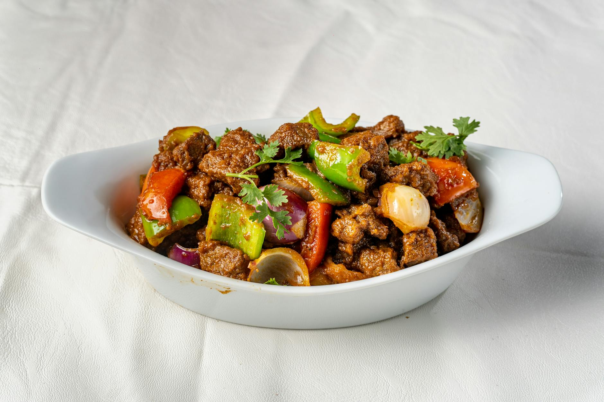

# Suqaar

*Somali cubed beef stir-fry: small dice of tender beef sautéed with onion, peppers and Somali spice mix (xawaash), finished with a pat of butter and fresh coriander. The meat stays just-cooked; the vegetables glaze. Eats with rice, anjero (Somali pancake), or stuffed into chapati.*

**Serves:** 4

**Prep Time:** 15 minutes

**Cook Time:** 20 minutes

## Overview
Beef tenderloin or sirloin is cubed small. A spice mix of cumin, coriander, cardamom and cinnamon — Somalia's xawaash — seasons it. The cubes sear quickly in a hot pan with onion and pepper; tomato paste deepens; chilli and butter finish. Coriander piles on at the table.

## Ingredients

- 600 g beef sirloin or tenderloin (cut into 1.5 cm cubes)
- 3 tablespoons vegetable oil
- 1 large onion (finely chopped)
- 1 red pepper (chopped)
- 1 green pepper (chopped)
- 5 garlic cloves (crushed)
- 2 cm fresh ginger (grated)
- 1 long green chilli (finely chopped)
- 2 tablespoons tomato paste
- 2 medium tomatoes (chopped)
- 1 teaspoon ground cumin
- 1 teaspoon ground coriander
- ½ teaspoon ground cardamom
- ½ teaspoon ground cinnamon
- ½ teaspoon ground turmeric
- ½ teaspoon black pepper
- 1 teaspoon salt (or to taste)
- 100 ml water
- 30 g unsalted butter
- A small bunch of fresh coriander (chopped)
- 2 lime wedges (to serve)

## Method

### Stage 1 – Sear the beef
1. Heat 2 tablespoons of oil in a wide pan over high heat.
1. Pat the beef cubes dry; toss with a pinch of the salt.
1. Sear in batches in a single layer for 60-90 seconds — they should brown on one side; lift out before they cook through.

### Stage 2 – Vegetables and spices
1. Lower the heat to medium; add the remaining oil.
1. Cook the onion 5 minutes until softening.
1. Add the peppers, garlic, ginger and chilli; cook 4 minutes more.
1. Stir in the tomato paste and the spices (cumin, coriander, cardamom, cinnamon, turmeric, black pepper); cook 1 minute.

### Stage 3 – Combine
1. Add the chopped tomatoes; cook 4 minutes until softening.
1. Pour in the water; bring to a simmer.
1. Return the beef and any juices; toss to coat.
1. Cook 3-4 minutes more — the beef should be just cooked through, the sauce slightly reduced.

### Stage 4 – Finish
1. Stir in the butter to gloss the sauce.
1. Taste; adjust salt.
1. Off the heat, scatter most of the coriander.

### Stage 5 – Serve
1. Pile onto plates with rice or warm anjero.
1. Top with remaining coriander; serve lime wedges alongside.

## Notes
- **Tender cut, fast cook:** Sirloin or tenderloin cooked briefly is the goal. Tougher cuts (chuck, brisket) need a long braise — different dish (maraq).
- **Xawaash:** The Somali spice mix is the dish's identity. The four spices listed approximate it; if you have ready-made xawaash, use 2 tablespoons in place of the spice list.
- **Don't overcrowd the pan:** Beef cubes that crowd steam-cook instead of searing. Cook in 2-3 batches if needed.

## Storage
- Keeps 3 days refrigerated; reheats in a pan with a splash of water.
- Doesn't freeze well; the texture goes grainy.
