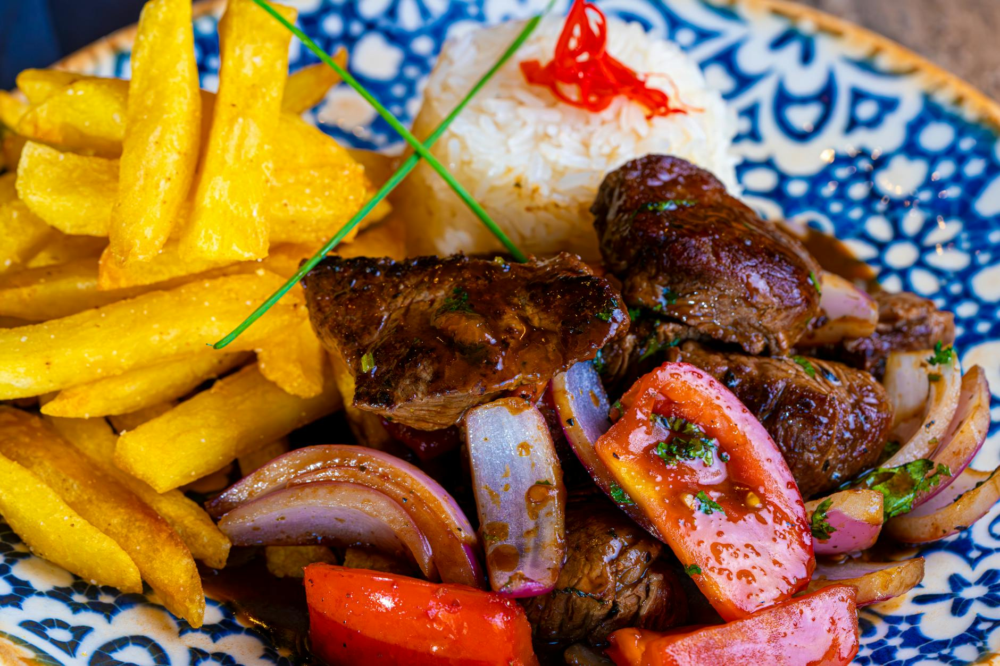

# Lomo Saltado

*Peru's signature stir-fry: thin strips of beef seared hot in a wok with red onion, tomato, soy sauce and aji amarillo (yellow Peruvian chilli), tossed at the end with crispy fries and fresh coriander. Born of Chinese-Peruvian (chifa) cooking; eats with rice and the fries hidden inside, soaking up the soy-and-chilli sauce.*

**Serves:** 4

**Prep Time:** 20 minutes

**Cook Time:** 25 minutes

## Overview
Beef strips marinate briefly in soy and aji amarillo paste. Fries cook separately — pre-fried, set aside. The wok hits high heat; beef sears in batches; red onion and tomato add briefly so they keep their bite; soy, vinegar, lime and stock pour in to sauce. The fries go in last, just before serving — a 30-second toss so they pick up flavour without going soggy.

## Ingredients

### Beef and marinade
- 600 g beef sirloin or rump (cut into 1 cm strips)
- 2 tablespoons soy sauce
- 1 tablespoon aji amarillo paste (Peruvian; or 2 tsp sambal oelek)
- 4 garlic cloves (crushed)
- 2 cm fresh ginger (grated)
- ½ teaspoon black pepper
- 1 tablespoon vegetable oil

### Fries
- 800 g floury potatoes (Maris Piper; cut into 1 cm sticks)
- 800 ml vegetable oil for frying
- Salt

### Stir-fry
- 2 tablespoons vegetable oil
- 1 large red onion (cut into wedges)
- 4 medium tomatoes (deseeded; cut into wedges)
- 2 long green chillies (sliced)
- 4 tablespoons soy sauce
- 2 tablespoons red wine vinegar
- 2 tablespoons beef stock or water
- Juice of 1 lime
- A small bunch of coriander (chopped)
- Black pepper

### To serve
- Cooked white rice

## Method

### Stage 1 – Marinate the beef
1. Mix the marinade ingredients; add the beef; rest 15 minutes.

### Stage 2 – Fries
1. Heat the oil to 165°C in a deep pan.
1. Fry the potato sticks in batches 5 minutes until just-tender; drain.
1. Heat the oil to 190°C.
1. Re-fry the chips 3 minutes until deep golden and crisp.
1. Drain on kitchen paper; salt; keep warm.

### Stage 3 – Sear the beef
1. Heat 1 tablespoon of oil in a wok over the highest heat until smoking.
1. Add half the beef in a single layer; sear 60 seconds untouched; toss 30 seconds; lift out.
1. Repeat with the rest of the beef.

### Stage 4 – Vegetables
1. Add the second tablespoon of oil to the wok.
1. Add the red onion wedges; toss for 90 seconds (should still have crunch).
1. Add the tomato and chillies; toss for 60 seconds.

### Stage 5 – Sauce
1. Return the beef and any juices.
1. Pour in the soy, vinegar and stock; toss for 30 seconds — the sauce should coat without pooling.
1. Off the heat, add the lime juice.

### Stage 6 – Combine with fries
1. Tip the fries into the wok; toss 30 seconds (just to coat — don't let them go soggy).
1. Stir in the coriander; grind in pepper.

### Stage 7 – Serve
1. Pile onto plates with white rice on the side.

## Notes
- **High heat is the dish:** Lomo saltado lives or dies on wok hei (the smoky char from a properly hot wok). Cook in batches if your hob can't sustain the heat.
- **Fries last:** Adding them earlier turns them limp. They go in for 30 seconds at the end, no more.
- **Aji amarillo:** A fresh-tasting yellow Peruvian chilli sold as paste at Latin grocers. Sambal or sriracha is a poor but functional substitute.

## Storage
- Best fresh; the fries don't reheat. Don't make ahead.
