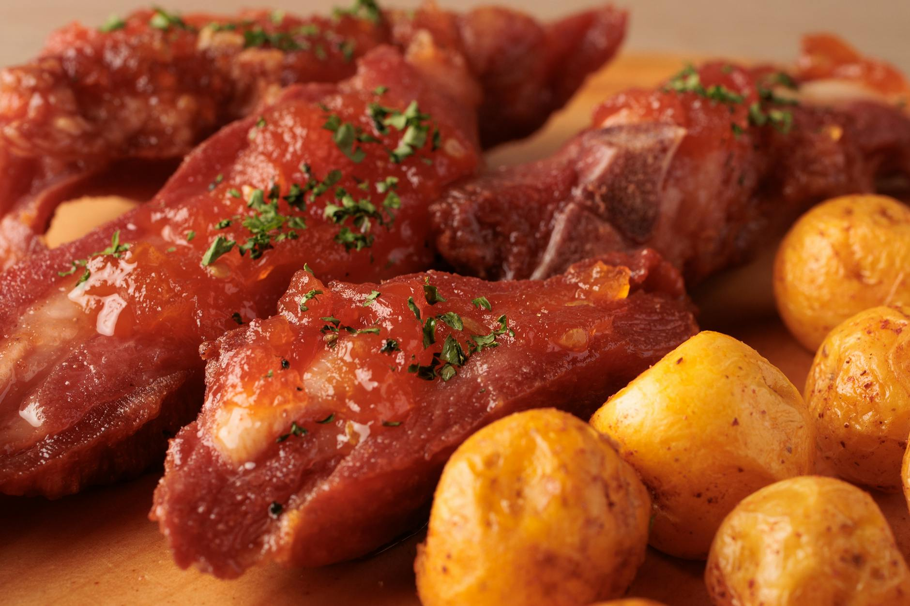

# Chorizo Pork with Crispy New Potatoes

## Overview
A vibrant Spanish dish combining tender pork tenderloin and spiced chorizo sausage in a rich tomato sauce, served alongside crispy roasted new potatoes. The chorizo releases its flavourful oils into the sauce while the potatoes develop golden, crispy exteriors. Bright lemon juice balances the richness of the pork and chorizo, creating a dish that is both comforting and fresh.

**Serves:** 4
**Prep Time:** 15 minutes
**Cook Time:** 35 minutes

## Ingredients

### Potatoes & Oil
- 500 grams baby new potatoes
- 2 tablespoons olive oil
- Sea salt and freshly ground black pepper to taste

### Protein
- 400 grams pork tenderloin (cut into chunks)
- 150 grams chorizo sausage

### Sauce & Aromatics
- 1 red onion (sliced)
- 500 grams tinned chopped tomatoes
- Large pinch chilli flakes
- Pinch of sugar

### Seasoning & Finish
- 1 lemon (juiced)
- 4 lemon quarters (for serving)

### Garnish
- Fresh rocket leaves

## Method

### Stage 1 – Prepare & Roast Potatoes
1. Place the baby new potatoes in a saucepan of cold salted water.
2. Bring to the boil and cook for 10 minutes until tender but still firm.
3. Drain the potatoes thoroughly.
4. Roughly mash with a fork, they should remain chunky, not smooth.
5. Spread the mashed potatoes out on a roasting tin in a single layer.
6. Season generously with sea salt and freshly ground black pepper.
7. Drizzle with half the olive oil (1 tablespoon).
8. Place under a hot grill for 5–10 minutes until crisp and golden on top.
9. They should develop a golden crust while remaining soft inside. Set aside.

### Stage 2 – Brown the Pork
1. Heat the remaining 1 tablespoon of olive oil in a large frying pan over medium-high heat.
2. Add the pork chunks and fry for 5–7 minutes, turning occasionally, until browned on all sides and cooked through.
3. Remove the pork to a clean plate and set aside.

### Stage 3 – Cook Chorizo & Onion
1. Add the chorizo sausage to the same pan over medium heat.
2. Fry for 3–4 minutes, stirring occasionally, until some of the fat is released from the chorizo.
3. Add the sliced red onion to the pan.
4. Cook for a further 5 minutes, stirring frequently, until the onion is softened and beginning to caramelize.

### Stage 4 – Build the Sauce
1. Drain off some of the excess fat from the chorizo (leave approximately 1 tablespoon of flavourful fat in the pan).
2. Add the tinned chopped tomatoes to the pan.
3. Stir in the chilli flakes and a pinch of sugar.
4. Add half the lemon juice.
5. Bring to the boil, then reduce heat to low.
6. Simmer uncovered for 10 minutes, stirring occasionally, to allow flavours to meld and sauce to thicken slightly.

### Stage 5 – Combine & Season
1. Return the cooked pork to the pan with the chorizo-tomato sauce.
2. Stir gently to combine.
3. Heat through for 2–3 minutes over low heat.
4. Add the remaining lemon juice.
5. Taste and adjust seasoning with sea salt and freshly ground black pepper as needed.

### Stage 6 – Serve
1. Divide the chorizo-pork sauce among serving plates.
2. Top each plate with a portion of the crispy roasted potatoes.
3. Scatter fresh rocket leaves over and around the potatoes.
4. Serve immediately with lemon quarters on the side for squeezing over the dish.

## Notes
- **Chorizo fat release:** The chorizo's spiced fat is essential to flavouring the sauce, don't drain off all of it. Leave approximately 1 tablespoon for depth.
- **Potato texture:** Mashing the potatoes increases the surface area for crisping. The result should be crispy exteriors with soft, fluffy interiors.
- **Lemon balance:** The citrus cuts through the richness of the pork and chorizo. Adjust quantity to your preference.
- **Pork tenderness:** Don't overcook the pork or it will become dry. The chunks should remain tender and juicy inside.
- **Sauce consistency:** Simmer uncovered so excess liquid evaporates, creating a thicker, more concentrated sauce.

## Variations
**With peppers:** Add 1 red bell pepper (sliced) to Stage 3 with the onion for extra sweetness and colour
**Spicier version:** Increase chilli flakes to 1 teaspoon or add fresh bird's eye chillies
**Smoky twist:** Use smoked paprika instead of chilli flakes for a different heat profile
**With olives:** Add 75g pitted black or green olives in Stage 4 for briny saltiness
**Seafood alternative:** Replace pork with 400g large prawns; reduce cooking time to 2–3 minutes

## Serving
Serve with: Fresh rocket leaves, lemon quarters, crusty bread for mopping sauce, and a crisp Spanish white wine or cold beer.

## Storage
- Keeps 2 days refrigerated (store potatoes separately to maintain crispiness)
- The pork-chorizo sauce freezes well up to 3 months; reheat gently on the stovetop
- Roasted potatoes are best eaten fresh but can be reheated in a 180°C oven for 5 minutes to re-crisp
- Not ideal for freezing the complete assembled dish (potatoes become soggy)