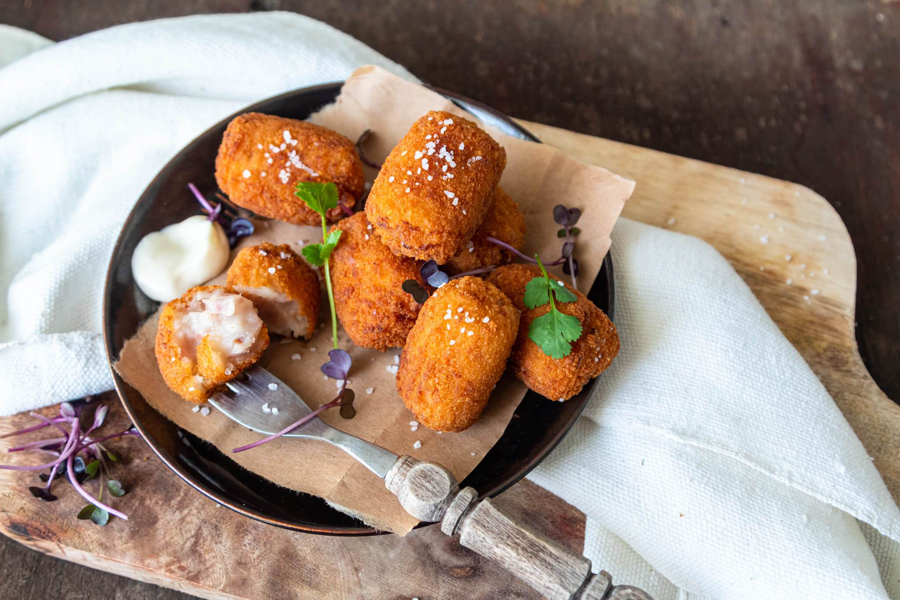

# Croquetas de Jamón

*The most Spanish of bar snacks: a stiff béchamel studded with chopped serrano ham, chilled until firm, then breadcrumbed and deep-fried into golden ovals with a creamy molten centre. Long process; addictive result.*

**Makes:** 24 croquetas

**Prep Time:** 30 minutes (plus 4 hours chilling)

**Cook Time:** 15 minutes

## Overview
A thick béchamel — three times the flour-to-milk ratio of standard béchamel — is studded with chopped jamón serrano, chilled until firm enough to shape, rolled into ovals, breaded with flour-egg-panko, and deep-fried at 180°C until deep golden. Eat hot.

## Ingredients

### Filling
- 100 g unsalted butter
- 1 small onion (very finely chopped)
- 100 g jamón serrano (or prosciutto), finely chopped
- 100 g plain flour
- 700 ml whole milk (warm)
- A grating of nutmeg
- Salt and white pepper

### Breading and frying
- 100 g plain flour
- 3 large eggs (beaten)
- 200 g panko breadcrumbs
- Vegetable oil for deep-frying

## Method

### Stage 1 – Béchamel base
1. Melt the butter in a heavy pan over medium heat.
1. Cook the onion gently for 8 minutes until soft and almost translucent (don't colour).
1. Add the chopped ham; cook 1 minute.
1. Sprinkle in the flour all at once and stir vigorously for 2 minutes (this is a thick roux; cook the raw flour out).
1. Pour in the warm milk in steady streams, whisking constantly to avoid lumps.
1. Continue whisking over medium heat for 8-10 minutes until the mixture is very thick and pulls away from the sides of the pan.
1. Season with nutmeg, salt and pepper.

### Stage 2 – Chill
1. Tip the mixture into a tray lined with cling film, spread to about 1.5 cm thick.
1. Cover with cling film pressed onto the surface (no skin forms).
1. Refrigerate at least 4 hours, ideally overnight.

### Stage 3 – Shape
1. Scoop heaped dessert-spoonfuls of the chilled mixture and roll into ovals (3 cm long) on a lightly floured surface.
1. Set on a tray as you go.

### Stage 4 – Bread
1. Set up three plates: flour, egg, panko.
1. Roll each croqueta in flour, dip in egg, then panko. Re-coat in egg and panko for a thicker crust if you like.

### Stage 5 – Fry
1. Heat oil to 180°C in a deep pan.
1. Fry the croquetas in batches for 2-3 minutes until deep golden.
1. Drain on a wire rack; eat hot.

## Notes
- **Chill thoroughly:** Warm filling is impossible to shape. Overnight is best.
- **Thick béchamel is non-negotiable:** Standard 5:5:50 (flour:butter:milk) flows. Croqueta béchamel is more like 7:7:50 — much stiffer.
- **Panko gives more crunch:** Traditional fine breadcrumbs work but panko stays crisper after frying.

## Storage
- Best fresh. Shaped raw croquetas freeze well 2 months — fry from frozen, adding 1 minute.
- Cooked keep 1 day refrigerated; reheat at 180°C for 6 minutes.
