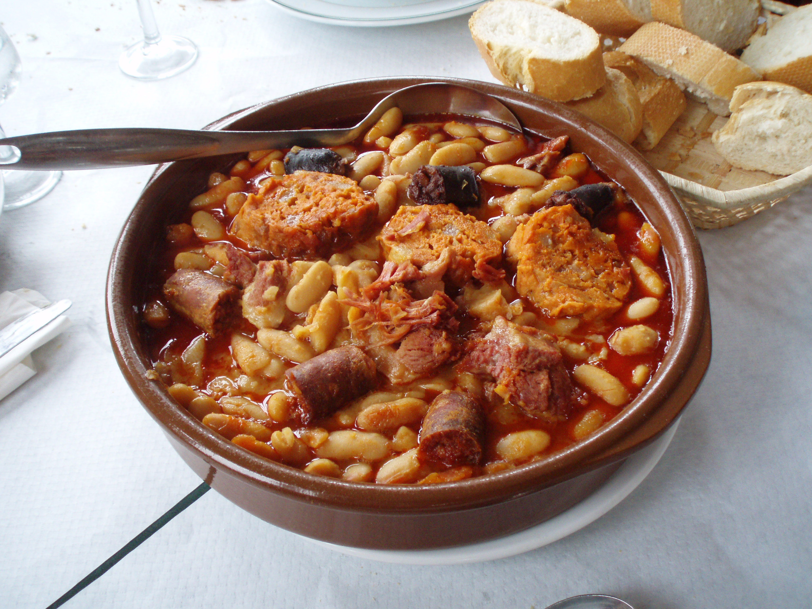

# Fabada Asturiana

*Asturian bean stew: large white fabes beans braised slow with chorizo, morcilla and pork shoulder until everything melts together into a rust-coloured, deeply savoury bowl. The Sunday-lunch-and-Monday-leftovers dish of northwest Spain.*

**Serves:** 6

**Prep Time:** 15 minutes (plus overnight bean soak)

**Cook Time:** 2½ hours

## Overview
Soaked fabes beans simmer with cooking chorizo, morcilla (Spanish blood sausage) and a piece of pork belly or shoulder, with a touch of saffron and smoked paprika. The whole thing braises slowly until the beans are soft and the broth is dark and unctuous.

## Ingredients

- 500 g fabes (or large dried butter beans / cannellini), soaked overnight in cold water
- 200 g pork belly in one piece, or pork shoulder
- 2 cooking chorizo sausages (about 200 g)
- 2 morcilla sausages (about 200 g) (or substitute black pudding)
- 1 onion (whole)
- 1 head garlic (whole, top sliced off to expose cloves)
- 2 bay leaves
- 1 large pinch saffron threads
- 1 teaspoon sweet smoked paprika
- Salt
- Crusty bread, to serve

## Method

### Stage 1 – Start the stew
1. Drain the soaked beans. Place in a large heavy pan with the pork, chorizo and morcilla.
1. Add the whole onion, head of garlic, bay leaves and enough cold water to cover by 5 cm.
1. Bring slowly to the boil; skim any scum.

### Stage 2 – Slow simmer
1. Reduce the heat so the surface barely shivers.
1. Crumble in the saffron and stir in the smoked paprika.
1. Cover loosely and cook 2 hours, scaring the surface occasionally with a wooden spoon to prevent sticking. The liquid should reduce slowly into a thick broth.
1. Don't add salt until the beans are tender; salt before that toughens them.

### Stage 3 – Finish
1. After 2 hours, taste a bean; it should be soft and creamy. If still firm, simmer another 30 minutes.
1. Lift out the meats, slice into chunks (chorizo into 2 cm rounds, morcilla into 2 cm rounds, pork into chunks).
1. Discard the onion, bay and head of garlic. Return the meats to the beans.
1. Season with salt; the broth should be glossy and slightly thickened.

### Stage 4 – Serve
1. Ladle into deep bowls. Crusty bread alongside; a chilled cider (Asturian sidra) is the traditional pairing.

## Notes
- **Don't salt the beans early:** Salt before the beans soften causes them to seize and stay tough. Add only at the end.
- **Authentic fabes are huge:** Big white beans the size of broad beans. Large butter beans or cannellini work; lima beans are similar.
- **Morcilla is the soul:** If you can't find Spanish morcilla, black pudding from a butcher gives a similar effect.

## Storage
- Improves overnight. Keeps 4 days refrigerated.
- Freezes 3 months.
