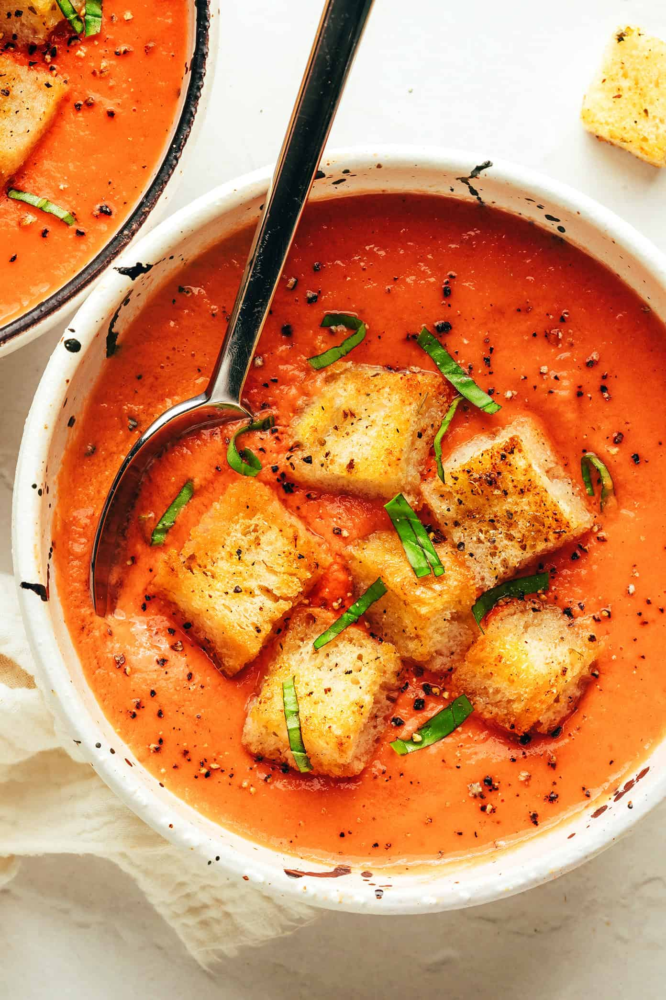

# Gazpacho

*Andalusian cold soup: tomato, cucumber, pepper, garlic, bread and olive oil blended into a thin chilled drink-soup. Built for hot summer days when nobody wants to turn on a hob. The bread softens the texture; the olive oil makes it.*

**Serves:** 4-6

**Prep Time:** 20 minutes (plus 4 hours chilling)

**Cook Time:** 0 minutes

## Overview
Ripe tomatoes, cucumber, green pepper and stale bread soak in red wine vinegar with garlic, then blitz with olive oil into a smooth velvety soup. Strained for restaurant texture or left chunky for a more rustic version. Served very cold with a swirl of olive oil and finely diced vegetables on top.

## Ingredients

- 1 kg very ripe tomatoes (cored and chopped)
- 1 cucumber (peeled, seeded, chopped)
- 1 green pepper (seeded, chopped)
- 1 small red onion (chopped)
- 2 garlic cloves
- 100 g stale white bread (crust off, soaked in cold water for 5 minutes, squeezed)
- 3 tablespoons sherry vinegar (or red wine vinegar)
- 6 tablespoons extra virgin olive oil
- 1 teaspoon salt
- A pinch of cayenne or smoked paprika
- 200 ml ice-cold water (if needed to thin)

### Garnish
- 2 tablespoons each: finely diced cucumber, pepper, red onion, tomato
- Croutons
- A drizzle of extra virgin olive oil

## Method

### Stage 1 – Blend
1. Place the tomatoes, cucumber, pepper, onion, garlic, soaked bread and vinegar in a blender.
1. Blitz on high for 1-2 minutes until completely smooth.
1. With the motor running, drizzle in the olive oil; the soup should turn a paler orange and thicken slightly.
1. Season with salt and cayenne; thin with cold water if too thick.

### Stage 2 – Strain (optional)
1. For a smoother texture, push the soup through a fine sieve or chinois.
1. Discard the solids.

### Stage 3 – Chill
1. Refrigerate for at least 4 hours (or overnight).
1. The flavour develops as it sits; tomato gazpacho is usually better the next day.

### Stage 4 – Serve
1. Stir well; check seasoning (cold dulls salt, so adjust now).
1. Pour into bowls or glasses.
1. Top with finely diced vegetables and croutons; finish with a swirl of olive oil.

## Notes
- **Use the ripest tomatoes you can find:** Out-of-season tomatoes give thin, lifeless gazpacho. If yours aren't great, add a tablespoon of tomato purée and a pinch of sugar to compensate.
- **Soaked bread is the binder:** Holds the emulsion together; without it the soup separates within minutes.
- **Sherry vinegar > red wine vinegar:** Andalusian, slightly sweeter, more aromatic. Both work.

## Storage
- Keeps 3 days refrigerated; the flavour mellows after day one.
- Doesn't freeze (the texture goes grainy).
