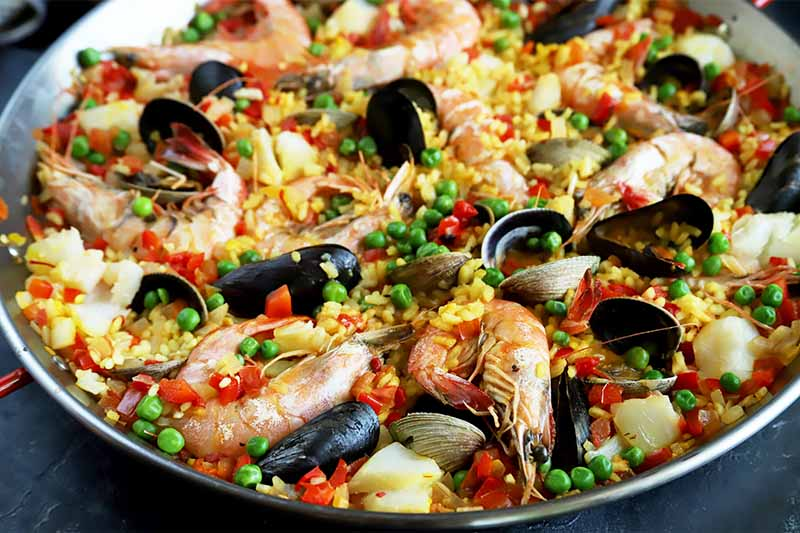

# Paella de Mariscos

*The seafood paella: prawns, mussels, clams, squid and white fish over saffron-tomato rice. The coastal cousin of paella valenciana; uses fish stock instead of chicken and lets the seafood season the rice as it cooks.*

**Serves:** 6

**Prep Time:** 20 minutes

**Cook Time:** 35 minutes

## Overview
A sofrito of onion, garlic and tomato is built in the paella pan, then bomba rice goes in and absorbs warm fish stock with saffron. Squid and white fish go in early; prawns, mussels and clams are nestled in for the last 10 minutes so they steam open without overcooking.

## Ingredients

- 4 tablespoons olive oil
- 1 onion (finely chopped)
- 4 garlic cloves (minced)
- 2 ripe tomatoes (grated, skins discarded)
- 1 teaspoon sweet smoked paprika
- 1 large pinch saffron threads
- 1.2 litres warm fish stock
- 350 g bomba rice
- 200 g squid (cleaned, cut into rings)
- 300 g firm white fish (monkfish or hake), cubed
- 12 large raw prawns (shell on)
- 200 g mussels (scrubbed, beards removed)
- 200 g clams (scrubbed)
- 100 g peas (frozen are fine)
- Salt
- 2 tablespoons chopped flat-leaf parsley
- Lemon wedges, to serve

## Method

### Stage 1 – Sofrito
1. Heat the olive oil in a 35-40 cm paella pan over medium heat.
1. Cook the onion for 8-10 minutes until soft and golden.
1. Add the garlic; cook 1 minute.
1. Add the grated tomato; cook 6-7 minutes until thick and dark.
1. Stir in the smoked paprika and saffron.

### Stage 2 – Squid and rice
1. Add the squid rings; cook 2 minutes.
1. Pour in the warm fish stock; bring to the boil. Season with salt.
1. Sprinkle the rice evenly across the pan; do not stir.

### Stage 3 – Cook the rice
1. Boil hard for 8 minutes.
1. Tuck in the white fish cubes; reduce heat to medium-low.
1. After another 5 minutes, nestle the prawns, mussels and clams into the rice (hinge-down for shellfish).
1. Scatter the peas over.
1. Cook another 8 minutes, until the rice is just tender, the shellfish have opened, and the prawns are pink and cooked through.
1. Crank the heat to high for 30 seconds at the end to crisp the bottom.

### Stage 4 – Rest and serve
1. Take off the heat; cover with a tea towel and rest 5 minutes.
1. Discard any unopened mussels or clams.
1. Scatter parsley; serve from the pan with lemon wedges.

## Notes
- **Fish stock makes it:** Don't substitute chicken or vegetable stock. A good shop-bought fish stock is fine if you don't want to make your own.
- **Seafood timing:** Squid early so it tenderises; shellfish late so it doesn't overcook. Get this wrong and you have rubber prawns.
- **Discard unopened mussels/clams:** Anything that doesn't open in cooking is dead beforehand; not safe to eat.

## Storage
- Best fresh. Reheats one day with a splash of stock; longer than that and the seafood degrades.
