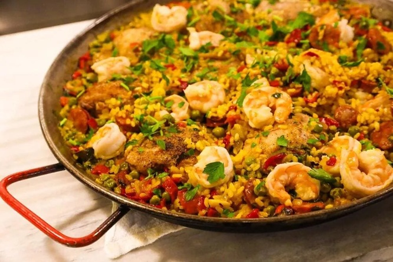

# Paella Valenciana

*The original paella from Valencia: chicken, rabbit, beans, snails (or rosemary if you're squeamish) and saffron rice cooked in a wide flat pan. The rice is unstirred to develop the prized socarrat — the caramelised crust on the bottom of the pan.*

**Serves:** 6

**Prep Time:** 15 minutes

**Cook Time:** 45 minutes

## Overview
Chicken thighs and rabbit pieces brown in olive oil, joined by green beans, butter beans and a sofrito of tomato and paprika. Saffron-infused stock and short-grain bomba rice go in, simmered without stirring until the rice is tender and the bottom has crisped into socarrat.

## Ingredients

- 4 tablespoons olive oil
- 4 chicken thighs (skin-on, bone-in, halved)
- 2 rabbit legs (cut into pieces) or 4 more chicken thighs
- 100 g flat green beans (cut into 3 cm pieces)
- 100 g butter beans, drained from a tin
- 2 ripe tomatoes (grated, skins discarded)
- 1 teaspoon sweet smoked paprika
- 1 large pinch saffron threads
- 1.2 litres warm chicken stock
- 350 g bomba rice (or other short-grain Spanish rice)
- 2 sprigs fresh rosemary
- Salt
- Lemon wedges, to serve

## Method

### Stage 1 – Brown the meat
1. Heat the olive oil in a 35-40 cm paella pan (or wide shallow frying pan) over medium-high heat.
1. Season the meat with salt; brown the chicken and rabbit pieces deeply on all sides. Push to the edges of the pan.

### Stage 2 – Sofrito
1. Add the green beans to the centre and stir for 3-4 minutes.
1. Pour in the grated tomato; cook 5-6 minutes until thick and dark.
1. Add the smoked paprika and saffron; stir 30 seconds.

### Stage 3 – Rice and stock
1. Pour in the warm stock; bring to the boil.
1. Sprinkle the rice evenly across the pan in a cross pattern.
1. Distribute the butter beans and rosemary sprigs over the surface.
1. From this point, DO NOT STIR.

### Stage 4 – Cook the rice
1. Boil hard for 10 minutes, then reduce to medium-low.
1. Cook another 8-10 minutes until the rice is just tender and the liquid is almost absorbed.
1. Listen for crackling at the base — that's the socarrat forming. Crank the heat to high for 30-60 seconds at the end if needed.

### Stage 5 – Rest and serve
1. Take off the heat, cover with a clean tea towel and rest for 5-8 minutes.
1. Serve from the pan with lemon wedges.

## Notes
- **Don't stir the rice:** Stirring releases starch and breaks the socarrat. The whole point is the unbroken crust at the bottom.
- **Bomba rice:** Holds its shape under the long simmer. Arborio works in a pinch but releases more starch.
- **Wide flat pan:** Paella needs a thin layer of rice (about 1.5 cm). A deep pan turns it into rice-and-stew.

## Storage
- Best the day it's made. Keeps 2 days refrigerated; reheat in a pan with a splash of stock (the socarrat is gone but the flavour is fine).
