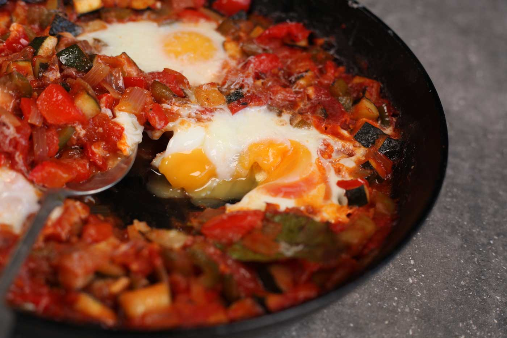

# Pisto Manchego

*La Mancha's slow-cooked pepper, courgette, aubergine and tomato stew, eaten as a tapa, a side, or with a fried egg dropped on top as a main. Nothing rushed: each vegetable cooks separately or in stages so they each retain their character before the lot melds into a sweet, oily, deeply ripe stew.*

**Serves:** 4

**Prep Time:** 15 minutes

**Cook Time:** 1 hour

## Overview
Onion softens slowly in olive oil; peppers join to break down sweetly; aubergine and courgette go in next to caramelise at the edges; tomatoes finish to bind. Each addition has time to take on the oil and contribute. The result is glossy, jam-like, deep — eaten with bread, fried eggs or alongside grilled food.

## Ingredients

- 100 ml olive oil (or 60 ml; pisto is properly oily)
- 2 large onions (chopped)
- 2 red peppers (chopped)
- 2 green peppers (chopped)
- 5 garlic cloves (crushed)
- 1 large aubergine (diced)
- 2 medium courgettes (diced)
- 6 large ripe tomatoes (skinned and chopped) or 1 x 800 g tin chopped tomatoes
- 1 teaspoon sweet smoked paprika
- 1 teaspoon dried oregano
- 1 teaspoon sugar
- Salt and black pepper
- 4 large eggs (optional, to serve)

## Method

### Stage 1 – Onions
1. Heat the oil in a wide heavy pan over medium heat.
1. Add the onions; cook 12-15 minutes until soft and golden. Don't rush this.

### Stage 2 – Peppers
1. Add the red and green peppers; cook 12-15 minutes more until they've collapsed and turned silky.

### Stage 3 – Aubergine
1. Add the aubergine; cook 10 minutes until softened and lightly caramelised at edges.

### Stage 4 – Courgette
1. Add the courgette and garlic; cook 5 minutes.

### Stage 5 – Tomatoes
1. Add the tomatoes, smoked paprika, oregano, sugar, salt and black pepper.
1. Bring to a steady simmer; reduce heat slightly.
1. Cook uncovered 15-20 minutes more until the mixture is thick, glossy, jam-like.

### Stage 6 – Serve
1. Taste; adjust salt and pepper.
1. Serve in shallow bowls. Optionally fry an egg per person and lay it on top, yolk soft.
1. Eat with bread to mop the oil.

## Notes
- **Cook each vegetable in its turn:** Throwing them in together gives mush. Each addition has time to soften and take on the oil.
- **Generous oil:** Pisto is properly olive-oil-rich. Skimping makes a flat, dry stew. The oil pools around the edge by the end; that's correct.
- **Smoked paprika optional but classic:** Sweet (dulce) smoked paprika; not hot. Adds the rounded, slightly woody depth.

## Storage
- Keeps 5 days refrigerated; arguably better the next day.
- Freezes 3 months.
