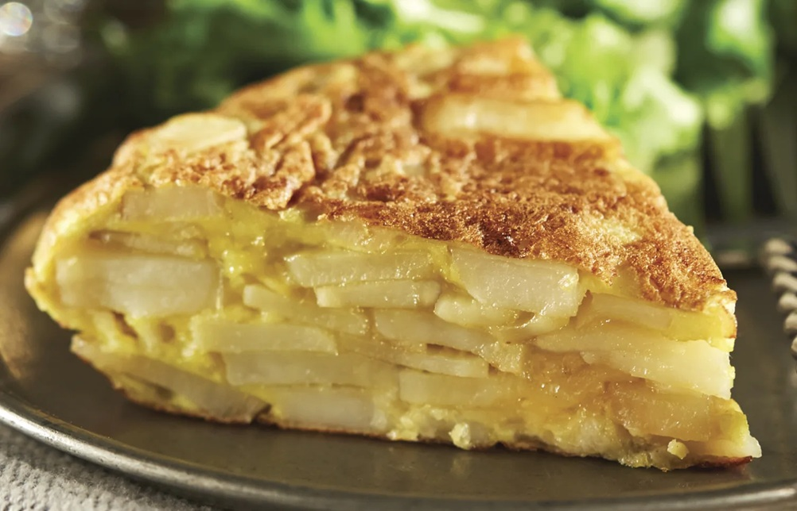

# Tortilla Española

*Spain's national dish: thinly-sliced potatoes and onion poached gently in olive oil, then bound with eggs and cooked into a thick, juicy round. The classic argument is whether the centre should be jugosa (juicy, just-set) or fully cooked through. Either way, eats hot, warm or cold; the bocadillo de tortilla — tortilla in a bread roll — is a national lunch.*

**Serves:** 4-6

**Prep Time:** 10 minutes

**Cook Time:** 35 minutes

## Overview
Potatoes slice thin and cook slowly in shallow olive oil with onions until soft — not fried, almost steamed in the oil. They drain (oil saved); fold into beaten eggs with salt; pour into a hot pan with a little of the saved oil; cook until the bottom is set; flip onto a plate and slide back to cook the other side. Centre should still wobble slightly when nudged.

## Ingredients

- 600 g floury potatoes (peeled and sliced 3 mm thick)
- 1 large onion (sliced thin)
- 300 ml olive oil
- 6 large eggs
- 1½ teaspoons salt
- Black pepper

## Method

### Stage 1 – Cook the potatoes and onions
1. Heat the oil in a 24 cm non-stick or well-seasoned cast-iron pan over medium heat.
1. Add the potatoes and onion; the oil should just cover them. They should bubble gently — not fry.
1. Cook 18-22 minutes, stirring every few minutes, until the potatoes are completely soft (a slice should crush easily) but not coloured. Onions should be limp and translucent.
1. Lift out with a slotted spoon into a colander; let drain. Save the oil.

### Stage 2 – Combine
1. Beat the eggs in a wide bowl with the salt and black pepper.
1. Tip in the warm potatoes and onions; mix gently — don't break them up too much.
1. Rest 5 minutes (lets the potatoes absorb some egg).

### Stage 3 – First side
1. Wipe the pan; put 2 tablespoons of the saved oil back in; heat over medium-high.
1. Pour in the egg-and-potato mixture; spread evenly.
1. Reduce the heat to medium-low; cook 5-7 minutes — the bottom should set golden, the top still wet.
1. Run a spatula around the edge to make sure nothing is stuck.

### Stage 4 – Flip
1. Slide a flat plate (larger than the pan) on top.
1. Holding the plate firmly against the pan, flip the lot in one quick motion; the cooked side is now on top of the plate.
1. Slide the tortilla back into the pan, raw side down.
1. Tuck the edges under with a spatula to neaten.

### Stage 5 – Second side
1. Cook 4-6 more minutes for jugosa (still wobbly in the centre); 7-8 for fully cooked.
1. Slide onto a clean plate.

### Stage 6 – Rest and serve
1. Rest 5 minutes before slicing — this lets the centre settle.
1. Cut into wedges and eat warm or cold.

## Notes
- **Don't fry — confit:** The potatoes should be soft, not crisp. Lower the heat if they start to brown; you want gentle cooking through and through.
- **The flip:** The most-feared step. Use a plate larger than the pan, hold it firmly, commit to the motion. A flip plate (plato volteador) makes it easy.
- **Jugosa vs fully cooked:** Spaniards split. Pull off the heat earlier for soft-set juicy centre; later for set-through. There is no wrong answer; just preference.

## Storage
- Keeps 3 days refrigerated; arguably better the next day. Eats well at any temperature.
