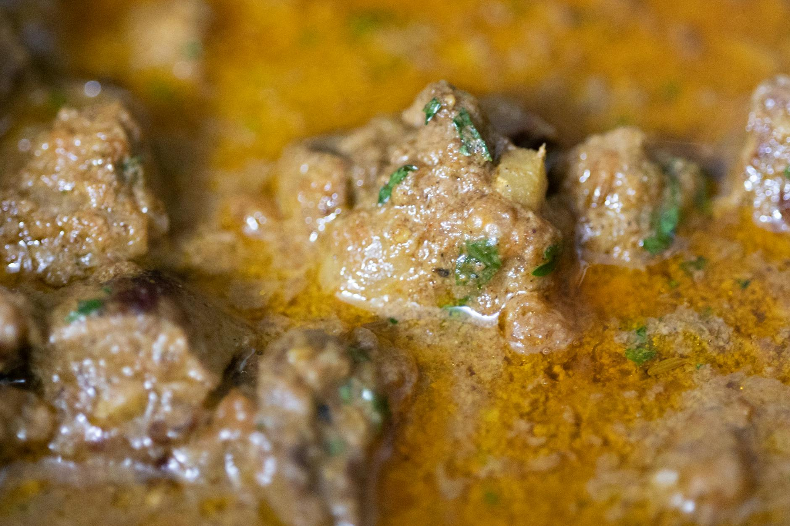

# Beef Panang Curry

**Serves:** 4

**Prep Time:** 10 minutes

**Cook Time:** 20 minutes

## Overview
A thick, sweet Panang curry with peanuts, served over jasmine rice. Similar to red curry but sweeter and thicker; add vegetables for extra nutrition or keep traditional.

## Ingredients
### Fat
- 2 tbsp rapeseed (canola) oil

### Protein
- 600 g (1 lb 5 oz) beef rib-eye, cut thinly against the grain

### Paste and sweeteners
- 1 batch Panang curry paste
- 1–2 tbsp palm sugar

### Dairy
- 600 ml (2½ cups) thick coconut milk

### Vegetables
- About 225 g (8 oz) vegetables, such as chopped baby sweetcorn, courgette (zucchini), mushrooms

### Aromatics and seasoning
- 3 lime leaves, stalks removed and leaves finely julienned
- 2 tbsp Thai fish sauce (more or less to taste)

## Method

### Stage 1 – Brown meat
1. Heat oil in wok or large frying pan over high heat.
1. Add beef; fry 2 mins to brown.

### Stage 2 – Add paste and sugar
1. Add curry paste and 1 tbsp sugar; fry briefly.
1. Add coconut milk; simmer 5 mins to thicken.

### Stage 3 – Add vegetables and finish
1. Stir in vegetables; simmer until cooked but fresh.
1. Add lime leaves and fish sauce.
1. Taste; adjust sugar or fish sauce.

## Notes
- Many Thai fish sauces contain gluten; use gluten-free brands if needed.
- For thinner curry, add stock like red curry.
- Authentic Panang has no vegetables; omit for tradition.

## Serving
- Serve over hot jasmine rice.
- Garnish with extra lime leaves or peanuts.

## Storage
- Refrigerate 2–3 days in airtight container.
- Reheat gently on stovetop.
- Freeze up to 2 months; thaw before reheating.