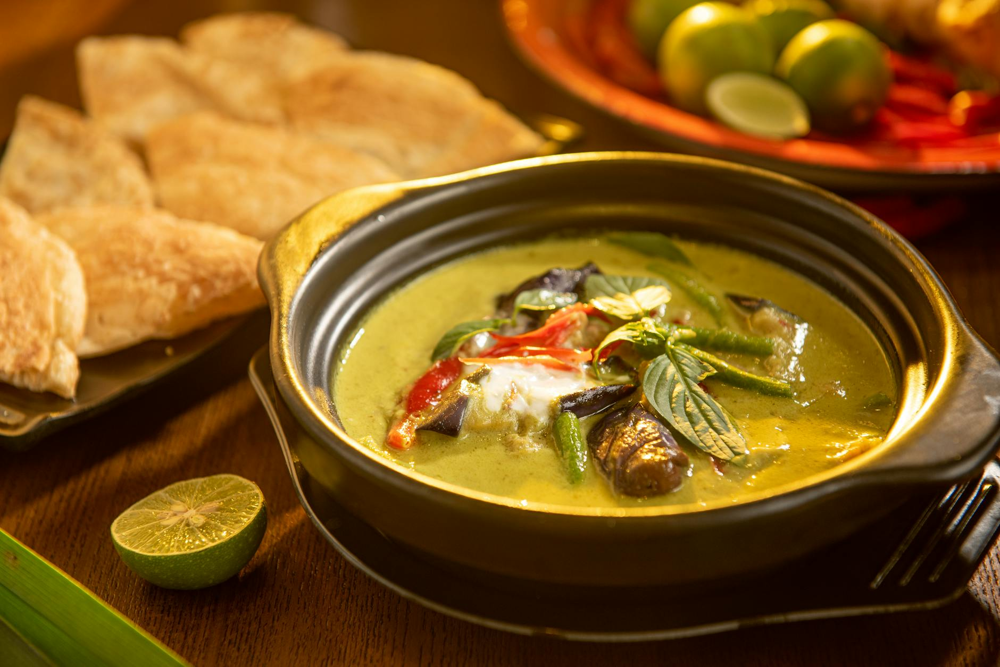

# Thai Beef Massaman Curry

**Serves:** 4

**Prep Time:** 10 minutes

**Cook Time:** 2 hours

## Overview
Rich, slow-cooked beef curry with Persian influences, featuring cinnamon, cardamom, and cloves. Tender beef and potatoes in coconut milk sauce; no vegetables traditionally, but can add. Serve with rice or enjoy as is.

## Ingredients
### Protein
- 700 g (1 lb 9 oz) stewing beef

### Vegetables
- 2 potatoes, peeled and cut into bite-size pieces
- ½ red onion, quartered

### Fat and nuts
- 2 tbsp rapeseed (canola) oil
- Handful of roasted peanuts

### Paste and sweeteners
- 1 batch massaman curry paste
- 1 tbsp palm sugar

### Dairy and acid
- 400 ml (1¾ cups) thick coconut milk
- 1 tsp tamarind paste

### Seasoning
- 3 tbsp Thai fish sauce
- Salt, to taste

### Garnish
- Thai holy basil

## Method

### Stage 1 – Cook beef
1. Place beef in saucepan; add 500 ml (2 cups) water.
1. Simmer 1½–2 hours until tender, adding water to cover as needed.
1. When almost tender, add potatoes; cook until fork tender.

### Stage 2 – Prepare curry base
1. Heat oil in wok or large frying pan over medium–high heat.
1. Add onion and peanuts; fry 3 mins.
1. Add curry paste; stir to combine.

### Stage 3 – Combine and simmer
1. Add coconut milk, sugar, tamarind paste, beef, potatoes, 250 ml (1 cup) cooking liquid, and fish sauce.
1. Simmer 10 mins to thicken.

### Stage 4 – Season and serve
1. Taste; adjust salt.
1. Garnish with holy basil.

## Notes
- Many Thai fish sauces contain gluten; use gluten-free brands.
- Low and slow cooking for tender beef.
- Persian-influenced spices: cinnamon, cardamom, cloves.

## Serving
- Serve with rice or as is.
- Garnish with basil.

## Storage
- Refrigerate 2–3 days in airtight container.
- Reheat gently; add water if thick.
- Freeze up to 2 months.