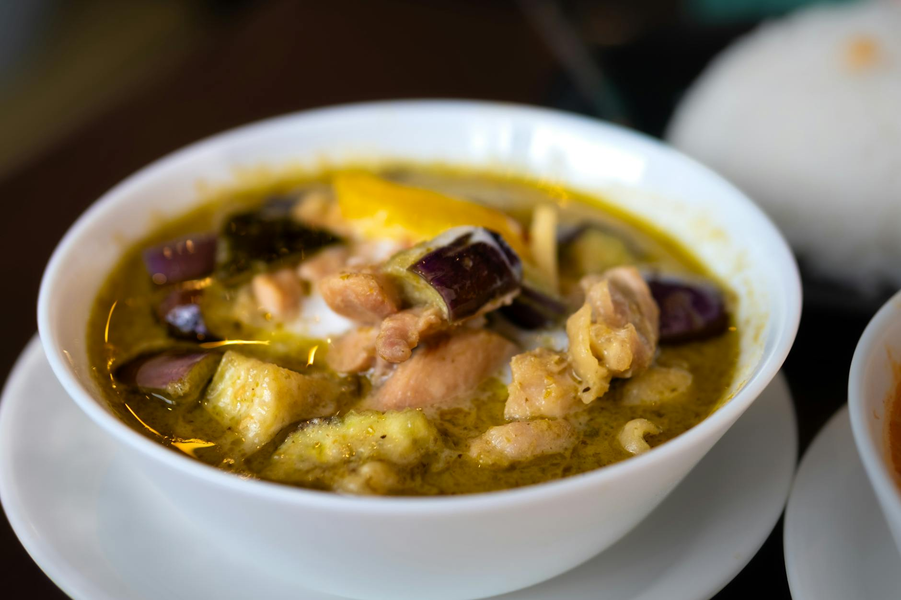

# Thai Green Chicken Curry

**Serves:** 4

**Prep Time:** 10 minutes

**Cook Time:** 20 minutes

## Overview
Spicy green curry with fresh bird's eye chillies. Use homemade paste for best flavor; adjust spice level. Creamy coconut milk base with chicken and vegetables.

## Ingredients
### Fat
- 2 tbsp coconut oil or rapeseed (canola) oil

### Paste
- 1 batch Thai green curry paste

### Protein
- 450 g (1 lb) skinless chicken thigh or breast fillets, cut into bite-size pieces

### Liquid
- 250 ml (1 cup) Thai chicken stock
- 400 ml (1¾ cups) thick coconut milk

### Vegetables
- About 225 g (8 oz) vegetables, such as baby corn, bamboo shoots, aubergine (eggplant), broccoli, sliced lotus root

### Seasoning
- 2 tbsp sugar (more or less to taste)
- 3 tbsp Thai fish sauce

### Aromatics and garnish
- Handful of Thai sweet basil, roughly chopped
- 3 lime leaves, stalks removed and leaves finely julienned
- 2 red spur chillies, cut into thin rings, to garnish
- Basil oil and some of the goop from the bottom, to garnish (optional)

## Method

### Stage 1 – Fry paste and chicken
1. Heat wok or frying pan over medium–high heat; add oil.
1. Add green curry paste; fry 30 seconds.
1. Add chicken; cook 2 mins, stirring.

### Stage 2 – Add liquids and simmer
1. Add stock and coconut milk; bring to simmer.
1. Cook 10 mins until chicken done and sauce thickens.

### Stage 3 – Add veggies and season
1. Stir in vegetables; cook to desired doneness.
1. Add sugar, fish sauce, basil, and lime leaves.
1. Taste and adjust.

### Stage 4 – Garnish and serve
1. Garnish with chillies and basil oil.

## Notes
- Many Thai fish sauces contain gluten; use gluten-free brands.
- Green curries are spicier than red due to bird's eye chillies.
- Use homemade paste for fresh flavors.

## Serving
- Serve with jasmine rice.
- Garnish as desired.

## Storage
- Refrigerate 2–3 days in airtight container.
- Reheat gently; add water if thick.
- Freeze up to 2 months.