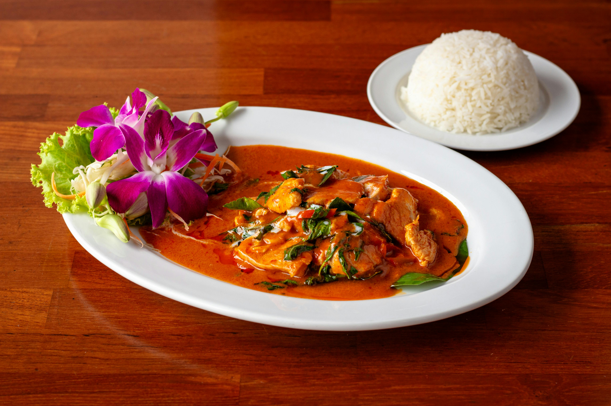

# Thai Red Chicken Curry

**Serves:** 4

**Prep Time:** 10 minutes

**Cook Time:** 20 minutes

## Overview
Classic Thai restaurant favorite with red curry paste. Color from chillies; use homemade paste for best flavor. Thin sauce with chicken and vegetables.

## Ingredients
### Fat
- 2 tbsp coconut oil or rapeseed (canola) oil

### Paste
- 1 batch Thai red curry paste

### Protein
- 450 g (1 lb) skinless chicken thigh fillets, cut into bite-size pieces

### Liquid
- 250 ml (1 cup) Thai chicken stock
- 400 ml (1¾ cups) thick coconut milk

### Vegetables
- About 225 g (8 oz) vegetables, such as baby aubergine (eggplant), sliced red (bell) pepper, green (string) beans

### Seasoning
- 3 tbsp Thai fish sauce
- 1 tbsp light soy sauce
- 1 tsp tamarind paste
- 1 tbsp palm sugar

### Garnish
- Coriander (cilantro) leaves
- 1 tsp roasted Thai chilli oil, to garnish (optional)

## Method

### Stage 1 – Fry paste and chicken
1. Heat oil in large frying pan or wok over medium–high heat.
1. Add red curry paste; fry 30 seconds.
1. Add chicken; fry 2 mins until 50% cooked.

### Stage 2 – Add liquids and simmer
1. Stir in stock and coconut milk; simmer 5 mins to thicken.

### Stage 3 – Add veggies and season
1. Add vegetables, fish sauce, soy sauce, tamarind, and palm sugar.
1. Simmer 3 mins until veggies cooked.
1. Taste and adjust; cook down to desired consistency.

### Stage 4 – Garnish and serve
1. Garnish with coriander and chilli oil.

## Notes
- Many soy and Thai fish sauces contain gluten; use gluten-free brands.
- Color varies with chillies in paste.
- Use homemade paste for less salty/spicy.

## Serving
- Serve with jasmine rice.
- Garnish as desired.

## Storage
- Refrigerate 2–3 days in airtight container.
- Reheat gently; add water if thick.
- Freeze up to 2 months.