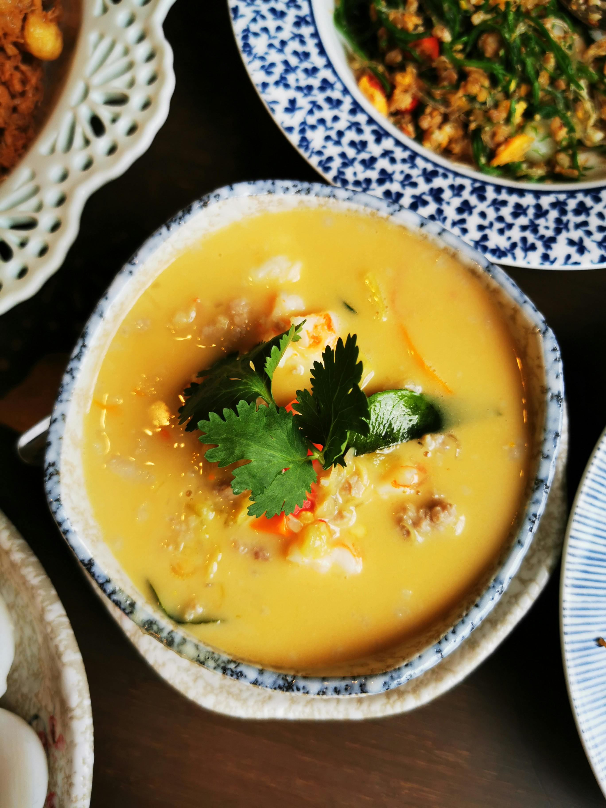

# Yellow Chicken Curry

**Serves:** 4

**Prep Time:** 10 minutes

**Cook Time:** 20 minutes

## Overview
Mild yellow curry with Indian influences from turmeric and curry powder. Similar to chicken korma but spicier. Use "cracking the coconut milk" method for natural oil, or add oil. Serve with rice.

## Ingredients
### Vegetables
- 10 small waxy new potatoes, quartered
- 1 carrot, cut into thin rounds
- 10 baby plum tomatoes, halved (optional)

### Dairy
- 600 ml (2¾ cups) thick coconut milk

### Fat
- 2 tbsp rapeseed (canola) oil (if not using coconut cracking method)

### Paste and sweeteners
- 1 batch yellow curry paste
- 1 tbsp palm sugar
- 1 tbsp tamarind paste

### Protein
- 600 g (1 lb 5 oz) skinless chicken thigh fillets, cut into bite-size pieces

### Spices
- 1 tsp curry powder

### Seasoning
- 2 tbsp Thai fish sauce

### Garnish
- 4 tbsp fried garlic
- Chopped chillies (optional)
- Chopped coriander (cilantro) leaves (optional)

## Method

### Stage 1 – Cook potatoes
1. Boil potatoes in saucepan until soft, about 10 mins.
1. Drain and set aside.

### Stage 2 – Crack coconut milk
1. Heat wok or large frying pan over medium–high heat.
1. Add 200 ml (¾ cup) coconut milk; simmer until it splits (oil rises).
1. If not splitting, proceed anyway.

### Stage 3 – Fry paste and chicken
1. Add curry paste; fry 30 seconds.
1. Stir in palm sugar and tamarind paste.
1. Add chicken; fry 2 mins until 80% cooked.

### Stage 4 – Add remaining ingredients
1. Add curry powder, carrot, and remaining coconut milk.
1. Simmer 5 mins to thicken.
1. Stir in fish sauce; taste and adjust.

### Stage 5 – Finish and garnish
1. Stir in cooked potatoes and tomatoes.
1. Garnish with fried garlic, chillies, and coriander.

## Notes
- Many Thai fish sauces contain gluten; use gluten-free brands.
- Indian-influenced with turmeric and curry powder.
- "Cracking" method uses natural coconut oil.

## Serving
- Serve with rice.
- Garnish as desired.

## Storage
- Refrigerate 2–3 days in airtight container.
- Reheat gently; add water if thick.
- Freeze up to 2 months.
