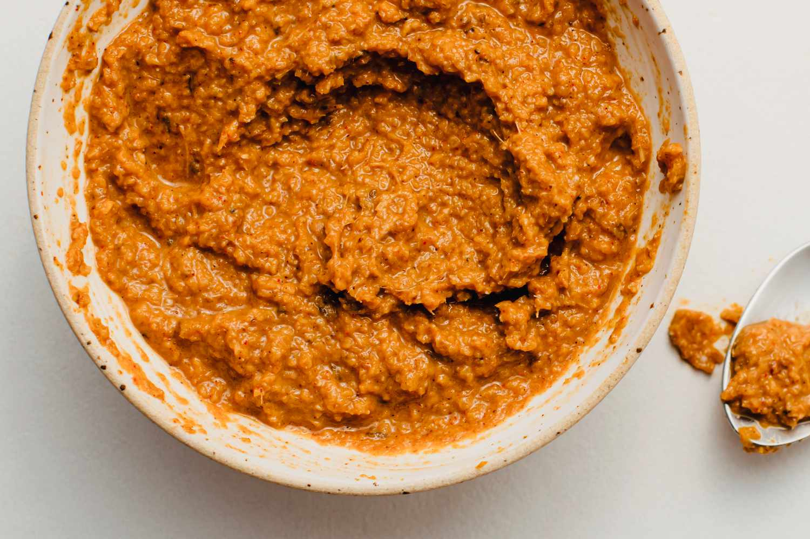

# Massaman Curry Paste

**Makes:** Approx. 250 ml (1 cup)

**Prep Time:** 40–60 minutes

**Cook Time:** 5 minutes

## Overview
Spice-heavy paste for massaman curries, with Muslim roots. More spices than other curries; requires pounding for smooth texture.

## Ingredients
### Whole spices
- 1 tbsp coriander seeds
- 1½ tbsp cumin seeds
- 5 whole cloves
- 1 tbsp black peppercorns
- 1 whole nutmeg
- Seeds from 6 green cardamom pods
- 5 cm (2 in) piece cinnamon stick

### Chillies and aromatics
- 12 dried red bird’s eye chillies, soaked in water for 30 minutes and cut into small pieces
- 8 garlic cloves, smashed
- 2–3 small shallots, thinly sliced
- 1 long lemongrass stalk (white part only), thinly sliced (about 3 generous tbsp)
- 1 thumb-sized piece galangal, sliced into thin rounds
- Zest of ½ lime
- 3 lime leaves (fresh or frozen)

### Paste
- 1 tsp shrimp paste

## Method

### Stage 1 – Toast and grind spices
1. Heat pan over medium–high heat; toast whole spices until fragrant but not smoking.
1. Transfer to pestle and mortar; cool and pound to fine powder.

### Stage 2 – Pound to paste
1. Add soaked chillies; pound to paste.
1. Add garlic, shallots, lemongrass, galangal, lime zest, and lime leaves.
1. Pound 40–60 mins until smooth and buttery.

### Stage 3 – Add shrimp paste
1. Add shrimp paste; pound to incorporate.
1. Taste and adjust.

## Notes
- Use mortar and pestle for best flavor; blender alternative possible but less authentic.
- Keeps 2 weeks refrigerated; freezes 2 months.

## Serving
- Not served directly; used in massaman curries.

## Storage
- Refrigerate 2 weeks in airtight container.
- Freeze up to 2 months; thaw before use.