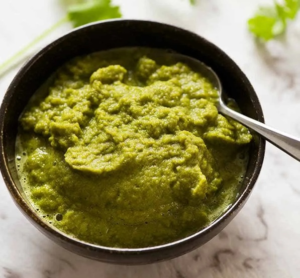

# Thai Green Curry Paste

**Makes:** Approx. 250 ml (1 cup)

**Prep Time:** 40–60 minutes

**Cook Time:** 5 minutes

## Overview
Spicy paste with green bird's eye chillies. Adjust chillies for heat; taste and balance flavors. Use fresh for best results.

## Ingredients
### Whole spices
- 1 tsp cumin seeds
- 1 tsp coriander seeds
- 1½ tsp white pepper

### Chillies and aromatics
- About 20 green bird’s eye chillies, roughly chopped (more or less to taste)
- 2 lemongrass stalks (white parts only), thinly sliced (about 4 generous tbsp)
- 8 garlic cloves, smashed
- 1 thumb-sized piece galangal, thinly sliced
- 3 small shallots, roughly chopped
- 10 Thai sweet basil stalks (about 1 tbsp)
- 5 coriander (cilantro) stalks (about ½ tbsp)
- Zest of ½ lime
- 5 lime leaves (fresh or frozen)

### Paste
- 1 tsp shrimp paste

## Method

### Stage 1 – Toast and grind spices
1. Heat frying pan over medium heat; toast cumin and coriander until fragrant but not smoking.
1. Transfer to pestle and mortar; cool and pound to powder with white pepper.

### Stage 2 – Pound to paste
1. Add green chillies; pound to paste.
1. Add lemongrass, garlic, galangal, shallots, basil stalks, coriander stalks, lime zest, and lime leaves.
1. Pound 40–60 mins until smooth and buttery.

### Stage 3 – Add shrimp paste
1. Stir in shrimp paste; pound to incorporate.

## Notes
- Adjust chillies for desired heat.
- Use mortar and pestle for best flavor; add water if blending.
- Best fresh; keeps 1 week refrigerated; freezes 3 months.

## Serving
- Not served directly; used in green curries.

## Storage
- Refrigerate 1 week in airtight container.
- Freeze up to 3 months; thaw before use.