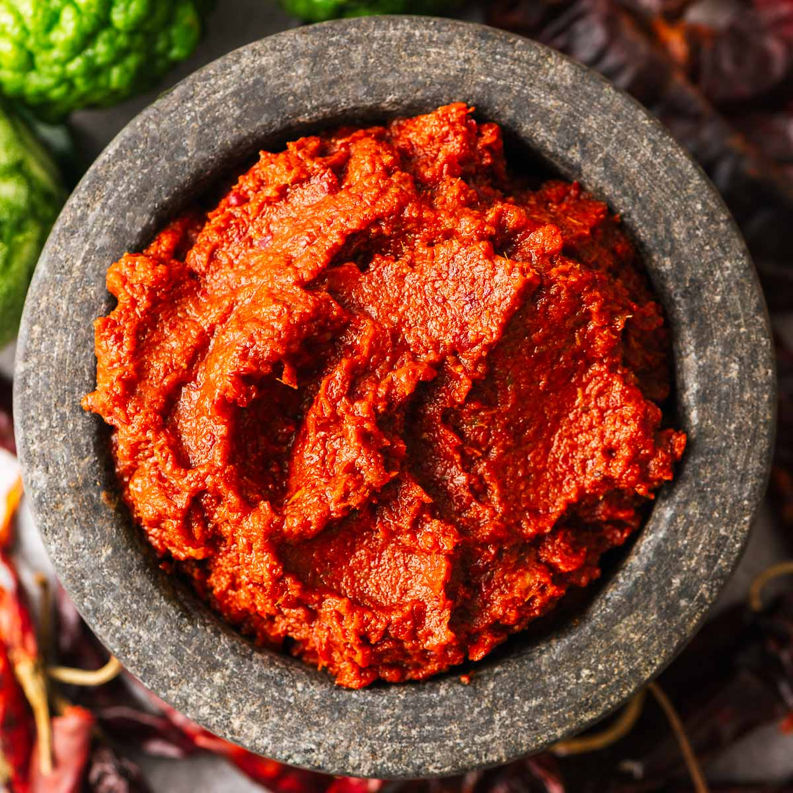

# Thai Red Curry Paste

**Makes:** Approx. 250 ml (1 cup)

**Prep Time:** 40–60 minutes

**Cook Time:** 5 minutes

## Overview
Common Thai curry paste with moderate spice. Adjust chillies for heat; add more spur chillies for vibrant red color.

## Ingredients
### Whole spices
- 1 generous tbsp cumin seeds
- 1 generous tbsp coriander seeds
- 1½ tsp white pepper

### Chillies and aromatics
- 12 dried red bird’s eye chillies, soaked in water for 30 minutes and cut into small pieces
- 12 garlic cloves, roughly chopped
- 2 medium shallots, finely chopped
- 1 thumb-sized piece galangal, thinly sliced
- 2 red spur chillies, thinly sliced
- 1 lemongrass stalk, tough outer part removed and thinly sliced
- 10 thick coriander stalks (about 1 generous tbsp)
- Zest of ½ lime

### Paste
- 1 tsp shrimp paste

## Method

### Stage 1 – Toast and grind spices
1. Heat frying pan over medium heat; toast cumin and coriander until fragrant but not smoking.
1. Transfer to pestle and mortar; cool and pound to powder with white pepper.

### Stage 2 – Pound to paste
1. Add dried bird’s eye chillies; pound to paste.
1. Add garlic, shallots, galangal, spur chillies, lemongrass, coriander stalks, and lime zest.
1. Pound 40–60 mins until smooth.

### Stage 3 – Add shrimp paste
1. Add shrimp paste; pound 5 mins to incorporate.

## Notes
- Adjust chillies for desired heat.
- Use mortar and pestle for best flavor; add water if blending.
- Keeps 2 weeks refrigerated; freezes 2 months.

## Serving
- Not served directly; used in red curries.

## Storage
- Refrigerate 2 weeks in airtight container.
- Freeze up to 2 months; thaw before use.