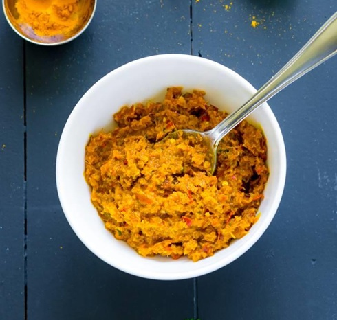

# Yellow Curry Paste

**Makes:** Approx. 250 ml (1 cup)

**Prep Time:** 40–60 minutes

**Cook Time:** 5 minutes

## Overview
Versatile paste with yellow color from turmeric. Use fresh turmeric for better flavor and moisture; it stains, so be careful.

## Ingredients
### Whole spices
- 1½ tsp coriander seeds
- 1½ tsp cardamom seeds
- ½ tsp green cardamom seeds (optional)
- 1½ tsp white pepper

### Chillies and aromatics
- 12 dried red bird’s eye chillies, soaked in water for 30 minutes and cut into small pieces
- 12 garlic cloves
- 1 thumb-sized piece galangal, thinly sliced
- 1 thumb-sized piece fresh turmeric, peeled and thinly sliced, or 1–1½ tsp ground turmeric
- 3 lime leaves, stalks removed and finely chopped
- 3 medium shallots, halved
- 10 thick coriander stalks (about 1 generous tbsp)
- 2 tbsp sliced lemongrass (½ lemongrass stalk)

### Paste
- 1 tsp shrimp paste

## Method

### Stage 1 – Toast and grind spices
1. Heat pan over medium–high heat; toast whole spices until fragrant but not smoking.
1. Transfer to pestle and mortar; pound to fine powder with white pepper.

### Stage 2 – Pound to paste
1. Add dried chillies; pound to paste.
1. Add garlic, galangal, turmeric, lime leaves, shallots, coriander stalks, and lemongrass.
1. Pound 40–60 mins until smooth and buttery.

### Stage 3 – Add shrimp paste
1. Add shrimp paste; pound to incorporate.
1. Check seasoning.

## Notes
- Fresh turmeric stains; use gloves.
- Use mortar and pestle for best flavor.
- Keeps 2 weeks refrigerated; freezes 2 months.

## Serving
- Not served directly; used in yellow curries.

## Storage
- Refrigerate 2 weeks in airtight container.
- Freeze up to 2 months; thaw before use.