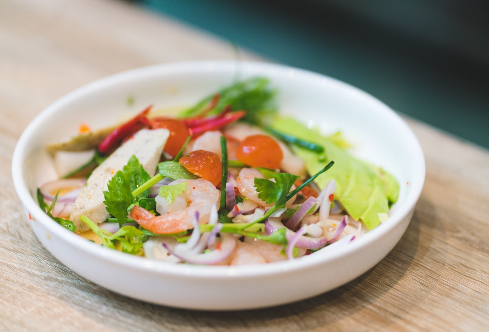

# Glass Noodle Salad

**Serves:** 2

**Prep Time:** 15 minutes

**Cook Time:** 15 minutes

## Overview
Spicy Thai salad with glass noodles, prawns, and pork. Nostalgic dish from Thai barbecues; serve hot or at room temperature.

## Ingredients
### Noodles
- 100 g (3½ oz) raw glass noodles

### Vegetables
- 6 baby plum tomatoes, quartered
- 4 shallots, thinly sliced
- 1 stick celery with leaves, thinly sliced

### Protein
- 10 small (or a few large) raw prawns (shrimp), peeled and deveined
- 125 g (4½ oz) minced (ground) pork

### Nuts and herbs
- 10 roasted cashews, roughly chopped
- 3 tbsp roughly chopped coriander (cilantro) leaves

### Dressing
- 1 tbsp dried shrimp, soaked in warm water for 10 minutes
- 3 garlic cloves, smashed
- 2 tbsp finely chopped coriander (cilantro) stalks
- 3 red bird’s eye chillies, roughly chopped
- 1 tbsp palm sugar, grated
- 3 tbsp Thai fish sauce
- 3½ tbsp lime juice

## Method

### Stage 1 – Soak noodles
1. Soak noodles in warm water 10 mins until soft.

### Stage 2 – Make dressing
1. Pound soaked shrimp, garlic, coriander stalks, chillies, and palm sugar in pestle and mortar to paste.
1. Stir in fish sauce and lime juice; taste and adjust.

### Stage 3 – Prepare salad base
1. Place tomatoes, shallots, and celery in salad bowl.

### Stage 4 – Cook noodles and prawns
1. Boil water; cook soaked noodles 2 mins.
1. Drain; set aside.
1. In same pan, keep 125 ml (½ cup) water; cook prawns 2 mins until done.
1. Transfer prawns to rest on noodles.

### Stage 5 – Cook pork
1. Add minced pork to remaining water; cook on high, stirring, until water dissolves and pork is cooked (~5 mins).

### Stage 6 – Assemble salad
1. Add prawns and pork to salad bowl.
1. Top with cooked noodles.
1. Pour dressing over; toss to separate noodles.
1. Add cashews and coriander; stir.
1. Serve immediately or chill 30 mins.

## Notes
- Many Thai fish sauces contain gluten; use gluten-free.
- Adjust chillies for heat.
- Serve hot for best flavor.

## Serving
- Serve as side or main with Thai barbecue.
- Garnish with extra herbs.

## Storage
- Refrigerate 1 day in airtight container.
- Best fresh; dressing may separate.