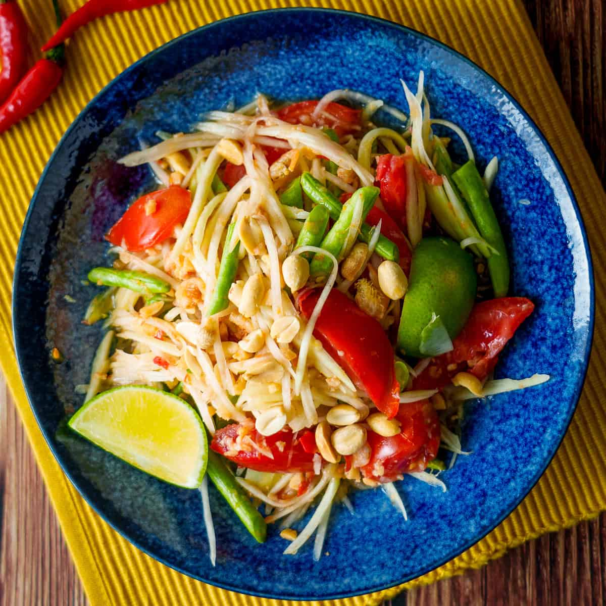

# Green Papaya Salad

**Serves:** 4

**Prep Time:** 15 minutes

**Cook Time:** 5 minutes

## Overview
Famous Thai salad (som tum) with sour, sweet, savory, and spicy flavors. Pounded dressing coats crispy papaya and vegetables. Make ahead; won't wilt.

## Ingredients
### Nuts and shrimp
- 2 tbsp peanuts (raw or roasted)

### Dressing
- 1½ tbsp dried baby shrimp
- 3 garlic cloves
- 2–3 red bird’s eye chillies
- 12 green (string) beans, cut into 2.5 cm (1 in) pieces
- 1 tbsp palm sugar, grated and finely chopped
- 1 tbsp tamarind paste
- 2 tbsp Thai fish sauce
- Juice of 1 large lime

### Vegetables and fruit
- 400 g (14 oz) green papaya, grated
- 1 medium carrot, peeled and grated
- 6 baby plum tomatoes, halved

### Herbs
- 2 tbsp finely chopped coriander (cilantro)
- 2 tbsp Thai sweet basil (or any basil), roughly chopped

## Method

### Stage 1 – Roast peanuts
1. Pound peanuts lightly in pestle and mortar.
1. Roast in frying pan over medium–high heat until light brown.
1. Set aside (skip if using roasted peanuts).

### Stage 2 – Make dressing
1. Pound dried shrimp in pestle and mortar to coarse paste.
1. Add garlic and chillies; pound into shrimp.
1. Add green beans; pound to bruise but keep pieces.
1. Add sugar, tamarind, fish sauce, and lime juice; stir to dissolve sugar.
1. Taste and adjust flavors.

### Stage 3 – Assemble salad
1. Place grated papaya and carrot in salad bowl.
1. Pour dressing over; stir to coat.
1. Add tomatoes, peanuts, coriander, and basil; stir well.
1. Chill in fridge before serving.

## Notes
- Many Thai fish sauces contain gluten; use gluten-free.
- Use pestle and mortar for authentic texture; food processor alternative.
- Adjust dressing for balance.

## Serving
- Serve chilled as side or starter.
- Garnish with extra herbs.

## Storage
- Refrigerate 2–3 days in airtight container.
- Flavors develop; best after chilling.