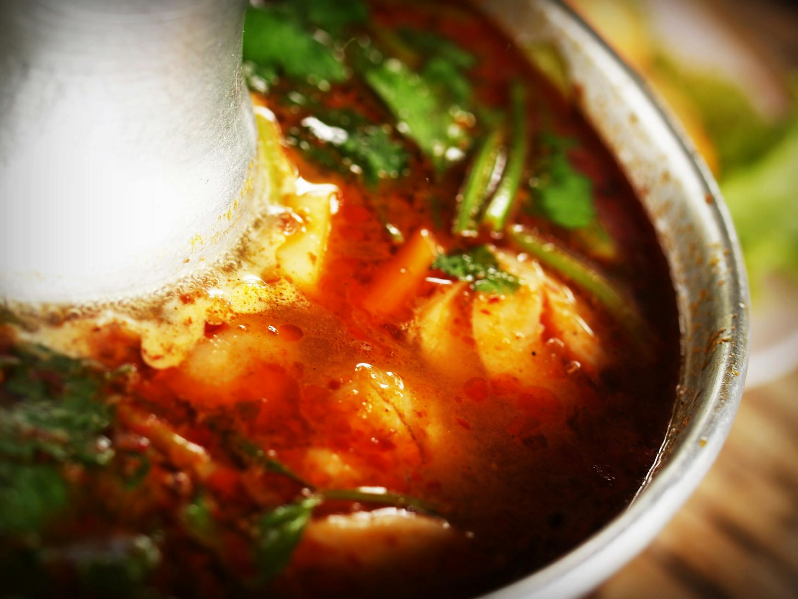

# Tom Yum Gai Soup (Hot and Sour Chicken Soup)

**Serves:** 4–6

**Prep Time:** 10 minutes

**Cook Time:** 20 minutes

## Overview
When you go out for Thai food this is sure to be on the menu. I love the spiciness of this soup – you get a good hit of spice but it doesn’t linger. Some chefs add sugar to it but, for me, this is a spicy, savoury and tart soup with only a hint of natural sweetness from the fried shallots and tomatoes. Do, of course, taste the soup and adjust the flavour to your liking, adding sugar if you want. It makes a delicious starter but you could bulk it up by adding other ingredients such as noodles to make it a light main. The word ‘gai’ means chicken, so this is a chicken tom yum soup. You could substitute prawn (shrimp) stock and prawns to make a delicious tom yum goong, or go vegetarian and use water and tofu.

## Ingredients
### Fat
- 2 tbsp rapeseed (canola) oil

### Aromatics
- 2 shallots, finely chopped
- 1 lemongrass stalk, smashed and cut into about 5 pieces
- 8 lime leaves, stalks removed and leaves thinly sliced
- 2.5cm (1in) piece of galangal, thinly sliced
- 3 garlic cloves, roughly chopped

### Protein
- 250g (9oz) chicken breast, cut into bite-size pieces

### Vegetables
- 8 mushrooms, quartered
- 2 tomatoes, quartered
- 3 spring onions (scallions), roughly chopped
- Handful of chopped or sliced vegetables, such as cabbage, bean sprouts, carrots (optional)

### Seasonings
- 1 tbsp tamarind paste
- 1 tbsp chilli jam (nam prik pao)
- 1 tbsp roasted Thai chilli oil with some of the goop at the bottom
- 3–4 tbsp Thai fish sauce*
- 3 green bird’s eye chillies, smashed and cut lengthwise
- 1 small handful of coriander (cilantro), roughly chopped
- 2 tsp palm or white sugar (optional and to taste)

## Method

### Stage 1 – Prepare aromatics
1. Heat the oil in a large saucepan over a medium–high heat until shimmering hot.
1. Add the shallots and fry for about a minute.
1. Add the stock or water, lemongrass, lime leaves, galangal and garlic and bring to a boil.
1. Reduce the heat and simmer this aromatic liquid for about 10 minutes.

### Stage 2 – Cook chicken
1. Stir in the chicken and continue cooking until the chicken is cooked through (about 5 minutes).
1. Add the tamarind paste and stir well.

### Stage 3 – Add seasonings and vegetables
1. Stir in the mushrooms, chilli jam, chilli oil, fish sauce, green bird’s eye chillies and coriander (cilantro).
1. Taste and adjust seasoning as desired; add sugar if wanted.
1. Add the quartered tomatoes and let them cook through in the hot stock.
1. Add the spring onions (scallions) and any other vegetables.

### Stage 4 – Serve
1. Ladle the soup into bowls and enjoy.

## Notes
* Many Thai fish sauces contain gluten but there are gluten-free brands available.

## Serving
- Serve hot as a starter or light main.

## Storage
- Refrigerate leftovers in airtight container for up to 2 days.
- Reheat gently; flavors intensify.