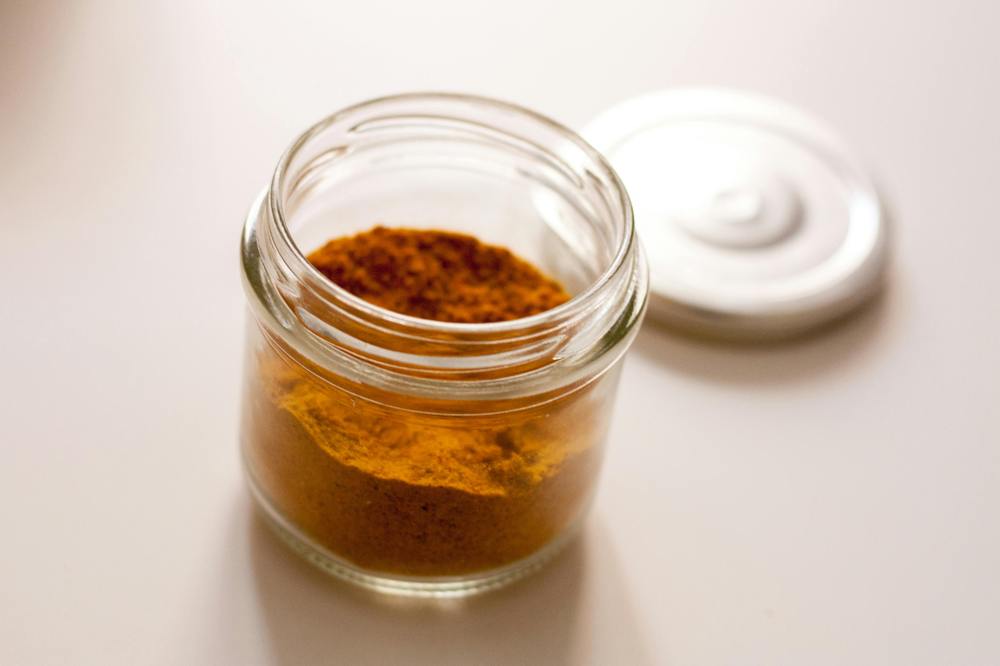

# Thai Curry Powder

**Makes:** about 145g (1¼ cups)

**Prep Time:** 8 minutes

**Cook Time:** 2 minutes

## Overview
I always have some of this homemade curry powder to hand. It’s slightly different to the curry powder I featured in my Indian cookbooks and it’s a good all-rounder. Thai food has many influences, including Indian, so a few of the recipes in this book call for curry powder. If you want to make your own, you’ll get great results with this.

## Ingredients
### Whole spices
- 3 tbsp coriander seeds
- 3 tbsp cumin seeds
- 2 tbsp black peppercorns
- 1 tbsp fennel seeds
- 1 tbsp black mustard seeds
- 6cm (2.5in) piece of cinnamon stick or cassia bark
- 2 Indian bay leaves (cassia leaves)
- 1 tsp fenugreek seeds
- 2 star anise
- 7 cardamom pods, lightly bruised
- 4 Kashmiri dried red chillies (optional)

### Ground spices
- 1 tbsp ground turmeric
- 1 tbsp hot chilli powder (optional)
- ½ tsp garlic powder
- 1 tsp dried onion powder

## Method

### Stage 1 – Roast spices
1. Roast all the whole spices, including the dried red chillies (if using), in a dry frying pan over a medium–high heat until warm to the touch and fragrant but not yet smoking.
1. Move the spices around in the pan so that they roast evenly.
1. Be very careful not to burn the spices or they will turn bitter.

### Stage 2 – Grind and combine
1. Tip the warm spices onto a plate and leave to cool.
1. Grind to a fine powder in a spice grinder or pestle and mortar.
1. Add the turmeric, chilli powder (if using), garlic powder and onion powder and stir to combine.

## Notes
- Use within 2 months for best flavor.

## Serving
- Use in Thai curries or as a general spice mix.

## Storage
- Store in an air-tight container in a cool, dark place.