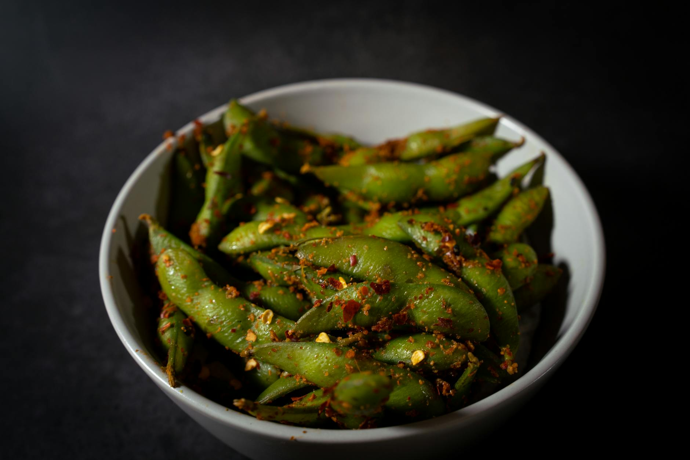

# Thai-Style Chilli Garlic Edamame

**Serves:** 4 as a starter

**Prep Time:** 5 minutes

**Cook Time:** 10 minutes

## Overview
I’m always happy when I go out for a Thai meal and I see edamame on the menu as a starter. It might be a very simple dish to make but it’s so addictive. I just can’t get enough and the great thing is you can make it at home with equally delicious results. You will find bags of frozen edamame in pods at most Asian grocers and they are also found in the freezer section of many supermarkets. The pods aren’t eaten but it is important to buy the edamame in the pod so you can pick them up and scrape the beans and all that amazing flavour stuck to the pod straight into your mouth.

## Ingredients
### Vegetables
- 500g (1lb 2oz) edamame beans in the pod

### Aromatics
- 3 garlic cloves, finely chopped

### Fat
- 1½ tsp rapeseed (canola) oil
- 1 tbsp sesame oil

### Seasonings
- 1 tbsp red chilli flakes
- 1 tbsp light soy sauce*
- Flaky sea salt, to taste

## Method

### Stage 1 – Cook edamame
1. Bring a saucepan of water to a boil.
1. Add the edamame and simmer over a medium heat for 3 minutes, then drain and keep warm.

### Stage 2 – Make marinade
1. Whisk together the garlic, both oils, chilli flakes and soy sauce in a serving bowl.
1. Adjust the flavour by adding more chilli flakes if desired.

### Stage 3 – Combine and serve
1. Add the hot edamame and stir well to combine.
1. Season with flaky salt to taste and serve immediately.

## Notes
* Many soy sauces contain gluten but gluten-free brands are available.

## Serving
- Serve hot as a starter.

## Storage
- Best served immediately; doesn't store well.