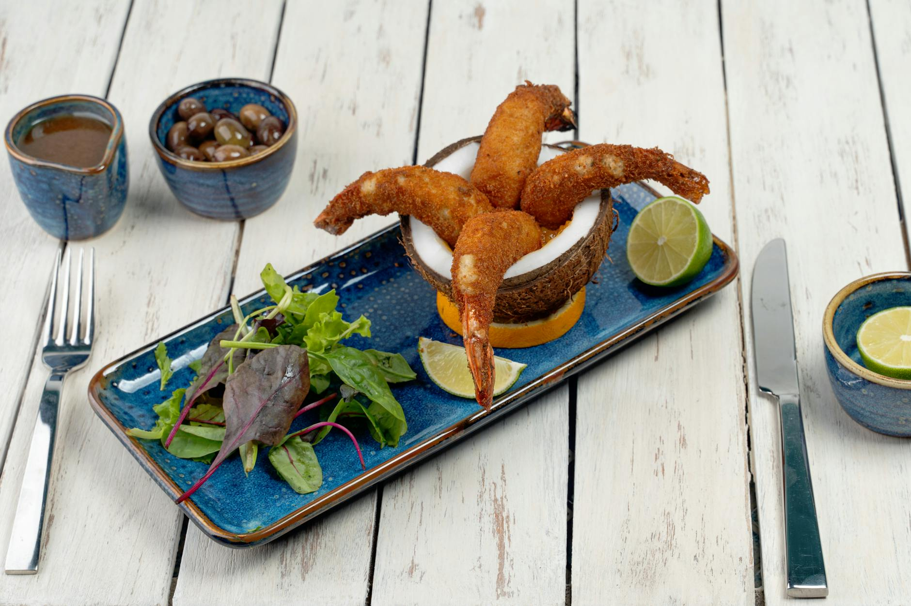

# Firecracker Prawns

**Makes:** 20

**Prep Time:** 20 minutes

**Cook Time:** 10 minutes

## Overview
Prawns (shrimp) curl naturally into half-circles. To get your firecracker prawns looking right you need to do some cosmetic work but it’s an easy job: the underside of the prawns needs to be scored in three places so that you can straighten them up. I have seen this popular starter prepared with many different marinades but as the name implies, it’s the chilli that is important. In this recipe I suggest using both chilli paste and roasted chilli flakes. How much of each you add, however, is completely down to you and how spicy you like your food. I recommend serving these with sweet chilli sauce.

## Ingredients

### Protein
- 20 large raw prawns (shrimp), peeled and deveined but tails left on

### Marinade
- 1 garlic clove, finely minced
- 1 tsp soy sauce
- 1 tsp honey
- 1 tbsp homemade chilli jam (nam prik pao)
- 1 tsp roasted chilli flakes (optional)
- ½ tsp lemon juice

### Other
- 10 egg roll wrappers
- 1 tsp cornflour (cornstarch)
- Rapeseed (canola) oil, for deep-frying or shallow-frying

## Method

### Stage 1 – Prepare Prawns
1. Using a sharp knife, make three shallow slits in the underside of each prawn (shrimp): one at one end, then in the middle and one more at the other end.
2. Then bend the prawn upwards to straighten.
3. Pat the prawns dry with a paper towel.
4. Whisk the marinade ingredients in a bowl and taste to adjust the seasoning – add the roasted chilli flakes if you want additional heat.
5. Mix the prawns into the marinade and marinate for 30 minutes in the fridge.

### Stage 2 – Prepare Wrappers
1. Meanwhile, cut the egg roll wrappers in half diagonally, so that you get two triangles out of each square wrapper.
2. Cover and set aside until ready to assemble.
3. Whisk the cornflour (cornstarch) with 1 tablespoon of cold water with a fork to make a thick paste.

### Stage 3 – Assemble
1. When you’re ready to put this delicious starter together, place one of the triangle egg rolls in front of you with the long end on the left.
2. Place one of the marinated prawns about a quarter of the way up so that the tail end is sticking over the long end of the wrapper but the head end is on the wrapper.
3. Fold the bottom corner of the triangle over the prawn and roll it up until you reach the right corner of the triangle and fold it over so that the prawn is securely in the pastry with just the tail end visible.
4. Brush with a little cornflour mixture to secure and then continue wrapping upwards until you have a neatly wrapped prawn.
5. Brush again with the cornflour mixture to secure.
6. Repeat with the remaining prawns.

### Stage 4 – Cook
1. To cook, either deep-fry or shallow-fry in about 2cm (1in) of oil over a medium–high heat until the wrappers are a golden brown and the prawns are cooked through.
2. This should take about 3 minutes.
3. Serve hot.

## Notes
- Adjust chilli to taste.

## Serving
Serve hot with sweet chilli sauce.

## Storage
- Best served immediately; can be kept warm for 10-15 mins.