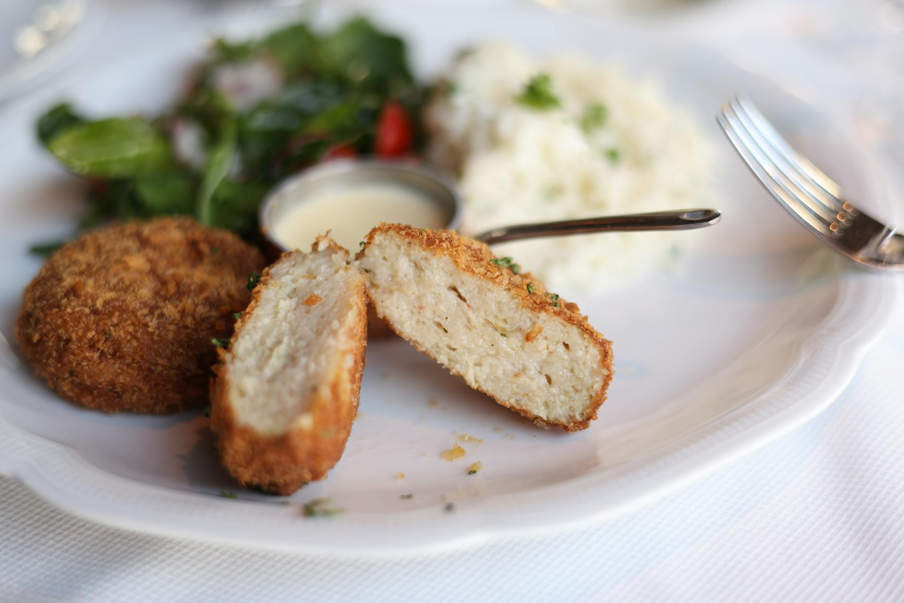

# Fishcakes

**Makes:** 12

**Prep Time:** 15 minutes

**Cook Time:** 10 minutes

## Overview
Thai fishcakes (often called ‘tod mun pla’ on menus) are known for their spongy consistency, which I’m not fond of; that sponginess comes from the egg, so I tend to leave it out. Fishcakes are usually deep-fried in street stalls and restaurants, but I find it much easier to shallow-fry them. These are great served with sweet chilli sauce, Thai seafood dipping sauce and/or cucumber and chilli relish.

## Ingredients

### Protein
- 500g (1lb 2oz) meaty fish fillets, such as lemon sole, cod or salmon, skinned

### Aromatics
- 1 tbsp finely chopped coriander (cilantro) (optional)
- 3 lime leaves, stalks removed and finely julienned
- 2 spring onions (scallions), thinly sliced
- 8 green (string) beans, thinly sliced

### Seasoning
- 3–4 tbsp Thai red curry paste
- 1 tbsp Thai fish sauce (gluten-free brands are available)
- 1 tbsp lime juice

### Sweeteners
- 1 tsp sugar (optional)

### Other
- 1 medium egg (optional)
- 1 tbsp tapioca starch

### Fat
- 5 tbsp rapeseed (canola) oil

## Method

### Stage 1 – Prepare Paste
1. Place the fish in a food processor.
2. Add the rest of the ingredients up to and including the lime juice. If you are using egg for a spongier fishcake, add it at this point too.
3. Blend until you have a fine fish paste. It is worth blending for a few minutes as the heat from your blender will help thicken the paste.

### Stage 2 – Mix
1. Transfer to a bowl and add the tapioca starch, lime leaves, spring onions (scallions) and beans and mix well with your hand.
2. Divide into twelve patties.
3. I often fry a spoonful of the paste to test for seasoning, then adjust if necessary.

### Stage 3 – Cook
1. Heat the oil in a large, non-stick frying pan over a medium heat.
2. Fry the fishcakes, in batches of about three or four, for about 2 minutes on one side, then flip over to cook the other side until they are nicely browned and cooked through.
3. Each batch should only take about 4 minutes.
4. Serve hot.

## Notes
- Egg is optional for sponginess.

## Serving
Serve hot with sweet chilli sauce, Thai seafood dipping sauce and/or cucumber and chilli relish.

## Storage
- Best served immediately; can be kept warm for 10 mins. Refrigerate leftovers for 1 day.