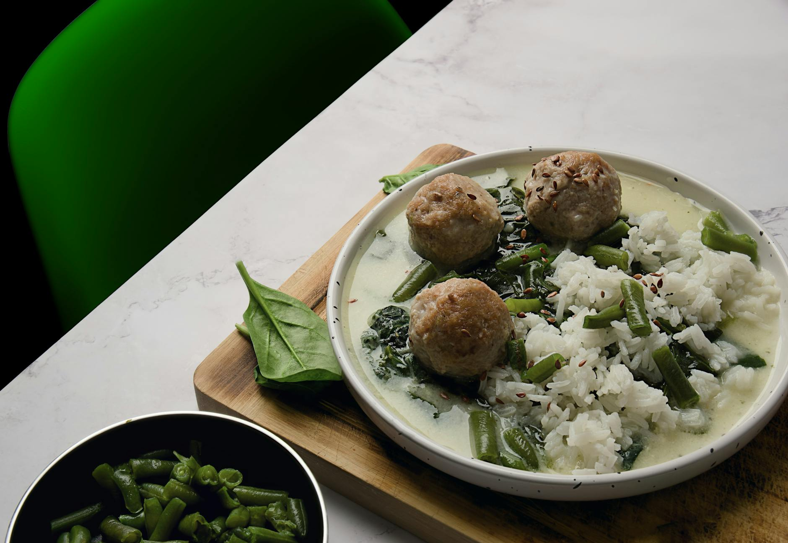

# Pork Meatballs

**Makes:** 20

**Prep Time:** 10 minutes

**Cook Time:** 10 minutes

## Overview
These meatballs are packed with delicious flavours. I like to serve them with a couple of dips like sweet chilli sauce and chilli jam. Before cooking them, I recommend frying up a bit of the prepared meat and adjusting the flavour to taste.

## Ingredients

### Aromatics
- 1 lemongrass stalk (white part only), bruised and cut into rings
- 5 spring onions (scallions), finely chopped
- 4 garlic cloves, finely chopped
- 2.5cm (1in) piece of galangal, finely chopped
- 3 red bird’s eye chillies, finely chopped
- 3 lime leaves, stalks removed and leaves finely chopped
- 30g (1 cup) fresh coriander (cilantro), finely chopped

### Protein
- 500g (1lb) minced (ground) pork

### Seasoning
- 2 tbsp Thai fish sauce (gluten-free brands are available)

### Sweeteners
- 1 tsp clear honey or grated palm sugar

### Fat
- 3 tbsp rapeseed (canola) oil

### Serving
- Lime wedges, to serve (optional)

## Method

### Stage 1 – Prepare Paste
1. Place the lemongrass in a pestle and mortar and pound to a fine paste.
2. Add the spring onions (scallions), garlic, galangal, chillies and lime leaves and pound until you have a nice paste and the ingredients are thoroughly combined. This should only take about 5 minutes.

### Stage 2 – Mix Meatballs
1. Transfer to a bowl and add the honey or palm sugar, fish sauce, coriander (cilantro) and pork, then mix this all up with your hands. For a finer finish, you can blend this mixture in a food processor.
2. Form into about twenty balls roughly 3.75cm (1½in) in diameter. At this point you could use them in a soup by simmering them in the broth.

### Stage 3 – Cook
1. To serve as a starter, heat the oil in a frying pan over a medium heat.
2. When hot, add the meatballs and brown them all over, moving them around the pan regularly.
3. After about 3–5 minutes they should be nicely browned and cooked through.
4. Serve immediately with a squeeze of lime juice if desired.

## Notes
- Before cooking them, I recommend frying up a bit of the prepared meat and adjusting the flavour to taste.

## Serving
Serve with a couple of dips like sweet chilli sauce and chilli jam. Serve immediately with lime wedges.

## Storage
- Keeps 1-2 days refrigerated
- Can be frozen for up to 1 month