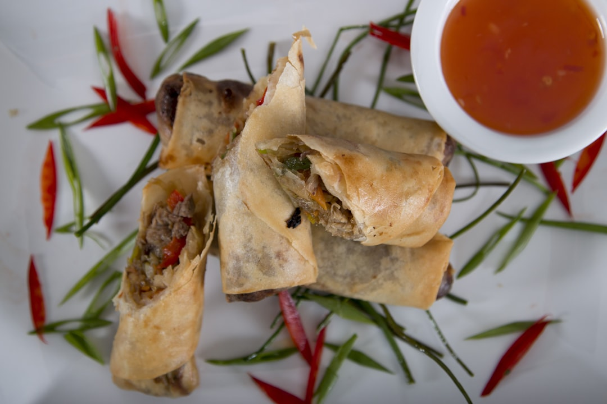

# Pork and Vegetable Spring Rolls

**Makes:** 30

**Prep Time:** 30 minutes

**Cook Time:** 20 minutes

## Overview
Made popular by Chinese restaurants and takeaways, these are another menu item that have been adapted to have a subtle Thai flavour. You need to plan ahead as the filling must be cold (or room temperature) before rolling your spring rolls. To make these vegetarian, simply leave out the meat.

## Ingredients

### Protein
- 450g (1lb) pork shoulder, cut into thin slices against the grain

### Vegetables
- 200g (7 oz) Chinese broccoli or young broccoli, finely chopped
- 200g (7 oz) fresh bean sprouts
- 200g (7 oz) carrots, grated
- 3 tbsp coriander (cilantro) stalks, finely chopped
- 4 spring onions (scallions), finely chopped

### Marinade
- 2 tbsp light soy sauce
- 1 tbsp Chinese rice wine or dry sherry
- 1 tsp sesame oil
- 1 tbsp Thai fish sauce
- ½ tsp palm sugar, finely grated
- ¼ tsp white pepper
- 1 tbsp cornflour (cornstarch)

### Seasoning
- ½ tsp palm sugar, grated (or use white sugar)
- 1 tbsp Chinese rice wine or dry sherry
- 1 tbsp dark soy sauce
- 1 tsp Thai fish sauce
- ½ tsp white pepper
- 1 tbsp cornflour (cornstarch), whisked with 2 tbsp water to make a paste

### Fat
- 6 tbsp rapeseed (canola) oil, plus 750ml (3 cups) for deep-frying

### Other
- 30 x 10cm (4in) spring roll wrappers
- 1 egg, beaten

### Serving
- Sweet chilli sauce

## Method

### Stage 1 – Marinate Pork
1. In a large bowl, whisk the marinade ingredients together until smooth with no sugar lumps.
2. Add the slivered pork and mix well with your hand so it is evenly coated.
3. Marinate for at least 1 hour or overnight (the longer the better).
4. Bring the meat to room temperature before cooking.

### Stage 2 – Cook Vegetables
1. When ready to cook, heat a wok or frying pan over a medium–high heat until a bead of water evaporates on contact.
2. Add 3 tablespoons of oil and swirl it around to coat the surface.
3. Add the broccoli, bean sprouts and carrots and fry, stirring continuously, for 45 seconds, then tip out onto a plate (they should be undercooked at this stage).
4. Spread them out, stir in the coriander (cilantro) stalks and spring onions (scallions) and set aside to cool.

### Stage 3 – Cook Pork and Combine
1. Clean your wok or pan with paper towel and turn the heat up to high.
2. When a drop of water evaporates immediately on contact, add the remaining oil and swirl it around to coat the surface.
3. Add the pork and stir quickly and continuously until the meat is about 80% cooked through – this should take about 5 minutes.
4. Add the par-cooked vegetables and toss well to combine.
5. Turn the heat down to medium and stir in the sugar, rice wine or sherry, dark soy sauce, fish sauce and white pepper, followed by the cornflour (cornstarch) mixture.
6. Cook for a further 20 seconds until the mixture is slightly thick and glossy, then pour onto a plate to cool before wrapping your spring rolls.
7. Try the mixture and adjust the flavour. Add more soy or fish sauce for a saltier flavour, more sugar for sweetness or even finely chopped chillies or red chilli flakes (not listed in the ingredients) for more spice.

### Stage 4 – Assemble Rolls
1. Take one spring roll wrapper and place it in front of you with one of the corners facing you.
2. Spoon 3 tablespoons of the filling into the bottom third of the wrapper, leaving space on each side.
3. Bring the wrapper corner nearest to you up over the filling.
4. Then fold the left and right sides tightly over the filling.
5. Continue rolling away from you as tightly and evenly as you can and seal with some of the beaten egg.
6. Repeat with the remaining filling and wrappers.

### Stage 5 – Fry
1. Heat the oil for deep-frying in a large saucepan or wok to 180°C (350°F).
2. When ready, add the spring rolls in batches to maintain the heat of the oil – you want them to come out crispy, not soggy.
3. Fry until crisp and lightly browned – around 3–5 minutes.
4. Serve hot or at room temperature with sweet chilli dip.

## Notes
- Filling must be cold before rolling.
- Adjust flavour as needed.

## Serving
Serve hot or at room temperature with sweet chilli sauce.

## Storage
- Best served immediately; can be refrigerated for 1 day and reheated.