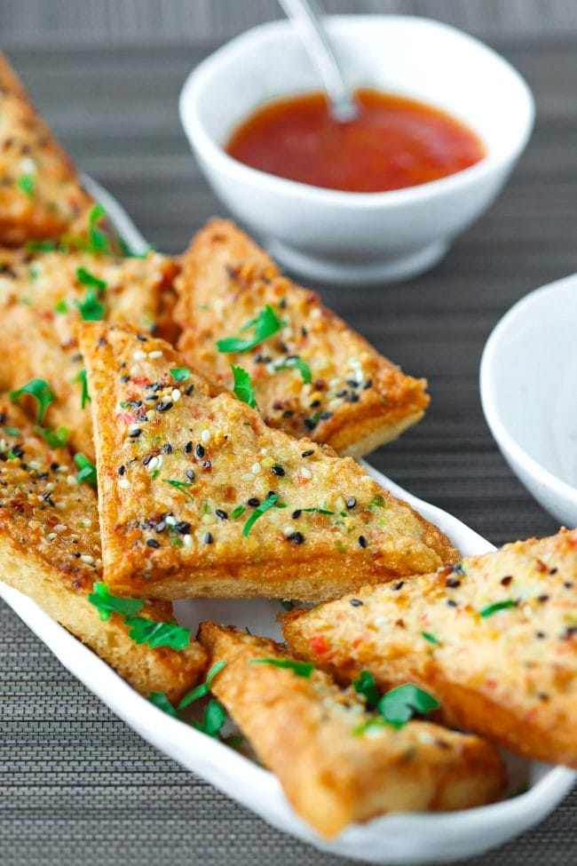

# Prawn Toasts

**Serves:** 6 or more

**Prep Time:** 15 minutes

**Cook Time:** 5 minutes

## Overview
These aren’t like those you find at most takeaways: thinly layered with a bit of prawn (shrimp). No way! These are slightly larger than bite-size prawn mountains. They are amazing served with the sweet chilli sauce.

## Ingredients

### Protein
- 500g (1lb 2oz) peeled and deveined prawns (shrimp)

### Aromatics
- 10 coriander (cilantro) stalks, finely chopped (about 2 generous tbsp)
- 6 lime leaves, de-stalked and finely chopped
- 4 garlic cloves, finely chopped

### Seasoning
- 2 tbsp Thai fish sauce
- 1 egg white
- ½ tsp white sugar

### Other
- 1 French baguette, sliced into 2cm (¾in) thick slices
- White or black sesame seeds, for sprinkling

### Fat
- Rapeseed (canola) oil, for frying

### Serving
- Sweet chilli sauce

## Method

### Stage 1 – Prepare Paste
1. Place the prawns (shrimp) in a food processor.
2. Add the coriander, lime leaves, garlic, fish sauce, egg white and sugar and blend to a thick paste that is somewhat gooey, like a soft dough.

### Stage 2 – Assemble
1. Lay the bread slices on a clean work surface and top each with a generous amount of the prawn mixture.
2. I like to pile them high like a mound – no skimping allowed!
3. Press the prawn mounds firmly in place on each piece of bread.
4. Sprinkle with sesame seeds. You could just sprinkle a few on or go all out and coat the whole top with them – that’s up to you.

### Stage 3 – Fry
1. Heat about 10cm (4in) of oil in a large saucepan or wok over a medium–high heat.
2. You are aiming for a frying temperature of 180°C (350°F).
3. When your oil is ready, carefully place the bread, prawn-side down, in the oil and fry for 2 minutes until the prawn coating is turning a delicious light brown colour (cook in batches if necessary).
4. Flip the toasts over and fry for another minute or so to colour the other side.
5. Transfer with a slotted spoon to paper towels to soak up any excess oil.
6. Serve hot.

## Notes
- Pile high.

## Serving
Serve hot with sweet chilli sauce.

## Storage
- Best served immediately.