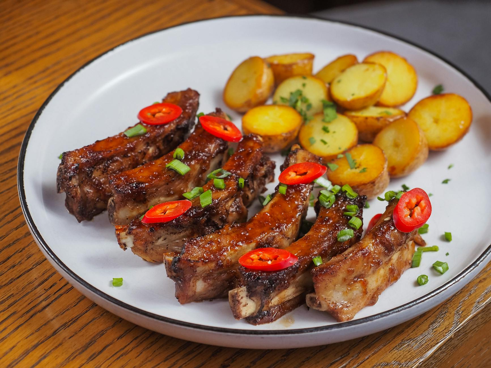

# Garlicky Salt and Pepper Pork Ribs

**Serves:** 2–4

**Prep Time:** 10 minutes

**Cook Time:** 20 minutes

## Overview
These ribs are comfort food at its best and a moreish way to start a delicious Thai meal. I like to serve them with nam jim jaew or sweet chilli sauce.

## Ingredients

### Protein
- 1 rack of pork baby back ribs, cut into small 2.5cm (1in) pieces

### Marinade
- 125ml (½ cup) rice wine vinegar
- 2 tbsp light soy sauce (gluten-free brands are available)
- 1 tbsp oyster sauce (gluten-free brands are available)
- 1 tsp roasted chilli flakes
- 6 garlic cloves, minced
- 2 tsp freshly ground black pepper
- 2 tsp salt

### Coating
- 7 tbsp cornflour (cornstarch)

### Fat
- Rapeseed (canola) oil, for deep-frying

### Serving
- Your choice of dipping sauce

## Method

### Stage 1 – Marinate
1. Put all the ingredients up to and including the salt in a bowl and whisk together.
2. Taste and adjust the ingredients to your preferences.
3. Add the pork ribs and mix well with your hands to combine.
4. Although you could fry these immediately, leaving them to marinate for a few hours or overnight will improve the flavour.

### Stage 2 – Coat
1. Just before you are ready to cook, add the cornflour (cornstarch) to the bowl and mix well to ensure the ribs are equally coated all over.

### Stage 3 – Fry
1. Pour about 5cm (2in) rapeseed (canola) oil into a wok or frying pan.
2. Heat to about 160°C (320°F).
3. You need to fry the pork for about 20 minutes, so it is important not to let it get too hot.
4. When hot, add the pork to the oil and fry for 15–20 minutes, depending on how meaty your ribs are.
5. The meat should turn a crispy brown and be really tender.
6. When frying like this, use your eyes! If the meat looks like it is burning, remove it from the oil.
7. Transfer to a plate lined with paper towels to soak up any excess oil.
8. Serve immediately with the dipping sauce of your choice.

## Notes
- Adjust marinade to taste.

## Serving
Serve immediately with nam jim jaew or sweet chilli sauce.

## Storage
- Best served immediately.