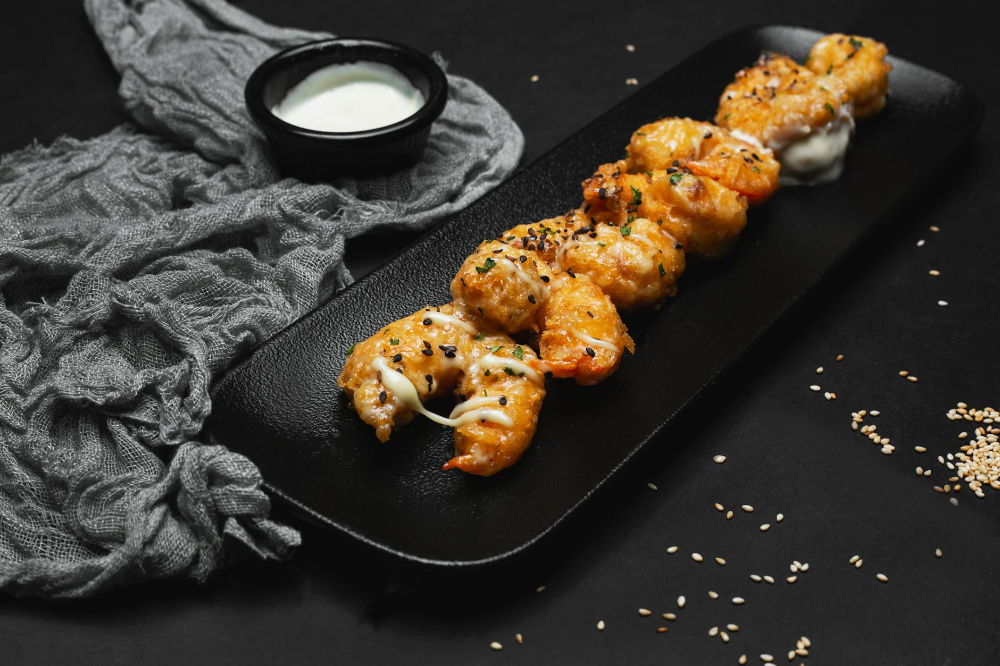

# Tempura Garlic Prawns

**Makes:** 20

**Prep Time:** 20 minutes

**Cook Time:** 10 minutes

## Overview
Here is another Thai starter you might think belongs in a Japanese cookbook. However, once you try these crisp prawns (shrimp) dipped into Thai seafood dipping sauce or sweet chilli sauce, you’ll find them to be 100% Thai. As in the photograph, you can fry veggies in the same way to make a tempura feast!

## Ingredients

### Protein
- 20 prawns (shrimp), peeled and deveined but tails left on

### Batter
- 225g (scant 2 cups) sifted plain (all-purpose) flour
- 2 tbsp rice flour
- 500ml (2 cups) ice-cold sparkling water
- 1 egg, beaten
- 1 tsp salt
- 1 tsp garlic powder

### Fat
- Rapeseed (canola) oil, for deep-frying

### Serving
- Thai seafood dipping sauce or sweet chilli sauce, to serve

## Method

### Stage 1 – Prepare Prawns
1. Using a sharp knife make three shallow slits in the underside of each prawn (shrimp) and then bend it upwards to straighten. This will prevent the prawns from curling when fried, making them easier to dip into the batter and then oil.

### Stage 2 – Make Batter
1. Sift the flours into a large bowl and then stir in the sparkling water, beaten egg, salt and garlic powder and whisk it all together. Your batter will be quite runny.
2. Heat about 10cm (4in) of the oil in a large saucepan or wok until it reaches 170–180°C (340–350°F) – or until a small bit of the batter dropped into the oil sizzles instantly.

### Stage 3 – Fry
1. Fry in batches of only four or five to avoid reducing the oil temperature.
2. Hold a prawn by the tail and dip it into the batter.
3. Shake off any excess and then slowly lower it into the hot oil.
4. Repeat with a few more and fry for about 2 minutes, or until crispy.
5. Drain on paper towels to soak up the excess oil and continue until all of the prawns are cooked.
6. Serve immediately with Thai seafood dipping sauce or sweet chilli sauce.

## Notes
- Batter is runny.

## Serving
Serve immediately with Thai seafood dipping sauce or sweet chilli sauce.

## Storage
- Best served immediately.