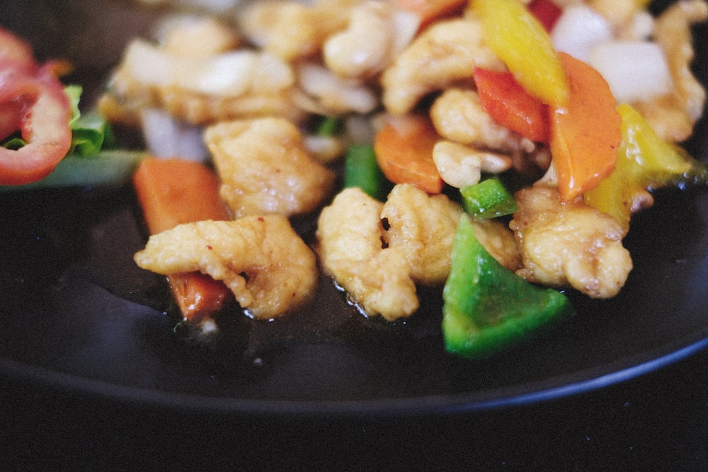

# Chicken with Cashews

**Serves:** 4

**Prep Time:** 20 minutes

**Cook Time:** 10 minutes

## Overview
This is a hugely popular dish at Thai restaurants and takeaways, and my family love it. It is important to cut the chicken pieces so that they are about the same size as the cashews (although this is more for presentation as large chunks also work fine). You can mix the sauce and fry the cashews, chillies and chicken a day or so in advance, making this a dish you can cook up very quickly after work with little mess. The first time I tried making this recipe, I burnt the cashews and chillies. Don’t make the same mistake or you’ll have to start all over again. They don’t take long to colour in the oil and cashews aren’t cheap, so keep an eye on them. Although there’s nothing stopping you from doing so, the dried and fried chillies are not meant to be eaten. I like to serve this curry with jasmine rice.

## Ingredients

### Protein
- 450g (1lb) skinless chicken thigh fillets, cut into small cashew-size pieces

### Sauce
- 2 tbsp light soy sauce
- 1 tbsp dark soy sauce
- 1 tbsp oyster sauce
- 1 tsp Thai seasoning sauce (optional)
- 70ml (¼ cup) water or chicken stock
- 1 tsp palm sugar, grated and finely chopped

### Aromatics
- 6 garlic cloves, roughly chopped
- 4 spring onions (scallions), sliced

### Vegetables
- 1 large onion, thinly sliced
- 3 red spur chillies, thinly sliced
- 2 green bird’s eye chillies, cut into thin rings

### Other
- 20–30 cashews
- 20 dried red bird’s eye chillies
- 3 tbsp cornflour (cornstarch)

### Fat
- 250ml (1 cup) rapeseed (canola) oil, plus an extra 3 tbsp

## Method

### Stage 1 – Prepare Sauce
1. Whisk all of the sauce ingredients together and taste it.
2. Add more sugar if you like a sweeter flavour and then set aside.

### Stage 2 – Fry Cashews and Chillies
1. Heat 250ml (1 cup) of rapeseed (canola) oil in a wok or saucepan until shimmering hot.
2. Add one cashew. It should sizzle on contact but not brown too quickly.
3. If that cashew looks like it is happy in the oil, add the rest and cook for about a minute until light golden brown in colour.
4. Transfer to a paper towel to soak up any excess oil.
5. Do the same with the chillies, checking the oil temperature first.
6. You want them to still be a nice deep red colour. If the oil is too hot, they will quickly burn and turn brown.

### Stage 3 – Fry Chicken
1. Dust the chicken pieces with the cornflour (cornstarch) and add it in small batches to the hot oil.
2. Fry for 3–5 minutes until golden brown and crispy.
3. Transfer to a paper towel to soak up the excess oil.

### Stage 4 – Combine
1. Now heat a wok or large frying pan over a medium heat.
2. Add 3 tablespoons of oil to the wok and stir in the garlic, onion, spur chillies and green bird’s eye chillies.
3. Fry until the garlic is turning soft and a very light brown colour but be very careful not to burn it.
4. Stir in the sauce mixture and simmer for about 30–60 seconds to thicken and then add the chicken, cashews and dried and fried chillies, stirring well to combine.
5. Continue cooking for a minute or two until the sauce is sticking to the meat and cashews and then taste it, adjusting the seasoning if necessary.
6. Serve immediately sprinkled with the chopped spring onions (scallions) to garnish.

## Notes
- Don't burn the cashews and chillies.
- Dried chillies are not meant to be eaten.

## Serving
Serve with jasmine rice.

## Storage
- Best served immediately; can be refrigerated for 1 day.