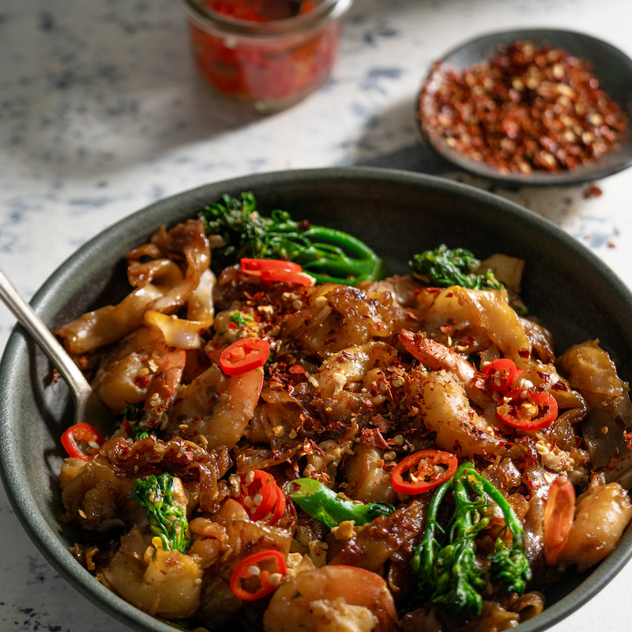

# Garlic Prawn Pad See Ew

*A classic Thai prawn pad see ew looks like a simple stir-fried noodle dish, but the finesse is in the prep: charring the noodles, marinating the seafood, and finishing with a traditional chilli vinegar that lifts the whole plate.*

**Serves:** 2
**Prep Time:** 10 minutes
**Cook Time:** 5 minutes

## Overview
"Pad see ew" translates literally as "stir-fried with soy sauce", and that soy is the heart of the dish: dark, sweet and clinging to wide rice noodles charred at the edges in a hot wok. Broccolini stands in for traditional Chinese broccoli (kai lan), the prawns get a brief garlic-soy marinade, and an egg is folded through right at the end. A sharp homemade chilli vinegar at the table is the traditional Thai counterweight to all that sweet soy.

## Ingredients

### Chilli Vinegar
- ¼ cup white vinegar
- 1 long red chilli (finely sliced)

### Prawn Marinade
- 200 grams peeled and deveined prawns (tail on)
- 2 garlic cloves (finely grated)
- 1 tablespoon soy sauce
- 1 teaspoon sesame oil
- Pinch of ground white pepper

### Stir-Fry
- 2 tablespoons vegetable oil
- 350 grams fresh rice noodles
- 2 teaspoons dark soy sauce
- ½ teaspoon caster (superfine) sugar
- 1 bunch broccolini (cut into bite-sized pieces)
- 2 tablespoons water
- 2 eggs (lightly whisked)
- 2 tablespoons soy sauce (to finish)
- Ground white pepper to taste

### To Serve
- Chilli powder (optional)

## Method

### Stage 1 – Make the Chilli Vinegar
1. Combine the white vinegar and sliced chilli in a small bowl.
2. Set aside to mingle while you cook.

### Stage 2 – Marinate the Prawns
1. Place the prawns in a bowl with the grated garlic, 1 tablespoon of soy sauce, the sesame oil and a pinch of white pepper.
2. Mix to combine.
3. Set aside to marinate for 10 minutes.

### Stage 3 – Char the Noodles
1. Heat 1 tablespoon of vegetable oil in a wok or large frying pan over medium-high heat.
2. Add the rice noodles, dark soy sauce and sugar.
3. Stir-fry until the noodles have softened and the edges start to char.
4. Transfer the noodles to a plate and set aside.

### Stage 4 – Sear the Prawns
1. Return the wok to the heat and add the remaining tablespoon of oil.
2. Add the prawns and spread them out in a single layer.
3. Leave undisturbed for a few seconds to develop a sear.
4. Stir-fry until almost cooked through.

### Stage 5 – Add the Broccolini & Egg
1. Add the broccolini and stir-fry for 1 minute.
2. Pour in 2 tablespoons of water and let the steam cook the broccolini until tender.
3. Push everything to one side of the wok.
4. Add the whisked egg to the empty side.
5. Gently push the egg up the sides of the wok until it just sets, then break it up and fold through the other ingredients.

### Stage 6 – Combine & Serve
1. Return the charred noodles to the wok.
2. Drizzle the remaining 2 tablespoons of soy sauce around the edge of the pan and add another pinch of white pepper.
3. Toss everything together until evenly coated.
4. Transfer to a serving plate.
5. Serve with the chilli vinegar and a sprinkle of chilli powder, if using.

## Notes
- **Loosen the noodles:** Microwave the rice noodles for about 20 seconds before using to warm them through, then gently separate the strands. This stops them from clumping or breaking in the wok.
- **Wok hei:** A genuinely hot pan is what gives pad see ew its signature smoky edge. Heat the wok until it's just smoking before adding the noodles.
- **Dark soy sauce:** This gives the noodles their colour and the slightly caramelised, savoury notes of the dish. Light soy alone won't deliver the same character.
- **Chilli vinegar:** Don't skip it. The sharpness cuts through the sweet soy glaze and is the traditional Thai way to season pad see ew at the table.

## Variations
**Chicken or pork:** Replace the prawns with thinly sliced chicken thigh or pork loin; marinate the same way.
**Vegetarian:** Drop the prawns and double the broccolini, or add tofu puffs and Chinese broccoli (gai lan) in their place.

## Serving
Serve with: A small dish of chilli vinegar and chilli powder for guests to season at the table
Garnish with: A wedge of lime and a few coriander leaves

## Storage
- Best eaten straight from the wok while the noodles are still glossy
- Leftovers keep 1 day refrigerated; reheat in a hot wok with a splash of water to loosen
- Chilli vinegar keeps 1 week refrigerated in a sealed jar
