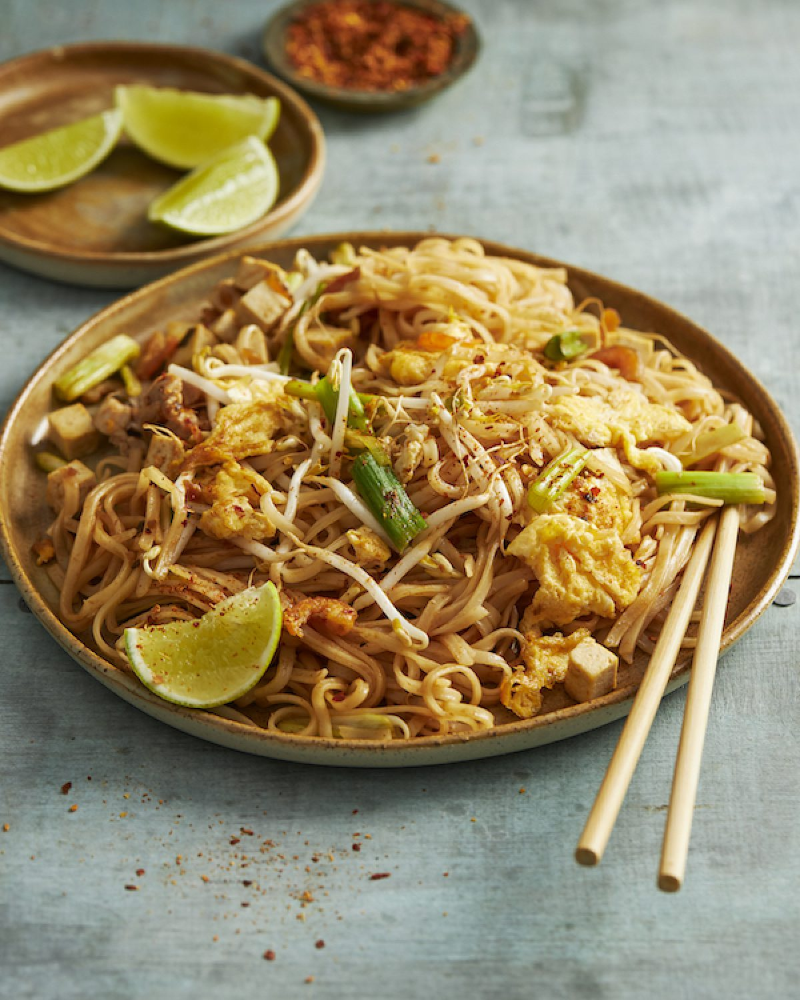

# Prawn and Pork Pad Thai

## Overview
This classic Thai dish of noodles is both aromatic and lightly spicy, serving well as either a main course or a starter. Pad Thai combines stir-fried rice noodles with tender chicken, pork, and prawns in a balanced sauce of curry paste, oyster sauce, and fish sauce. Fresh herbs, crushed peanuts, and a squeeze of lime complete this iconic Thai street food favourite.

**Serves:** 4
**Prep Time:** 15 minutes
**Cook Time:** 15 minutes

## Ingredients

### Noodles & Base
- 110 grams dried rice noodles
- 3 tablespoons groundnut oil
- 200 ml chicken stock

### Aromatics & Pastes
- 2 cloves garlic (very finely chopped)
- 3 cm cube of ginger (very finely chopped)
- 1 teaspoon red curry paste
- 1 teaspoon chilli sauce
- 1 teaspoon oyster sauce

### Protein
- 100 grams skinned chicken breast (cut into strips)
- 100 grams lean pork (minced)
- 8 cooked king prawns
- 20 raw prawns (peeled and deveined)

### Vegetables & Fresh Herbs
- 1 tablespoon red bell pepper (chopped)
- 2 red chillies (chopped)
- 2 tablespoons bean sprouts
- 3 tablespoons spring onions (chopped)
- 2 tablespoons Thai basil leaves (chopped)
- 1 tablespoon coriander leaves (chopped)

### Seasoning & Garnish
- Sweet soy sauce (to taste)
- Fish sauce (to taste)
- 2 tablespoons roasted peanuts (roughly crushed)
- 1 teaspoon palm sugar
- Thai basil leaves (for garnish)
- Lime wedges (for serving)

## Method

### Stage 1 – Prepare Noodles
1. Bring 1 litre of water to the boil in a large saucepan.
2. Break up the rice noodles a little as you add them to the saucepan.
3. Move them around gently to help them break up and soften.
4. Remove from heat and set aside (noodles will continue to soften in the residual heat).

### Stage 2 – Stir-Fry Aromatics & Pastes
1. Heat the groundnut oil in a wok or large frying pan over high heat.
2. Add the very finely chopped garlic, ginger, red curry paste, chilli sauce, and oyster sauce.
3. Stir-fry for 30 seconds until fragrant and the pastes are well distributed through the oil.

### Stage 3 – Cook Chicken & Pork
1. Pour in the chicken stock and bring to a simmer.
2. Add the chicken strips and minced pork.
3. Stir-fry for approximately 3 minutes until the chicken is cooked through and the pork is no longer pink.

### Stage 4 – Add Seafood
1. Add the cooked king prawns and raw prawns.
2. Continue to stir-fry for a further 3 minutes until the raw prawns turn pink and are cooked through.

### Stage 5 – Combine Noodles & Vegetables
1. Drain the noodles thoroughly.
2. Add the drained noodles to the wok with all remaining ingredients: red bell pepper, red chillies, bean sprouts, spring onions, Thai basil, and coriander.
3. Toss everything together thoroughly, mixing for 1–2 minutes until well combined and heated through.

### Stage 6 – Season & Finish
1. Season with sweet soy sauce and fish sauce to taste, starting with small amounts and adjusting as needed.
2. Add the palm sugar and stir through.
3. Transfer to serving bowls.
4. Top with crushed roasted peanuts and garnish with fresh Thai basil leaves.
5. Serve immediately with lime wedges on the side.

## Notes
- **Noodle texture:** Rice noodles soften quickly, don't overcook or they'll become mushy. Slightly underdone is better than overdone.
- **Protein balance:** This dish works with various proteins. Use what you prefer or have available; the amounts can be adjusted.
- **Raw prawns essential:** Include raw prawns alongside cooked ones for textural contrast and authentic flavour.
- **Fish sauce:** This is key to authentic Pad Thai flavour. Start with ½ teaspoon and adjust to taste, it adds umami depth.
- **High heat essential:** Keep the wok or pan very hot throughout cooking to achieve the characteristic slightly caramelized noodle flavour.
- **Make-ahead:** Prep all ingredients in advance; cooking itself is very quick once you start.

## Variations
**Vegetarian:** Omit all proteins and use extra vegetables (mushrooms, broccoli, carrots) and tofu or chickpeas
**Shrimp-only:** Use 400g large prawns instead of the mixed proteins for a seafood-focused version
**Extra spicy:** Increase red curry paste to 1½ teaspoons or add fresh bird's eye chillies
**With pineapple:** Add ½ cup fresh pineapple chunks in Stage 5 for sweetness and tropical flavour
**Milder version:** Reduce chilli sauce and curry paste by half, or omit fresh chillies

## Serving
Serve immediately in bowls with: Extra crushed peanuts, fresh lime wedges, Thai basil leaves, and chilli flakes on the side. Pair with jasmine rice or a fresh Thai salad.

## Storage
- Best eaten immediately while hot and aromatic
- Can be refrigerated up to 1 day (noodles will soften slightly)
- Reheat gently in a wok or large frying pan over medium heat with a splash of water or stock to prevent sticking
- Not recommended for freezing (noodles become soggy and texture is compromised)