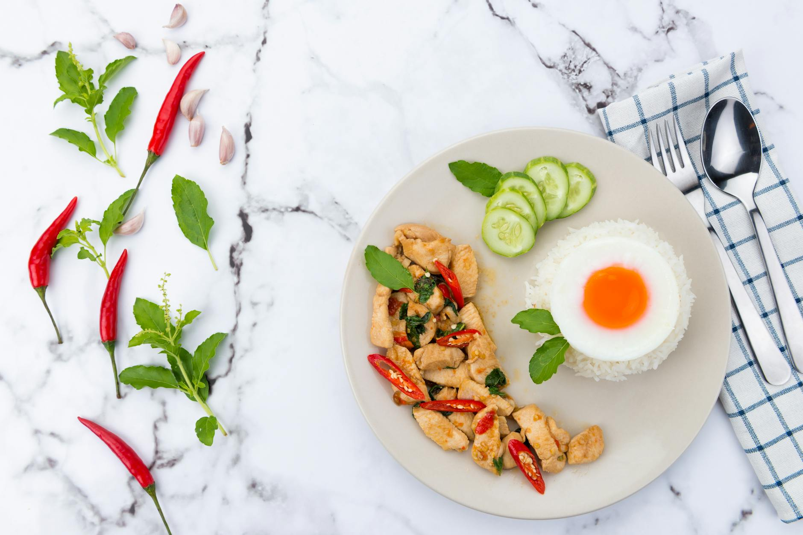

# Stir Fried Chicken with Chilli and Basil

## Overview
Pad krapow kai, this quick and easy chicken dish is an excellent introduction to Thai cuisine. Fiery chillies partner the holy basil, which has a pungent flavour that is spicy and sharp. Tender chicken pieces are stir-fried until just cooked through, then tossed with garlic, fresh chillies, and aromatic holy basil, creating a vibrant dish bursting with authentic Thai flavours.

**Serves:** 4–6
**Prep Time:** 10 minutes
**Cook Time:** 10 minutes

## Ingredients

### Chicken & Oil
- 450 grams skinless chicken breasts
- 3 tablespoons vegetable oil

### Aromatics & Seasonings
- 4 garlic cloves (thinly sliced)
- 4 fresh red chillies (de-seeded and finely chopped)
- 3 tablespoons Thai fish sauce
- 2 teaspoons dark soy sauce
- 1 teaspoon granulated sugar

### Fresh Herbs
- 12 holy basil leaves
- 2 fresh red chillies (de-seeded and very finely chopped, for garnish)
- 20 deep-fried holy basil leaves (for garnish)

## Method

### Stage 1 – Prepare Chicken
1. Using a sharp knife, cut the chicken breasts into bite-size pieces (approximately 2–3cm).
2. Set aside.

### Stage 2 – Deep-Fry Basil Leaves for Garnish
1. Make sure the basil leaves are completely dry (they will splutter if wet when added to oil).
2. Heat oil in a separate small pan to approximately 180°C (a cube of bread should brown in about 20 seconds).
3. Carefully add the basil leaves (10 leaves at a time) and deep-fry briefly until crisp and translucent (about 30–40 seconds).
4. Remove using a slotted spoon and drain on kitchen paper.
5. Set aside for garnish.

### Stage 3 – Stir-Fry Aromatics
1. Heat 3 tablespoons of vegetable oil in a wok over medium-high heat.
2. Add the sliced garlic and chopped red chillies.
3. Stir-fry for 1–2 minutes until the garlic is golden and fragrant.
4. **Important:** Do not let the garlic burn or it will turn bitter and ruin the dish.

### Stage 4 – Cook Chicken
1. Add the bite-size chicken pieces to the wok.
2. Stir-fry over medium-high heat, turning pieces frequently, until they change colour and are no longer pink.
3. This should take approximately 4–5 minutes depending on piece size.

### Stage 5 – Season
1. Add the Thai fish sauce, dark soy sauce, and granulated sugar to the chicken.
2. Stir-fry for 1–2 minutes, tossing constantly to coat all pieces evenly.
3. The chicken should be fully cooked at this point (no pink remaining).

### Stage 6 – Add Fresh Basil
1. Stir in the 12 fresh holy basil leaves.
2. Toss everything together for about 30 seconds just until the basil is wilted and fragrant.
3. Do not overcook or the basil will lose its vibrant colour and flavour.

### Stage 7 – Serve
1. Spoon the mixture onto a warm serving platter or individual serving dishes.
2. Garnish with the finely chopped fresh red chillies and deep-fried basil leaves.
3. Serve immediately.

## Notes
- **Holy basil characteristics:** Native to Asia, holy basil differs from other basils, the heat actually develops the flavour. The leaves have typical basil fragrance with added pepper and mint notes.
- **Holy basil substitute:** If unavailable, use a mix of ordinary basil and spearmint (approximately equal parts) for a similar flavour profile.
- **Deep-frying basil:** Ensure leaves are completely dry before frying to prevent dangerous splattering. Work with small batches and watch carefully.
- **Garlic timing:** Keep heat medium (not high) during garlic frying to prevent burning. Burnt garlic creates bitter flavours that dominate the dish.
- **Fresh basil addition:** Add at the very end, wilting should take only 30 seconds. Overcooked basil loses colour, flavour, and texture.

## Variations
**Seafood version:** Replace chicken with 450g large prawns or squid; reduce cooking time in Stage 4 to 2–3 minutes
**Extra spicy:** Increase fresh red chillies to 6 or add bird's eye chillies for significantly more heat
**Milder version:** Reduce chillies to 2 and de-seed completely; reduce fish sauce to 2 tablespoons
**With vegetables:** Add 1 red bell pepper (sliced) or green beans (sliced) in Stage 4 for additional texture
**Pork or beef:** Use 450g minced pork or beef sliced thinly instead of chicken; reduce cooking time accordingly

## Serving
Serve with: Jasmine rice or Thai sticky rice. Accompany with lime wedges, fresh chillies, and extra fish sauce on the side for those who prefer more heat.

## Storage
- Best eaten immediately while hot and aromatic
- Keeps 1 day refrigerated in an airtight container (basil will lose some vibrance)
- Reheat gently in a wok or frying pan over medium heat with a splash of water or stock
- Not recommended for freezing (basil and texture are compromised)