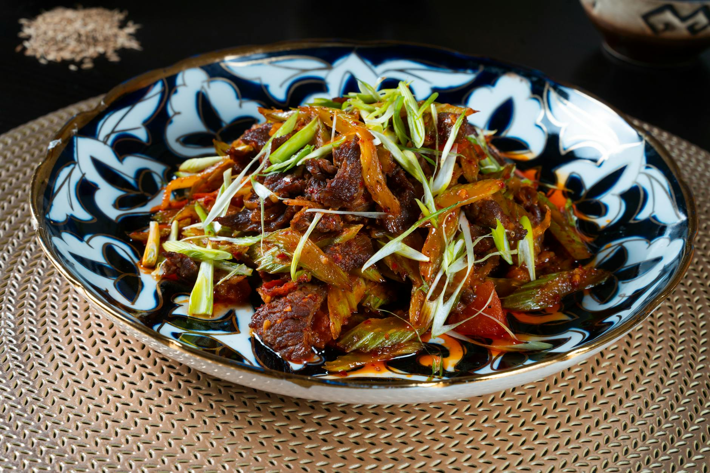

# Stir-Fried Beef in Oyster Sauce

**Serves:** 4

**Prep Time:** 10 minutes

**Cook Time:** 20 minutes

## Overview
On Thai menus this is often called ‘pad nam mun hoy’, which means fried with oyster sauce. There are many versions of Thai oyster sauce curries, but this beef version is right up there when it comes to popularity. Stir-fried beef in oyster sauce usually also comes served with mushrooms and my favourite variety for this recipe are straw mushrooms, but you could use any type you can find – wild mushrooms work really well. Serve with a hot bowl of jasmine rice.

## Ingredients

### Protein
- 350g (12oz) sirloin steak

### Marinade
- 2 tbsp light soy sauce*
- 2 tbsp rapeseed (canola) oil or sesame oil

### Aromatics
- 4 garlic cloves, roughly chopped
- 4 spring onions (scallions), cut into 5cm (2in) pieces
- 1 red spur chilli, cut into thin rings

### Vegetables
- Large handful (about 100g) of whole straw mushrooms
- 1 medium onion, thinly sliced

### Seasoning
- 3–4 tbsp oyster sauce*
- 4 tbsp stock or water
- ½ tsp ground white pepper
- 1 tbsp cornflour (cornstarch), mixed with 1½ tbsp water

## Method

### Stage 1 – Marinate
1. Slice the sirloin against the grain into thin 6mm (¼in) strips.
2. Place in a bowl and add 1 tablespoon of the light soy sauce and 1 tablespoon of the oil.
3. Mix well and leave to marinate for 10 minutes. For a more intense flavour, you could let the meat marinate for longer.

### Stage 2 – Cook
1. Heat the remaining oil in a wok over a medium–high heat.
2. When the oil begins to shimmer, stir in the chopped garlic and fry for a couple of minutes until fragrant but not browned.
3. Now add the marinated beef strips and stir-fry until browned, stirring continuously. This should only take a couple of minutes.
4. Add the mushrooms and sliced onion and stir it all up to combine.
5. Pour in the oyster sauce, remaining soy sauce, stock or water and white pepper.
6. Again, stir this quickly and then add the cornflour (cornstarch) and water paste.
7. Bring to a simmer – the paste will cause the sauce to thicken and give it a shiny appearance.
8. Don’t forget to taste it and adjust the flavours to taste.
9. To finish, add the chopped spring onions (scallions) and chilli slices and stir a bit so that they are coated lightly in the sauce.

## Notes
* Many soy and oyster sauces contain gluten but gluten-free brands are available.

## Serving
Serve with a hot bowl of jasmine rice.

## Storage
- Best served immediately; can be refrigerated for 1 day.