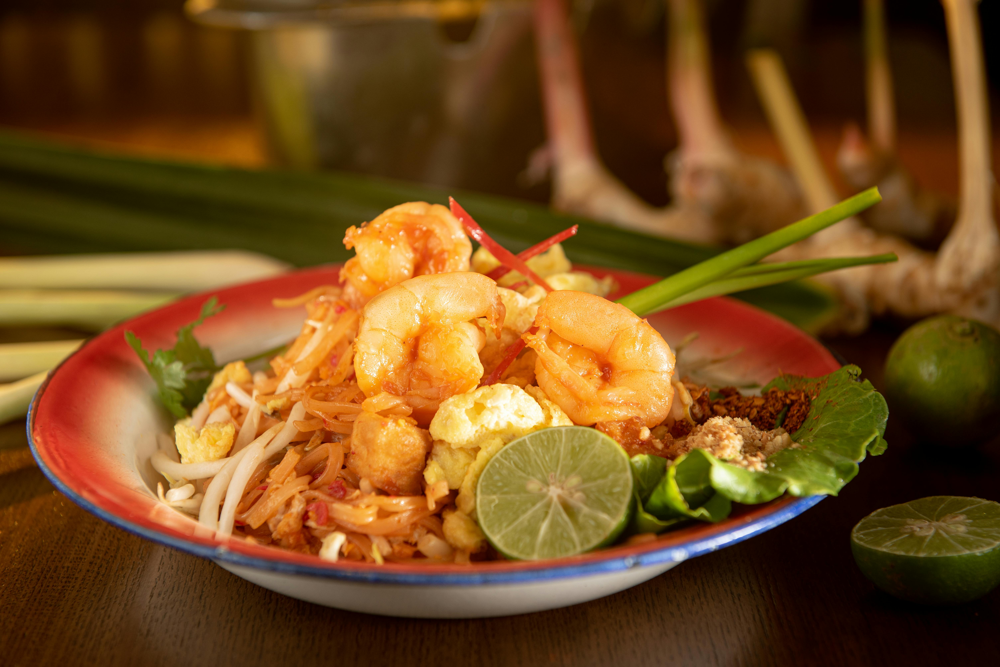

# Traditional Pad Thai

**Serves:** 4
**Prep Time:** 20 minutes
**Cook Time:** 20 minutes

## Overview
Pad thai began as a 1930s government-promoted national dish during a campaign to reduce rice consumption, and has since become Thailand's best-known noodle export. The success of any version comes down to the sauce: equal parts fish sauce, tamarind and palm sugar, with a spoonful of finely chopped pickled radish for backbone. Once the sauce is mixed the wok work is fast, with soft rice noodles, chicken, tofu, dried shrimp and egg joining in quick succession before the dish is finished with peanuts, chives, lime and chilli at the table.

## Ingredients

### Pad Thai Sauce
- 3 tablespoons fish sauce
- 3 tablespoons tamarind puree (or 2 tablespoons tamarind concentrate loosened with 1 tablespoon water)
- 3 tablespoons palm sugar (finely grated, or substitute soft brown sugar)
- 2 tablespoons finely chopped pickled radish (chai po, optional but traditional)

### Stir-Fry
- 200 grams dried rice stick noodles (5 mm wide)
- 1 tablespoon vegetable oil
- 400 grams chicken thigh fillets (thinly sliced)
- 2 tablespoons dried shrimp
- 50 grams firm tofu (finely diced)
- 2 eggs (lightly whisked)
- ½ cup Chinese garlic chives or spring onion (cut into batons)
- ¼ cup bean sprouts

### To Serve
- ¼ cup roasted peanuts (roughly chopped)
- Chilli powder
- Lime wedges

## Method

### Stage 1 – Soak the Dried Shrimp
1. Place the dried shrimp in a small bowl and cover with warm water.
2. Soak for 15 minutes to soften slightly.
3. Drain and discard the soaking water.

### Stage 2 – Mix the Sauce
1. In a small bowl, combine the fish sauce, tamarind puree, palm sugar and pickled radish (if using).
2. Stir until the sugar dissolves into a smooth, glossy sauce.

### Stage 3 – Cook the Noodles
1. Bring a large pot of water to the boil.
2. Add the rice stick noodles and cook for 7 to 8 minutes, until just tender.
3. Drain and rinse under cold water to stop them cooking further.
4. Set aside.

### Stage 4 – Stir-Fry & Combine
1. Heat the vegetable oil in a wok or large frying pan over high heat.
2. Add the chicken and stir-fry until just cooked through.
3. Add the softened dried shrimp and the diced tofu.
4. Stir-fry for another 30 seconds, until warmed through.
5. Push everything to one side of the pan.
6. Pour the whisked eggs into the empty side, spread them out and let them set briefly until golden on the bottom.
7. Break up the egg with a spatula and mix it through the other ingredients.
8. Add the cooked noodles and the pad thai sauce.
9. Stir-fry until everything is well combined and glossy.
10. Toss through the garlic chives or spring onion, followed by the bean sprouts.
11. Remove the pan from the heat.

### Stage 5 – Plate Up
1. Divide the noodles between serving plates.
2. Sprinkle generously with the chopped peanuts.
3. Serve with chilli powder and lime wedges on the side.

## Notes
- **Pickled radish (chai po):** Salty-sweet fermented daikon, sold at Asian grocers. It's the traditional crunch in pad thai. The recipe still works without it; just bump the fish sauce by half a teaspoon.
- **Tamarind:** Look for tamarind puree or concentrate in the Asian aisle. If you only have tamarind block, soak 30 g in 60 ml hot water, mash, and strain to get the puree.
- **Palm sugar:** Sold in small discs or jars. Grate it finely so it dissolves cleanly into the sauce.
- **Wok hei:** A high heat is essential. The noodles should pick up a hint of char, not steam in their own moisture.
- **Don't overcook the noodles:** They finish cooking in the wok with the sauce. Drain them while still slightly firm in the centre.

## Variations
**Prawn pad thai:** Replace the chicken with 300 g of peeled, deveined prawns added at the start of Stage 4.
**Vegetarian:** Drop the chicken and dried shrimp; double the tofu and use mushroom-based vegetarian fish sauce.
**Spicier:** Add 1 to 2 sliced bird's eye chillies to the wok with the chicken, or stir a teaspoon of chilli powder into the sauce.

## Serving
Serve with: A wedge of lime, chilli powder, extra peanuts and a small bowl of pickled chillies in vinegar
Garnish with: A handful of fresh coriander leaves and a few extra bean sprouts piled on top

## Storage
- Best eaten immediately while the noodles are still glossy
- Leftovers keep 1 day refrigerated; reheat in a hot wok with a splash of water to loosen the noodles
- Pad thai sauce keeps 1 week refrigerated in a sealed jar
