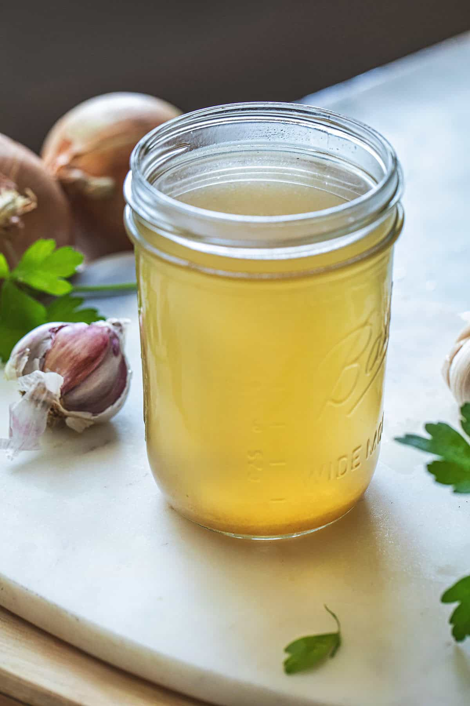

# Thai Chicken Stock

**Makes:** approx. 1.5 litres (6 cups)

**Prep Time:** 5 minutes

**Cook Time:** 2 hours

## Overview
When making stocks for Asian dishes, it is important to use Asian ingredients. Chicken stock is used as a base for dishes in so many cuisines. Using a Western-style chicken stock or – even worse – chicken stock cubes to cook Thai recipes just won’t do, as the flavours will be wrong. This simple Thai stock will get you the flavour you need for your Thai dishes.

## Ingredients
### Protein
- 1.5kg (3lb 5oz) meaty chicken bones

### Aromatics
- 10 coriander (cilantro) stalks
- 1 large onion, roughly chopped
- 10 garlic cloves, smashed
- 2.5cm (1in) piece of galangal, thinly sliced and lightly smashed
- 1 whole lemongrass stalk, bruised

### Seasonings
- 1 tsp white peppercorns (or black peppercorns if you must)

## Method

### Stage 1 – Prepare stock
1. Add the chicken bones to a large saucepan and cover with 2 litres (8 cups) of water.
1. Bring to a simmer, skimming off any foam that floats to the top.

### Stage 2 – Add ingredients
1. Once foam is skimmed, add the remaining ingredients.
1. Allow to simmer for about 2 hours.

### Stage 3 – Strain
1. Strain through a fine sieve.

## Notes
- You could add more water and a few pork bones to this stock for a delicious chicken and pork stock, popular in Thai cooking.
- This can be used whenever chicken stock is called for in a recipe.

## Serving
- Use as base for Thai dishes.

## Storage
- Refrigerate up to 3 days or freeze for months.
- Cool quickly in ice bath before storing.