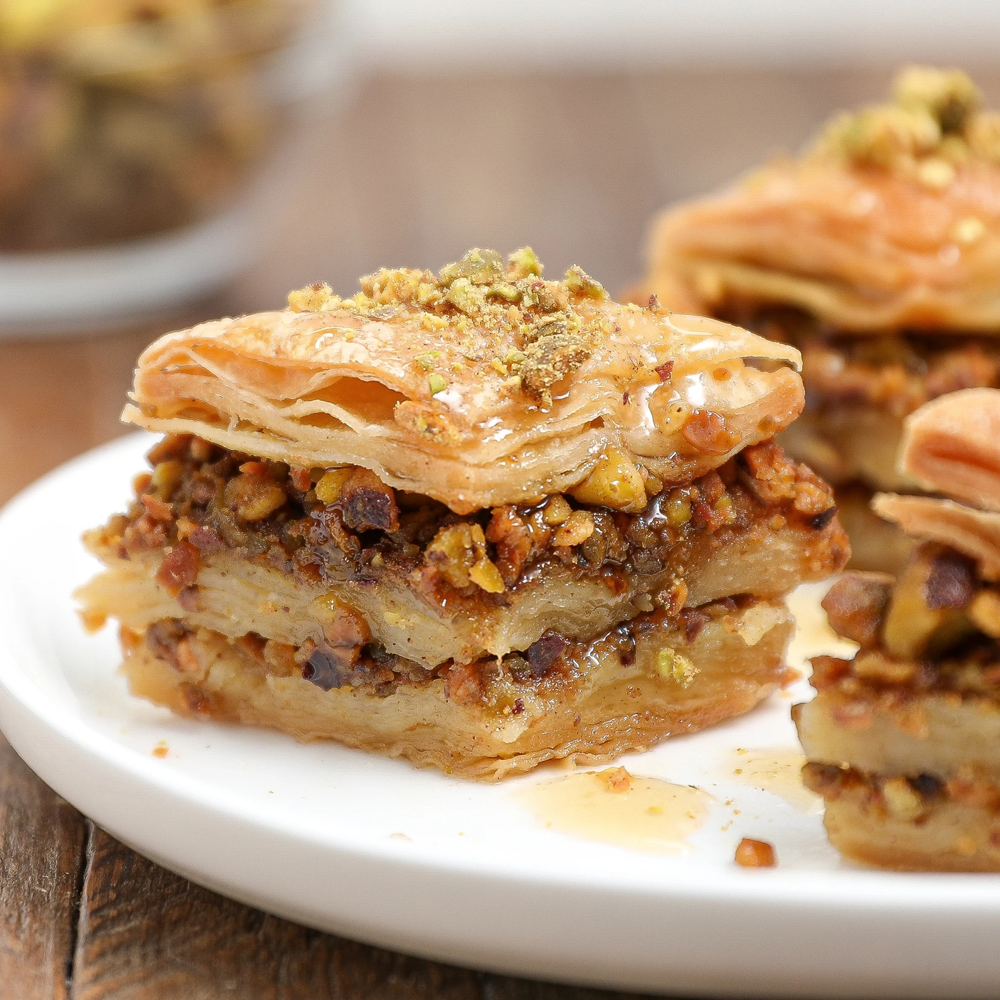

# Baklava

*Layered phyllo, butter and pistachios, baked golden, then drowned in cool sugar syrup so each bite shatters and weeps honey. The Turkish version (especially Gaziantep-style) leans heavily pistachio, butter-rich, slightly less sweet than the Greek and Levantine versions. A patient build but the technique is straightforward.*

**Serves:** 16

**Prep Time:** 45 minutes

**Cook Time:** 50 minutes (plus 4 hours soaking)

## Overview
Phyllo sheets layer with melted butter — half the stack on the base, the pistachio filling spread across, the other half on top. The whole tray scores into diamonds before baking; a slow bake at moderate heat ensures even gold colour and crisp layers. Cool sugar syrup pours over hot baklava and gets absorbed instantly.

## Ingredients

### Pastry
- 500 g phyllo pastry (thawed if frozen)
- 350 g unsalted butter (clarified is best; or melted and the milk solids skimmed)

### Filling
- 400 g shelled pistachios (Antep variety, finely chopped)
- 50 g caster sugar (optional — many traditional recipes omit, since the syrup sweetens enough)

### Syrup
- 500 g caster sugar
- 350 ml water
- 1 tablespoon lemon juice
- 1 tablespoon honey (or rosewater for a floral version)

## Method

### Stage 1 – Syrup
1. Combine the sugar, water and lemon juice in a small pan.
1. Bring to a boil; simmer 8-10 minutes until slightly thickened.
1. Off the heat, stir in the honey.
1. Cool fully — must be cold before pouring on hot baklava.

### Stage 2 – Filling
1. Pulse the pistachios in a food processor to a coarse rubble — or chop by hand.
1. Mix with the sugar if using.

### Stage 3 – Layer the bottom
1. Heat the oven to 170°C (150°C fan).
1. Brush a 30 x 20 cm baking tin generously with butter.
1. Lay one phyllo sheet (cut to fit if needed); brush with butter.
1. Repeat with 9 more sheets, brushing each.

### Stage 4 – Spread filling
1. Sprinkle the pistachio mixture evenly across the buttered phyllo.

### Stage 5 – Layer the top
1. Lay another phyllo sheet over the filling; brush with butter.
1. Continue layering and buttering until you've used about 10-12 more sheets.

### Stage 6 – Score
1. With a very sharp knife, score the top layers into diamonds (about 4 cm across) — cut down to the filling but not all the way through.

### Stage 7 – Bake
1. Pour any remaining butter over the top.
1. Bake 45-50 minutes until deep golden and crisp throughout.

### Stage 8 – Drown in syrup
1. As soon as the baklava comes out of the oven, slowly pour the cold syrup all over.
1. You'll hear it sizzle; the baklava absorbs the syrup in 2-3 minutes.

### Stage 9 – Cool
1. Cool 4 hours minimum at room temperature — the syrup needs time to distribute.
1. Cut all the way through along the score lines; lift out diamonds.

## Notes
- **Cold syrup, hot baklava:** Reverse and the layers go soggy. The temperature contrast is what creates the crisp-soaked texture.
- **Quality of phyllo matters:** Fresh thinly-rolled Turkish-style phyllo gives the best result. Frozen sheets work but need extra care to keep from drying out — keep unused sheets covered with a damp cloth.
- **Score before baking:** You can't cut clean through baked baklava. Score 90% of the way down before it goes in the oven.

## Storage
- Keeps a week at room temperature in an airtight tin; eats arguably better on day 2-3.
- Don't refrigerate — the phyllo softens.
