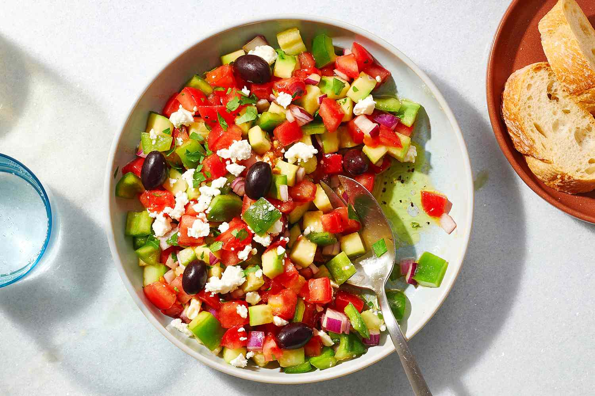

# Çoban Salatası

*Turkey's "shepherd's salad": tomato, cucumber, onion, pepper and parsley diced and dressed with lemon, olive oil and a sprinkle of sumac. Always on the table beside grilled meats; the difference between a good kebap meal and a great one. Sometimes finished with crumbled feta or olives, but the classic is plain and bright.*

**Serves:** 4

**Prep Time:** 15 minutes

**Cook Time:** 0 minutes

## Overview
Vegetables are diced into 1 cm cubes — slightly larger than Israeli salad. Olive oil, lemon and a generous shake of sumac bring it together. Eats at room temperature; doesn't keep — make right before serving.

## Ingredients

- 4 medium tomatoes (deseeded; diced 1 cm)
- 1 large cucumber (deseeded; diced 1 cm)
- 1 small red onion (diced 1 cm)
- 1 long green pepper (Turkish sivri biber if you can find; diced)
- A small bunch of flat-leaf parsley (chopped)
- 4 tablespoons extra-virgin olive oil
- Juice of 1 lemon
- 1 teaspoon sumac (plus more for sprinkling)
- 1 teaspoon salt
- ½ teaspoon black pepper
- 100 g feta (crumbled, optional)
- A handful of kalamata olives (optional)

## Method

### Stage 1 – Combine
1. Toss the tomato, cucumber, onion, pepper and parsley together in a wide bowl.

### Stage 2 – Dress
1. Drizzle with olive oil and lemon juice.
1. Sprinkle with sumac, salt and black pepper.
1. Toss gently.

### Stage 3 – Optional toppings
1. Top with feta and olives if using.

### Stage 4 – Serve
1. Sprinkle with extra sumac for colour.
1. Serve at room temperature alongside grilled meats, kebabs or pide.

## Notes
- **Sumac is the dish:** Without it, this is just a tomato salad. The tart, lemony, slightly fruity flavour of sumac is what makes it Turkish.
- **Sivri biber peppers:** Long, thin, mildly hot Turkish green peppers. If you can find them at a Turkish grocer, use them; pale green Romanos are the next best.
- **Don't make in advance:** Cucumbers and tomatoes weep; the salad goes watery and limp within an hour.

## Storage
- Best within an hour of mixing.
