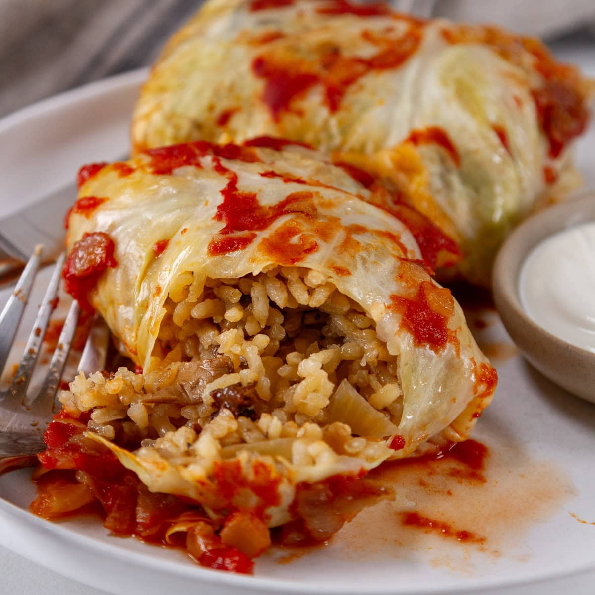

# Holubtsi

*Ukrainian stuffed cabbage rolls: blanched cabbage leaves wrapped around a filling of pork, beef, rice and onion, then braised in a tomato-and-soured-cream sauce until soft and tender. The leaves go almost translucent; the filling is juicy. A Sunday-dinner classic across Eastern Europe.*

**Serves:** 6

**Prep Time:** 45 minutes

**Cook Time:** 1¼ hours

## Overview
A whole cabbage is cored and lowered into boiling water; the outer leaves soften and peel off in turn. The filling — half-cooked rice mixed with beef, pork, onion, garlic, herbs, egg — gets a heaped tablespoon onto each leaf, which folds and rolls into a parcel. The rolls layer in a pot with sauce of tomato, stock and soured cream; everything braises 1 hour. Soured cream and dill at the table.

## Ingredients

### Cabbage
- 1 large green cabbage (around 1.5 kg)
- 1 tablespoon salt (for the blanching water)

### Filling
- 100 g long-grain rice (rinsed)
- 300 ml water
- 500 g minced beef
- 250 g minced pork
- 1 large onion (very finely chopped)
- 4 garlic cloves (crushed)
- 1 large egg
- 1 teaspoon dried marjoram
- 1 teaspoon paprika
- 1½ teaspoons salt
- ½ teaspoon black pepper
- A small bunch of dill (chopped)

### Sauce
- 2 tablespoons sunflower oil
- 1 medium onion (chopped)
- 2 medium carrots (grated)
- 3 garlic cloves (crushed)
- 2 tablespoons tomato paste
- 1 x 400 g tin chopped tomatoes
- 600 ml beef or vegetable stock
- 200 g soured cream (at room temperature)
- 1 bay leaf
- 2 sprigs thyme
- 1 teaspoon paprika
- 1 teaspoon salt
- Black pepper

### To serve
- Extra soured cream
- Fresh dill (chopped)

## Method

### Stage 1 – Half-cook the rice
1. Combine the rice with the 300 ml water and a pinch of salt; bring to the boil; cover; reduce to lowest heat; cook 8 minutes.
1. Off the heat, rest covered 5 minutes; cool — the rice should be half-done.

### Stage 2 – Cabbage
1. Cut a deep cone-shape into the base of the cabbage to remove the core.
1. Bring a large pot of salted water to the boil.
1. Lower the cabbage in core-side down; cook 3-4 minutes; with tongs, peel off softened outer leaves and lay them on a tea towel to drain.
1. Continue dipping and peeling until you have 16-18 large leaves.
1. Trim the thick central rib of each leaf flat with a knife so it rolls cleanly.

### Stage 3 – Filling
1. Combine the half-cooked rice with the minced beef, pork, onion, garlic, egg, marjoram, paprika, salt, pepper and dill. Mix thoroughly with your hands.

### Stage 4 – Roll
1. Place a heaped tablespoon of filling near the base of each leaf.
1. Fold the bottom up over the filling; fold the sides in; roll up tight.
1. Repeat for all leaves.

### Stage 5 – Sauce
1. Heat the oil in a heavy pot over medium heat.
1. Cook the onion 5 minutes; add the carrot; cook 5 minutes more.
1. Add the garlic and tomato paste; cook 1 minute.
1. Stir in the chopped tomatoes, stock, paprika, salt, pepper, bay and thyme.
1. Bring to a simmer.

### Stage 6 – Braise
1. Pack the rolls seam-side down in a wide oven-proof pot or deep roasting tin (a couple of layers is fine).
1. Pour the sauce over — it should come about ¾ of the way up.
1. Cover with the lid (or foil) and braise at 160°C for 1 hour.

### Stage 7 – Finish
1. Whisk a few ladlefuls of the hot sauce into the soured cream to temper.
1. Stir the soured cream mix back into the pot; cook another 10 minutes uncovered.
1. Discard the bay and thyme.

### Stage 8 – Serve
1. Lift rolls onto plates; spoon sauce over.
1. Top with extra soured cream and fresh dill.
1. Serve with crusty bread or mashed potato.

## Notes
- **Trim the cabbage rib:** The thick central rib is what makes leaves crack when rolling. Slice it down to leaf-thickness with a sharp knife.
- **Half-cooked rice:** Fully-cooked rice goes mushy; raw rice doesn't fully cook through. Half-cooked is the sweet spot.
- **Don't cook with high heat:** Tomato + soured cream split if boiled hard. Gentle simmer; skim if needed.

## Storage
- Keeps 4 days refrigerated; tastes better the next day.
- Freezes 3 months.
