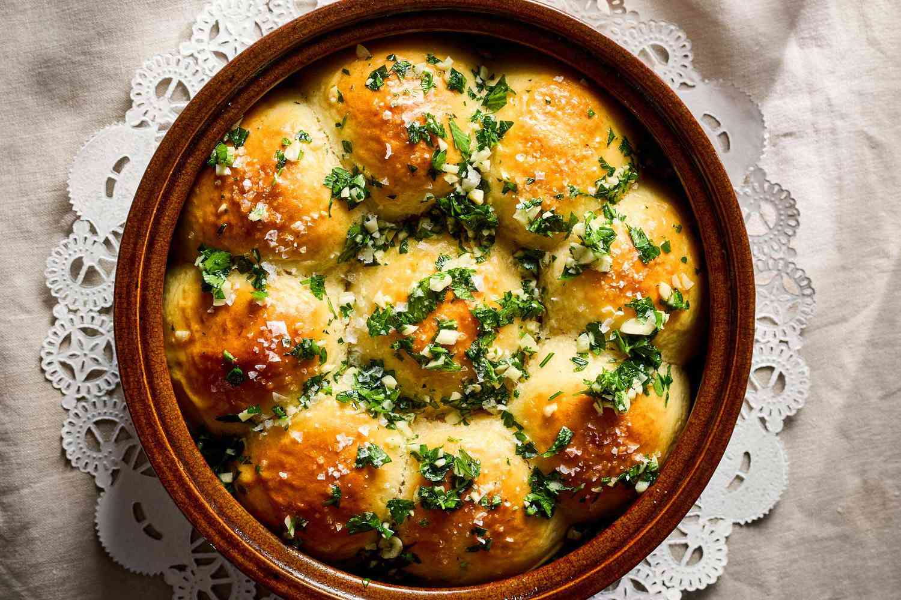

# Pampushky

*Ukrainian small soft yeast rolls slathered with a paste of garlic, oil, salt and dill — pulled apart and dipped into bowls of borscht. Pillow-soft on the inside, glossy with garlic oil on top, intensely savoury. The traditional companion to red borscht, but also good as a starter on their own.*

**Makes:** 12 rolls

**Prep Time:** 25 minutes (plus 1½ hour rising)

**Cook Time:** 20 minutes

## Overview
A simple enriched dough — flour, milk, butter, egg, yeast — rises until doubled. Twelve small balls form, arrange touching in a round tin and rise again. Bake until golden. While they bake, garlic-oil dressing is mashed in a mortar; the rolls come out and immediately get brushed all over with the warm garlicky oil.

## Ingredients

### Dough
- 500 g strong white bread flour
- 1 sachet (7 g) fast-action yeast
- 1 tablespoon caster sugar
- 1 teaspoon salt
- 250 ml whole milk (lukewarm)
- 1 large egg (plus 1 yolk for glaze)
- 50 g unsalted butter (softened)
- 2 tablespoons sunflower oil

### Garlic oil topping
- 8 garlic cloves
- 1 teaspoon salt
- 4 tablespoons sunflower oil
- 2 tablespoons fresh dill (finely chopped)
- 2 tablespoons water

## Method

### Stage 1 – Dough
1. Combine the flour, yeast, sugar and salt in a bowl.
1. Whisk the lukewarm milk with the egg, butter and oil.
1. Pour into the flour; mix to a soft dough.
1. Knead 10 minutes by hand or 6 in a stand mixer with a dough hook, until smooth and elastic.
1. Cover and rise 1 hour until doubled.

### Stage 2 – Shape
1. Knock back the dough; divide into 12 equal balls.
1. Arrange in a buttered 26 cm round cake tin or oven-proof skillet, leaving small gaps — they'll touch as they rise.

### Stage 3 – Second rise
1. Cover loosely; rise 30-40 minutes until puffy and just touching each other.

### Stage 4 – Bake
1. Heat the oven to 200°C (180°C fan).
1. Whisk the egg yolk with 1 tablespoon water; brush over the rolls.
1. Bake 18-22 minutes until deep golden.

### Stage 5 – Garlic oil
1. While baking, pound the garlic with the salt to a smooth paste in a mortar.
1. Mix in the oil, dill and water to make a slick, pungent dressing.

### Stage 6 – Glaze and serve
1. Pull rolls from the oven; immediately brush all over the tops with the garlic oil — it should soak into the warm crust.
1. Eat warm, pulled apart and dipped into hot borscht.

## Notes
- **Brush hot from the oven:** Cool rolls don't absorb the garlic oil; they sit dressed but unflavoured.
- **Smash the garlic, don't mince:** A mortar releases the oils properly. A grater or microplane is the next best; minced is fine.
- **Eat the day baked:** Pampushky stale fast — they're not bread to keep. Make for the meal you're eating.

## Storage
- Best fresh; refrigerate 2 days at most. Reheat at 180°C for 5 minutes covered, then re-brush with fresh garlic oil.
