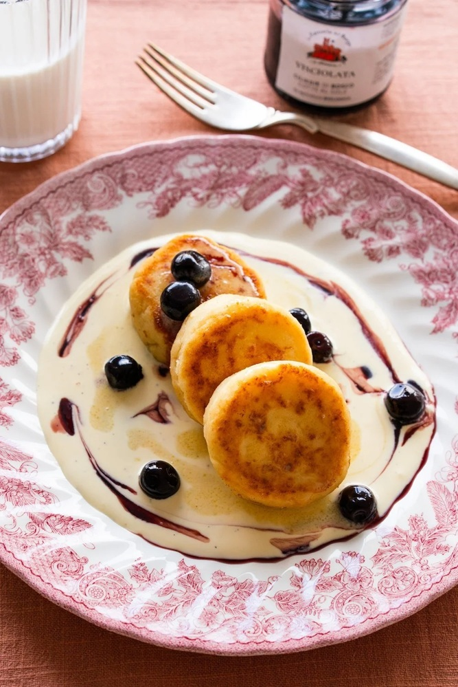

# Syrnyky

*Ukrainian cheese pancakes: small thick rounds of sweet, vanilla-scented cottage cheese batter, pan-fried until golden, served with sour cream and jam. Breakfast, dessert, the most-eaten enrichment in Ukrainian home cooking. Eats hot, warm, or cold.*

**Makes:** 12 syrnyky

**Prep Time:** 15 minutes

**Cook Time:** 15 minutes

## Overview
Drained dry cottage cheese (or quark, ricotta, farmer's cheese) mixes with eggs, flour, sugar and vanilla into a thick batter. Heaped tablespoons land on a buttered hot pan, flatten to 2 cm thick discs, and fry slowly to golden — the cheese cooks through, the surface crisps. Soured cream and jam on top.

## Ingredients

### Batter
- 500 g dry cottage cheese (curd cheese, quark, or well-drained ricotta)
- 2 large eggs
- 80 g caster sugar (or to taste)
- 1 teaspoon vanilla extract
- 5 tablespoons plain flour (plus more for shaping)
- ½ teaspoon salt
- Zest of 1 lemon (optional)
- 50 g raisins (optional)

### Frying
- 30 g unsalted butter
- 2 tablespoons sunflower oil

### To serve
- 200 g soured cream
- Cherry jam, raspberry jam, or honey

## Method

### Stage 1 – Drain the cheese (if needed)
1. If your cottage cheese or ricotta is wet, drain it through a fine sieve lined with muslin for 30 minutes — pressing gently. Wet cheese gives soggy syrnyky.

### Stage 2 – Batter
1. Mash the cheese with a fork in a bowl until mostly smooth (a few small lumps are fine).
1. Mix in the eggs, sugar, vanilla, salt and lemon zest.
1. Stir in the flour and raisins. The mixture should hold its shape on a spoon.

### Stage 3 – Shape
1. Dust a board with flour.
1. Scoop heaped tablespoons of batter; with floured hands, gently roll each into a ball, then flatten to a 2 cm thick disc.

### Stage 4 – Fry
1. Heat half the butter and oil in a wide pan over medium-low heat.
1. Lay the syrnyky in carefully; don't crowd.
1. Cook 3-4 minutes per side until each is deep golden and the inside is set (push gently — should feel firm but not hard).
1. Lift onto a plate; cover loosely with foil to keep warm.
1. Cook in batches, adding more butter and oil.

### Stage 5 – Serve
1. Pile syrnyky onto plates.
1. Top with a generous spoon of soured cream and a spoonful of jam or honey.

## Notes
- **Dry cheese is essential:** Wet cottage cheese leaks during cooking; the syrnyky go limp and brown unevenly. Drain or buy farmer's cheese.
- **Medium-low heat:** Too hot and the outside burns before the cheese sets through; too cool and they don't crisp. Slow and steady.
- **Don't overmix:** A few small cheese lumps in the batter give better texture than a smooth purée.

## Storage
- Best fresh. Refrigerate 3 days; reheat in a buttered pan over medium heat to restore the crisp.
- Freeze cooked 1 month; reheat at 180°C for 8 minutes.
