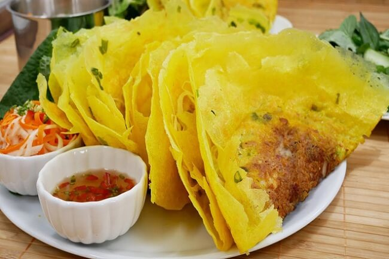

# Bánh Xèo Chay

*Vietnamese rice-flour and turmeric pancake, crispy at the edges and slightly chewy in the centre, folded over a stir-fried filling of mushrooms, beansprouts and tofu. The name "bánh xèo" comes from the sizzle the batter makes hitting the hot pan. Eaten by tearing pieces, wrapping in lettuce and herbs, dipping in nuoc cham.*

**Serves:** 4

**Prep Time:** 20 minutes

**Cook Time:** 30 minutes

## Overview
Rice flour, turmeric, coconut milk and water make a thin yellow batter. Filling vegetables — mushrooms, sliced onion, tofu — sauté in a hot pan; the batter pours over to form a thin pancake; beansprouts pile in last; the lot folds in half and slides out crisp. Wrap pieces in lettuce with herbs; dip in nuoc cham.

## Ingredients

### Batter
- 200 g rice flour
- 30 g cornflour
- 1 teaspoon ground turmeric
- ½ teaspoon salt
- 1 teaspoon sugar
- 200 ml coconut milk
- 400 ml water
- 4 spring onions (finely sliced)

### Filling (per pancake)
- 50 g mixed mushrooms (oyster mushroom, shiitake; sliced)
- 30 g firm tofu (sliced thinly)
- 30 g sliced onion
- 50 g beansprouts
- Pinch salt

### To cook
- 4 tablespoons vegetable oil (split between batches)

### Nuoc cham (vegetarian)
- 4 tablespoons light soy sauce
- 3 tablespoons rice vinegar
- 2 tablespoons sugar
- 4 tablespoons water
- Juice of 1 lime
- 2 garlic cloves (crushed)
- 1 bird's-eye chilli (finely sliced)
- 1 carrot (julienned)

### To serve
- 1 head butter lettuce (separated into leaves)
- A large handful mint
- A large handful coriander
- A large handful Thai basil

## Method

### Stage 1 – Batter
1. Whisk the rice flour, cornflour, turmeric, salt and sugar.
1. Whisk in the coconut milk, water and spring onions.
1. Rest 30 minutes (lets the flour hydrate; gives a crisper pancake).

### Stage 2 – Sauce
1. Whisk all the nuoc cham ingredients except the carrot until the sugar dissolves.
1. Stir in the carrot. Set aside.

### Stage 3 – Cook the pancakes (one at a time)
1. Heat 1 tablespoon of oil in a 24 cm non-stick or well-seasoned pan over medium-high heat.
1. Add about a quarter of the mushrooms, tofu and onion; stir-fry 2 minutes with a pinch of salt.
1. Spread out across the pan in a thin layer.
1. Whisk the batter; pour about a quarter of it (~150 ml) over the filling; tilt to coat the pan in a thin layer.
1. Reduce heat to medium; cook 3-4 minutes until the edges turn deep golden and lift away.
1. Pile a small handful of beansprouts on one half.
1. Slide a spatula under the other half; fold over; slide onto a plate.
1. Repeat 3 more times for the remaining pancakes.

### Stage 4 – Serve
1. Bring the pancakes, lettuce, herbs and nuoc cham to the table.
1. Each diner: tear off a piece of pancake, wrap in a lettuce leaf with a sprig of each herb, dip and eat.

## Notes
- **Hot pan, thin batter:** Bánh xèo's signature is crispy edges. Lukewarm pan or thick batter gives a soft pancake — wrong texture.
- **Beansprouts are added late:** They wilt slightly but should keep their crunch. Adding them with the batter makes them limp.
- **Rice flour vs glutinous rice flour:** Use plain rice flour (not glutinous/sticky rice flour). The cornflour helps the crisp.

## Storage
- Best eaten right away; the crisp doesn't survive sitting. Make the batter ahead; cook the pancakes when you eat.
