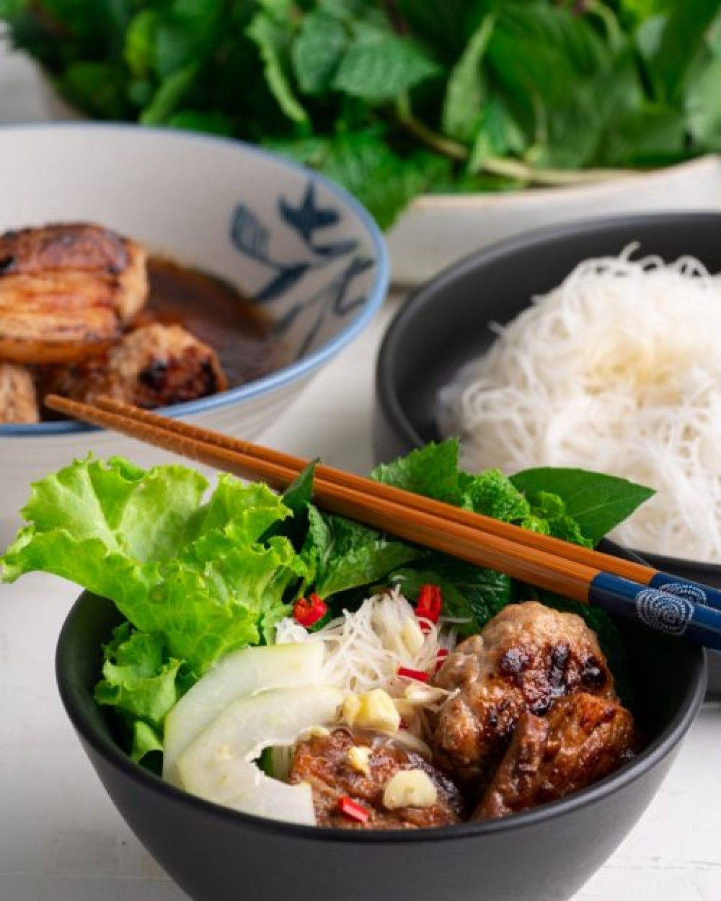

# Vietnamese Pork Bun Cha

*Bun cha is a Hanoi street-food classic of grilled pork over rice vermicelli, with a sweet, sour, salty fish-sauce dipping broth and a tangle of fresh herbs.*

**Serves:** 6
**Prep Time:** 15 minutes
**Cook Time:** 1 hour

## Overview
Two cuts of pork (sliced belly and seasoned mince patties) are marinated in a fish-sauce, garlic and shallot mixture, then char-grilled fast over high heat to keep them juicy. They land in bowls of warm fish-sauce dressing alongside cooked rice vermicelli, fresh mint, Thai basil, lettuce, pickled green papaya and a sprinkle of garlic and chilli. Diners assemble each spoonful at the table from the components, lifting noodles and herbs into the broth.

## Ingredients

### Marinade
- ¼ cup fish sauce
- 4 small Asian shallots (or 2 eschallots, finely chopped)
- 6 garlic cloves (finely chopped)
- 1 tablespoon dark soy sauce
- 1 tablespoon white sugar
- 1 teaspoon ground black pepper

### Pork
- 500 grams pork mince
- 500 grams pork belly (sliced)
- Vegetable oil (for grilling)

### Pickled Papaya (optional)
- ½ cup white vinegar
- ½ cup white sugar
- 1 teaspoon sea salt
- 100 grams thinly sliced green papaya (or carrot)

### Dressing
- ½ cup fish sauce
- 3 tablespoons white vinegar
- ¾ cup white sugar
- 1 cup water
- 2 tablespoons lime juice

### To Serve
- 500 grams dried vermicelli noodles (cooked according to packet)
- 3 red chillies (seeded and finely chopped)
- 5 garlic cloves (finely chopped)
- Fresh mint
- Thai basil
- Lettuce leaves

## Method

### Stage 1 – Marinate the Pork
1. In a bowl, combine all the marinade ingredients.
2. Mix half of the marinade with the sliced pork belly and set aside to marinate for at least 1 hour, or overnight in the fridge.
3. Mix the other half of the marinade with the pork mince and form into small patties.
4. Set the patties aside to marinate too.

### Stage 2 – Pickle the Papaya
1. In a large bowl, combine the white vinegar, sugar and salt.
2. Stir until the sugar dissolves.
3. Add the sliced papaya and set aside for at least 30 minutes.
4. Pickled papaya keeps for up to a week refrigerated.

### Stage 3 – Make the Dressing
1. In a small saucepan over high heat, combine the fish sauce, vinegar, sugar and water.
2. Stir until the sugar dissolves.
3. Transfer to a bowl and allow to cool to room temperature.
4. Stir in the lime juice.

### Stage 4 – Grill the Pork
1. Heat a char-grill pan, barbecue plate or frying pan over high heat.
2. Brush with oil and grill the pork belly for 2 minutes on each side, until slightly charred and cooked through.
3. Transfer to a serving platter.
4. Brush the pan with oil again and cook the pork patties for 3 to 4 minutes on each side, until charred and cooked through.
5. Transfer to the same platter.

### Stage 5 – Assemble & Serve
1. Place a generous portion of pork belly and patties into a medium-sized serving bowl.
2. Spoon over a generous amount of the dressing.
3. Serve alongside the noodles, herbs, lettuce, pickled papaya, garlic and chilli.
4. Each diner builds their own bowl by combining noodles, herbs and lettuce with the pork, then spooning over dressing and adding garlic and chilli to taste.

## Notes
- **Cook the pork fast:** A high heat for a short time keeps the pork tender and juicy. Don't be tempted to lower the heat; the marinade contains sugar and benefits from a quick char.
- **Marinate overnight:** Even 1 hour helps, but overnight develops far more depth in both the pork belly and the patties.
- **Dressing temperature:** Cool the syrup completely before adding the lime juice, otherwise the heat dulls the lime's brightness.
- **Pickled papaya:** Optional but classic. Green papaya is sold at Asian grocers; finely shredded carrot is a fine stand-in.
- **Build at the table:** Bun cha is meant to be assembled spoonful by spoonful, with each diner adjusting the chilli, garlic and dressing to taste.

## Variations
**Chicken bun cha:** Replace both cuts of pork with boneless chicken thigh; the marinade and method work identically.
**Beef bun bo:** Swap pork for thinly sliced beef; reduce the cook time on the grill.

## Serving
Serve with: Vietnamese pickled chillies and a small dish of crushed roasted peanuts
Garnish with: A sprig of perilla leaves alongside the mint and basil

## Storage
- Pork keeps 2 days refrigerated; reheat briefly under a hot grill
- Dressing keeps 1 week refrigerated in a sealed jar
- Pickled papaya keeps 1 week refrigerated
- Noodles, herbs and lettuce should be prepared fresh
