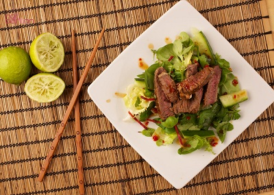

# Go Bo Hoi An

## Overview
Go Bo Hoi An is a piquant Vietnamese beef salad featuring thinly sliced seared beef tossed with crisp vegetables, fresh herbs, and a bright tamarind-lime dressing. This dish has delicate undertones of lime and garlic which carry through the tamarind flavours perfectly. The combination of tender beef, crunchy vegetables, aromatic herbs, and crispy rice papers creates a textural and flavourful celebration of Vietnamese cuisine. Quick to make but requires advance preparation, ensure the salad, dressing, and toppings are made and ready to use before cooking the beef.

**Serves:** 2
**Prep Time:** 20 minutes
**Marinating time:** 3 hours (or overnight)
**Cook Time:** 5 minutes

## Ingredients

### Beef & Marinade
- 200 grams beef sirloin or tenderloin (frozen)
- 1 tablespoon tamarind paste
- 1 teaspoon sugar
- Salt and freshly ground black pepper to taste
- 1 garlic clove (crushed)

### Salad Base
- 75 grams lettuce (shredded)
- 75 grams green papaya (grated)
- 75 grams tomatoes (de-seeded and thinly sliced)
- 75 grams cucumber (de-seeded and thinly sliced)
- ½ white onion (thinly sliced)
- 4 fresh red chillies (de-seeded and thinly sliced)

### Dressing
- Juice of 1 lime
- 1 tablespoon Thai fish sauce
- 3 tablespoons sugar
- 1 garlic clove (crushed)

### Garnish & Toppings
- 30 grams fresh mint (leaves)
- 30 grams fresh coriander (leaves)
- 15 grams fresh basil (leaves)
- 2 tablespoons fried shallot slices
- 2 tablespoons roasted peanuts (crushed)
- 2 roasted rice papers (broken into pieces)

## Method

### Stage 1 – Prepare Beef for Marinating
1. Place the frozen beef in the freezer until very firm (approximately 1 hour if not already frozen).
2. Using a very sharp knife, slice the beef as thinly as possible (approximately 3mm thickness).
3. **Tip:** If the beef begins to thaw during slicing, place it back in the freezer for 15 minutes to firm up again.

### Stage 2 – Marinate Beef
1. Mix together the tamarind paste, sugar, salt, pepper, and crushed garlic in a bowl.
2. Add the thinly sliced beef and toss gently to coat evenly with the marinade.
3. Cover the bowl with plastic wrap and refrigerate for at least 3 hours (overnight is preferable for deeper flavour).

### Stage 3 – Prepare Salad Components
1. Shred the lettuce and grate the green papaya.
2. De-seed the tomatoes and slice thinly.
3. De-seed the cucumber and slice thinly.
4. Slice the white onion thinly.
5. De-seed the red chillies and slice thinly.
6. Place all salad vegetables in a large serving bowl.

### Stage 4 – Make the Dressing
1. Squeeze the lime juice into a small bowl.
2. Add the Thai fish sauce, sugar, and crushed garlic.
3. Whisk together until the sugar dissolves completely.
4. Set aside until ready to use.

### Stage 5 – Cook the Beef
1. Heat a large heavy-based frying pan or wok over high heat until very hot.
2. Add the marinated beef (including the marinade liquid) to the hot pan.
3. Shake the pan constantly for 1–2 minutes so that the beef is seared on all sides and cooked through.
4. The beef should remain rare to medium-rare inside with a caramelized exterior. Don't overcook or it will become tough.
5. Remove from heat and set aside.

### Stage 6 – Assemble the Salad
1. Toss the prepared salad vegetables with the prepared dressing until well coated.
2. Add the seared beef (including any pan juices) to the salad and mix gently to combine.
3. Transfer the salad to a serving plate.

### Stage 7 – Garnish & Serve
1. Top the salad with the fresh mint, coriander, and basil leaves.
2. Sprinkle over the fried shallot slices, crushed roasted peanuts, and rice paper pieces.
3. Serve immediately on a bed of banana leaves if available, with crispy rice papers on the side.

## Notes
- **Frozen beef technique:** Freezing the beef makes it easier to slice thinly and evenly. This creates a tender texture when cooked quickly at high heat.
- **Tamarind paste:** Provides authentic sour-sweet flavour essential to Vietnamese cuisine. Available in Asian supermarkets; no substitute captures the same flavour.
- **Marinating time:** Minimum 3 hours, but overnight marinating develops flavour significantly. Plan ahead.
- **Pre-prep essential:** Have all components ready before cooking the beef, the searing happens very quickly and the dish should be assembled immediately.
- **Rice papers:** Traditional roasted rice papers add crunch and authenticity. Available in Asian supermarkets.
- **Herb balance:** Fresh herbs are essential to this dish, they brighten and balance the rich beef and tangy dressing.

## Variations
**Pork version:** Use 200g pork tenderloin (frozen and sliced thinly); marinate and cook the same way
**Vegetarian:** Omit beef and replace with 200g crispy tofu (pressed and pan-fried) or grilled mushrooms
**Extra spicy:** Increase fresh red chillies to 6–8 or add bird's eye chillies for significantly more heat
**Shrimp version:** Use 250g large prawns (marinate for 1 hour only); cook for only 1 minute in the hot pan
**With noodles:** Serve the beef and vegetables over rice vermicelli noodles for a more substantial meal

## Serving
Serve on banana leaves (if available) with extra lime wedges, fresh chillies, fish sauce, and roasted rice papers on the side. Pairs beautifully with Vietnamese beer or fresh lime juice drinks.

## Storage
- Best eaten immediately while the beef is warm and aromatic
- Leftover salad (without beef) keeps 1 day refrigerated; don't store beef separately as it dries out
- Not recommended for freezing (texture and flavours are compromised)
- The marinated raw beef keeps refrigerated for up to 24 hours before cooking