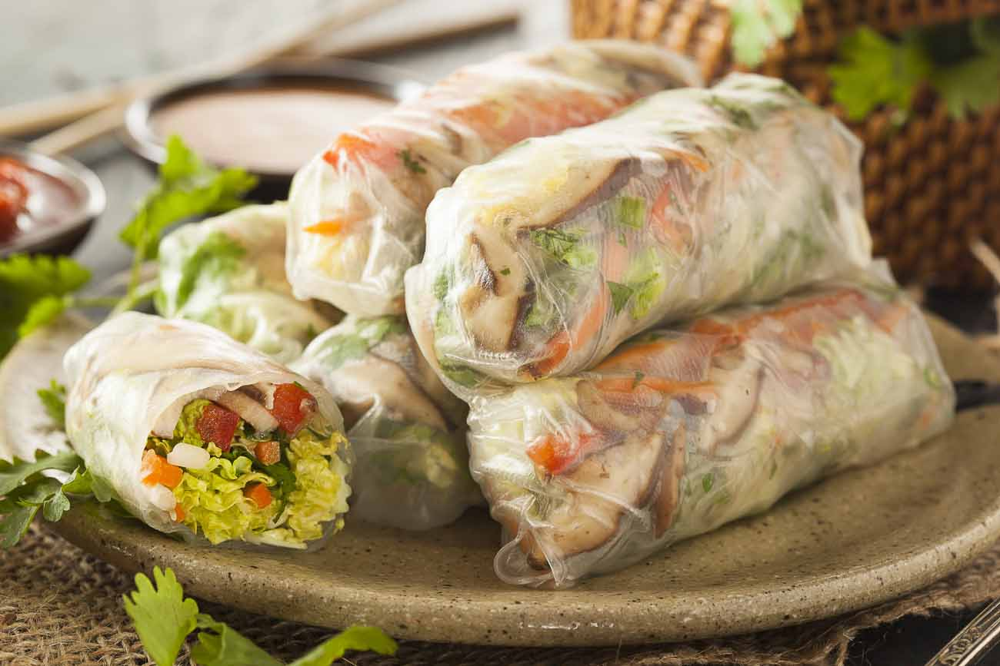

# Gỏi Cuốn Chay

*Vietnamese vegetarian summer rolls: cool rice paper wrapped around lettuce, herbs, vermicelli and tofu, dipped in a sweet-sour peanut sauce. Light, fresh, exactly the right thing in summer; the dipping sauce does most of the work.*

**Makes:** 12 rolls (serves 4)

**Prep Time:** 30 minutes

**Cook Time:** 15 minutes

## Overview
Vermicelli noodles cook briefly and get tossed with sesame oil to stop sticking. Tofu pan-fries until golden. Rice paper rounds soak in warm water until pliable; everything stacks on each round and rolls tightly. The peanut sauce blends in seconds.

## Ingredients

### Rolls
- 100 g rice vermicelli noodles
- 2 teaspoons toasted sesame oil
- 200 g firm tofu (cut into 12 thin batons)
- 1 tablespoon vegetable oil
- 1 tablespoon light soy sauce
- 12 sheets rice paper (22 cm rounds)
- 1 small head butter lettuce or little gem (separated into leaves)
- 100 g beansprouts
- 1 carrot (julienned)
- 1 cucumber (julienned)
- A large handful mint leaves
- A large handful coriander leaves
- A large handful Thai basil leaves
- A handful chives (cut into 8 cm lengths)

### Peanut dipping sauce
- 4 tablespoons hoisin sauce
- 2 tablespoons smooth peanut butter
- 2 tablespoons rice vinegar
- 1 tablespoon brown sugar
- 1 garlic clove (crushed)
- 60-100 ml hot water (to loosen)
- 1 bird's-eye chilli (finely sliced; optional)
- 1 tablespoon crushed roasted peanuts

## Method

### Stage 1 – Noodles
1. Cook the vermicelli per packet (usually 3-4 minutes in boiling water); drain; rinse under cold water.
1. Toss with the sesame oil to stop sticking.

### Stage 2 – Tofu
1. Heat the oil in a frying pan over medium heat.
1. Fry the tofu batons 3-4 minutes per side until golden.
1. Sprinkle with the soy sauce in the pan; toss to coat; remove.

### Stage 3 – Sauce
1. Whisk the hoisin, peanut butter, vinegar, sugar, garlic and chilli (if using).
1. Whisk in hot water until pourable.
1. Top with crushed peanuts.

### Stage 4 – Set up the rolling station
1. Fill a wide shallow bowl with warm water.
1. Have all fillings in arm's reach: lettuce, vermicelli, tofu, beansprouts, carrot, cucumber, herbs, chives.

### Stage 5 – Roll
1. Dip a rice paper round in warm water for 5-10 seconds — pliable but still firm; it'll continue softening as you work.
1. Lay flat on a clean board.
1. On the lower third, lay: a leaf of lettuce, a small pile of vermicelli, a baton of tofu, a few beansprouts, a few sticks of carrot and cucumber, a few herb leaves, two chive lengths sticking out one end.
1. Fold the bottom up over the filling; fold the sides in; roll up tight, sausage-style.
1. Place seam-side down on a tray; cover with a damp cloth so they don't dry.
1. Repeat for all 12.

### Stage 6 – Serve
1. Cut diagonally in half; serve with the peanut sauce.

## Notes
- **Don't oversoak the rice paper:** It'll keep softening on the board. Pull it out while it still has some bend; it'll be perfect by the time you've laid the fillings.
- **Roll tight or they fall apart:** Loose rolls split when you bite. Tuck the ends in firmly.
- **Eat soon:** The rolls turn rubbery after 2-3 hours covered. Best within an hour of rolling.

## Storage
- Best fresh. Cover any leftovers with a damp paper towel and plastic wrap; refrigerate up to 6 hours. Sauce keeps a week in the fridge.
