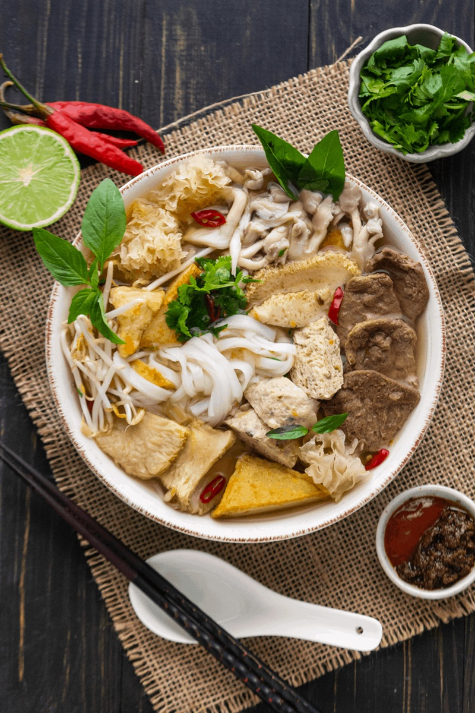

# Phở Chay

*Vietnamese vegetarian pho: a fragrant broth of charred onion, ginger, star anise, cinnamon and clove built on mushroom and seaweed for depth, with rice noodles, tofu and a heaped bowl of fresh herbs at the table. The broth is the dish — clear, aromatic, just-savoury.*

**Serves:** 4

**Prep Time:** 20 minutes

**Cook Time:** 1¼ hours

## Overview
Onion and ginger char black on a flame to give the broth its signature smoky depth. They go into water with toasted spices, dried mushrooms, kombu (kelp) and a few aromatics, simmering for an hour to extract flavour. The broth strains clear; tofu poaches in it briefly. Rice noodles cook separately; everything assembles in bowls with a pile of fresh herbs and chillies.

## Ingredients

### Broth
- 2 onions (halved, skin on)
- 8 cm fresh ginger (split lengthwise)
- 4 star anise
- 1 cinnamon stick
- 5 cloves
- 1 tablespoon coriander seeds
- 1 tablespoon black peppercorns
- 25 g dried shiitake mushrooms
- 1 piece kombu (about 10 x 5 cm)
- 250 g daikon (peeled, roughly chopped) — optional but classic
- 2 large carrots (chopped)
- 2.5 litres water
- 60 ml light soy sauce
- 2 teaspoons salt (or to taste)
- 1 tablespoon brown sugar

### To assemble
- 400 g flat rice noodles (banh pho)
- 300 g firm tofu (cubed)

### To serve
- A large handful Thai basil leaves
- A large handful coriander
- A large handful mint
- 200 g beansprouts
- 2 limes (cut into wedges)
- 2 bird's-eye chillies (sliced)
- Hoisin sauce
- Sriracha or other chilli sauce

## Method

### Stage 1 – Char the alliums
1. Set the onions cut-side down directly on a gas flame (or under a hot grill); char until blackened (5-6 minutes per side).
1. Char the ginger pieces the same way until streaked black.
1. This is non-negotiable for proper pho flavour.

### Stage 2 – Toast the spices
1. Toast the star anise, cinnamon, cloves, coriander seeds and peppercorns in a dry pan over medium heat 2-3 minutes until fragrant.
1. Tip into a square of muslin and tie shut (or use a tea infuser/bag).

### Stage 3 – Simmer the broth
1. Combine the charred onion and ginger, spice bag, mushrooms, kombu, daikon, carrots and water in a large pot.
1. Bring to a boil; reduce to a steady simmer.
1. Cook 1 hour uncovered. The liquid will reduce slightly and turn deep golden.

### Stage 4 – Strain and season
1. Strain through a fine sieve into a clean pot, pressing the solids gently.
1. Discard the solids (or save the rehydrated mushrooms for a stir-fry).
1. Stir in the soy sauce, salt and sugar; taste and adjust — should be savoury, lightly sweet, deeply aromatic.
1. Add the tofu; simmer 5 minutes to warm through.

### Stage 5 – Noodles
1. Cook the rice noodles per packet (usually 4-5 minutes in boiling water).
1. Drain and divide between four wide bowls.

### Stage 6 – Serve
1. Lift tofu pieces from the broth and divide between the bowls.
1. Ladle hot broth over.
1. Bring the herbs, beansprouts, lime wedges and chillies to the table.
1. Each diner adds what they want — torn basil, mint and coriander; a squeeze of lime; chillies; a swirl of hoisin and sriracha.

## Notes
- **Charring is the soul of pho:** Smoky-sweet onion and ginger are what distinguish pho from generic noodle soup. Open the windows.
- **Vegan:** The broth is naturally vegan; sub the soy sauce as needed and check that your hoisin doesn't contain anchovies (some brands do).
- **Make ahead:** The broth keeps 5 days refrigerated and freezes 3 months. Texture is best when made fresh, but the broth itself only improves overnight.

## Storage
- Broth keeps 5 days refrigerated, freezes 3 months. Cooked noodles don't keep well; cook fresh.
