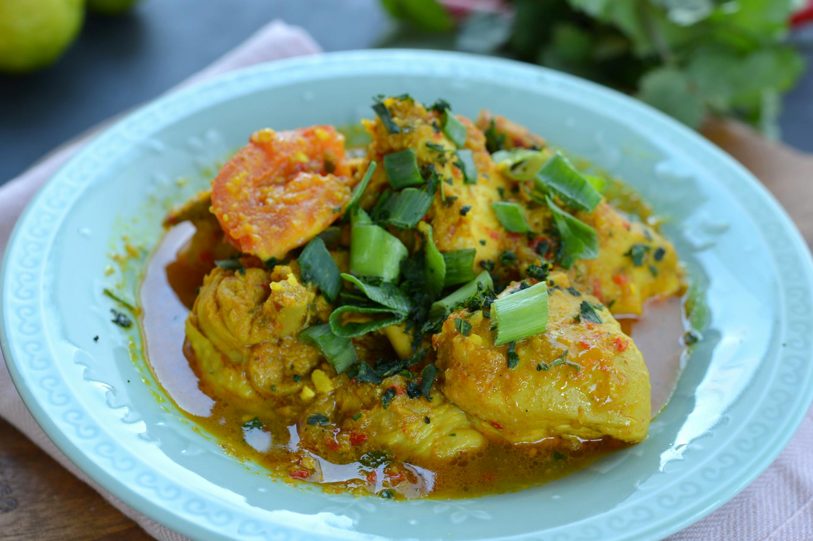

# Vietnamese Chicken Curry

## Overview
A fragrant Vietnamese curry that blends French colonial influences with traditional Southeast Asian spicing. This dish showcases the Vietnamese love of balance, aromatic spices like star anise, cardamom, and cinnamon partner with earthy lemongrass and fresh chillies. The result is a warm, comforting curry with subtle sweetness and complex layered flavours. Even though Vietnam was colonized by the French, the traditional cuisine has more in common with their Chinese neighbours.

**Serves:** 4
**Prep Time:** 15 minutes
**Cook Time:** 30 minutes

## Ingredients

### Protein & Oil
- 800 grams skinless chicken breasts (cut into strips)
- 3 tablespoons sunflower oil

### Aromatics & Spices
- 4 garlic cloves (finely chopped)
- 1 red chilli (finely sliced)
- 2 star anise
- 4 tablespoons lemongrass (very finely chopped)
- 1 teaspoon cardamom seeds (crushed)
- 1 cinnamon stick
- 1 tablespoon ground bean sauce (or oyster sauce as substitute)

### Vegetables
- 12 spring onions (cut into 3cm lengths)
- 300 grams green beans (cut into 5cm lengths)
- 1 red bell pepper (de-seeded and sliced)

### Liquid Base
- 400 ml coconut milk
- 100 ml chicken stock
- 2 tablespoons fish sauce
- 1 tablespoon palm sugar

### Garnish
- 2 tablespoons fresh coriander (chopped)
- 2 tablespoons fresh mint (chopped)
- 2 tablespoons roasted peanuts (roughly crushed)

## Method

### Stage 1 – Prepare Ingredients
1. Cut chicken breasts into strips approximately 1cm wide.
2. Finely chop the garlic and lemongrass.
3. Crush the cardamom seeds using a mortar and pestle.
4. Prepare all vegetables and have them ready.

### Stage 2 – Toast Spices
1. Heat 3 tablespoons of sunflower oil in a large wok or heavy-based frying pan over medium heat.
2. Add the star anise and cinnamon stick.
3. Toast for 1–2 minutes until fragrant, stirring occasionally.
4. Do not let them burn, they should become aromatic but remain whole.

### Stage 3 – Cook Aromatics
1. Add the finely chopped garlic, red chilli, and lemongrass to the toasted spices.
2. Stir-fry for 2–3 minutes until very fragrant.
3. Add the crushed cardamom seeds and ground bean sauce.
4. Stir well and cook for a further 1 minute.

### Stage 4 – Brown Chicken
1. Add the chicken strips to the aromatic mixture.
2. Stir-fry over medium-high heat for 5–7 minutes until the chicken is sealed and lightly browned on the outside.
3. The chicken doesn't need to be cooked through at this point.

### Stage 5 – Build the Curry
1. Pour in the coconut milk and chicken stock.
2. Add the fish sauce and palm sugar.
3. Stir well to combine all ingredients.
4. Bring to a gentle boil, then reduce heat to medium-low.
5. Simmer for 8–10 minutes until the chicken is cooked through and tender.

### Stage 6 – Add Vegetables
1. Add the spring onions, green beans, and red bell pepper.
2. Continue to simmer for a further 5–8 minutes until the vegetables are tender-crisp.
3. The total cooking time should not exceed 30 minutes or the vegetables will become mushy.

### Stage 7 – Finish & Serve
1. Remove from heat.
2. Sprinkle over the fresh coriander, mint, and crushed roasted peanuts.
3. Serve immediately with jasmine rice or rice noodles.

## Notes
- **Ground bean sauce:** Available in good Asian supermarkets. If unavailable, substitute oyster sauce (use the same quantity).
- **Star anise & cinnamon:** These whole spices add depth and must be toasted to release their essential oils. Remove before serving or leave in if guests are aware.
- **Lemongrass freshness:** Fresh lemongrass is far superior to dried. Use the tender white portions only and chop very finely.
- **Chicken texture:** Don't overcook the chicken or it will become dry. The curry continues cooking when removed from heat due to residual warmth.
- **Vegetable timing:** Add vegetables toward the end to maintain their texture and nutritional value.

## Variations
**Seafood version:** Replace chicken with 600g large prawns or firm white fish; reduce cooking time in Stage 4 to 2–3 minutes
**Extra spicy:** Add 2–3 fresh bird's eye chillies in Stage 3 or increase red chilli to 2
**Vegetarian:** Omit chicken and use 400g firm tofu (cubed); use vegetable stock instead of chicken stock
**With pumpkin:** Add 250g pumpkin (cubed) in Stage 6 for sweetness and texture
**Coconut-forward:** Increase coconut milk to 500ml and reduce chicken stock to 50ml for a richer sauce

## Serving
Serve with: Jasmine rice, rice noodles, or steamed basmati rice. Accompany with lime wedges, fresh chillies, and extra fish sauce on the side.

## Storage
- Keeps 3 days refrigerated in an airtight container
- Freezes well up to 3 months (remove whole spices before freezing if preferred)
- Reheat gently on the stovetop over medium-low heat, adding a splash of coconut milk or stock if needed