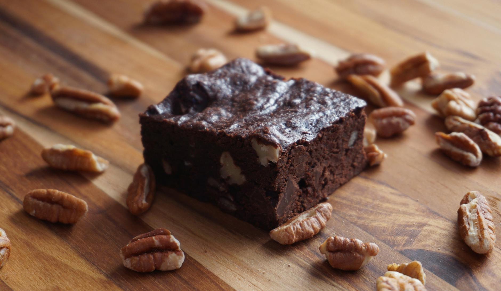

# Pecan nut brownies

*These brownies marry especially well with crème anglaise or a spoonful of crème fraîche.*

**Serves:** 16 

## Overview
Rich, fudgy chocolate brownies studded with toasted pecan nuts. These brownies have a dense, moist interior with just-set edges, the perfect balance of chocolate intensity and nutty richness. Elegant enough for entertaining yet comforting enough for everyday indulgence, especially paired with crème anglaise or fresh whipped cream. 

## Ingredients
- 200 grams butter (cut into small pieces)
- butter (to grease)
- 200 grams dark chocolate at 70% cocoa solids (cut into small pieces)
- 4 eggs
- 220 grams light brown sugar
- 120 grams plain flour
- 220 grams pecan nuts (cut into large pieces)

## Method
1. Butter a 24 x 34 cm baking tin, 6 cm deep, and line with greaseproof paper, allowing the paper to extend above the rim of the tin.
1. Preheat the oven to 190°C.
1. Melt the butter and chocolate in a heatproof bowl set over a pan of barely simmering water, making sure that the bottom of the bowl does not touch the water in any way.
1. Stir until smooth, then remove the bowl from the pan and set aside to cool slightly.
1. Using an electric mixer, beat the eggs for 2 minutes, then add the brown sugar and beat until the mixture reaches a ribbon consistency, about 6 minutes.
1. Using a spatula, incorporate into the melted chocolate, but do not overwork.
1. Add the flour and nuts in a stead stream, folding them in with the spatula just until evenly mixed; stop mixing at this point.
1. Pour the mixture into the prepared tin and immediately place in the oven.
1. Cook for 20 - 25 minutes, lowering the oven setting to 180°C after 10 minutes.
1. To test, insert a skewer or knife tip into the centre; it should come out clean and shiny.
1. Set aside to cool in the tin.
1. Once cooled, lift out the brownie, using the lining paper.
1. Cut into squares or smaller pieces and serve in an artful heap.

## Notes
- **Chocolate quality:** Use high-quality 70% cocoa solids chocolate, cheaper chocolate produces dull, grainy results.
- **Egg beating:** The 6-minute ribbon stage is essential for incorporating air that creates the fudgy texture.
- **Don't overmix:** Fold ingredients gently with a spatula to maintain airiness, overmixing creates tough, dense brownies.
- **Doneness test:** The skewer should come out clean but with a slight sheen from melted chocolate. Overbaking dries them out.

## Serving
Serve with: Crème anglaise, whipped cream, vanilla ice cream, or fresh berries
Presentation: Dust with icing sugar or cocoa powder, or garnish with gold leaf for elegance
Temperature: Room temperature or slightly warmed

## Storage
- Keeps 4-5 days in an airtight container at room temperature
- Freezes well up to 2 months (freeze cut pieces in layers separated by parchment)
- Texture improves and mellows after 1-2 days as flavors develop
- Cannot be properly reheated; serve at room temperature or chilled